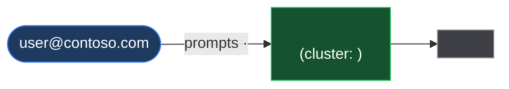
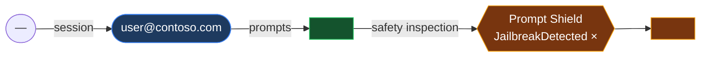

# AI Agent Activity — Instructions

## Purpose

This skill reports the **runtime activity** of AI agents built on **Agent 365 / Copilot Studio / Microsoft 365 Copilot / Work IQ** across a tenant — who invoked which agents, what tools and connectors ran, over which channels, with what token/inference usage, and what the content-safety layer (Prompt Shield jailbreak / XPIA) caught.

It answers **"what are the agents actually doing?"** — the behavioral counterpart to the configuration-focused **[`ai-agent-posture`](../ai-agent-posture/SKILL.md)** skill.

| | `ai-agent-posture` (config) | `ai-agent-activity` (this skill — runtime) |
|---|---|---|
| **Question** | How are agents *configured*? (access, tools declared, data sources, credentials) | What are agents *doing*? (prompts, tool calls, users, channels, safety flags) |
| **Primary table** | `AgentsInfo` (Advanced Hunting) | `UnifiedAgentObservability` (Data Lake) **or** `CloudAppEvents` (Defender) |
| **Time model** | Point-in-time config snapshots | Event stream over a lookback window |
| **Use together** | Posture flags a *broadly-accessible, email-capable* agent | Activity shows whether that agent is *actually used*, by whom, and whether it was *jailbroken* |

**Use them together:** run `ai-agent-posture` to find the risky *configurations*, then run this skill to see which of those agents are *active-and-dangerous* at runtime.

**References:**
- **Query library (all validated KQL):** [`queries/cloud/agent365_observability.md`](../../../queries/cloud/agent365_observability.md) — this skill **references** those queries rather than duplicating them. It contains the Plane A + Plane B equivalents, the `RawEventData` ↔ `UnifiedAgentObservability` field crosswalk, and the Defender-parity matrix.
- **Security for AI native alerts (companion signal):** see [Core Queries C12](#c12--security-for-ai-native-alerts-identify--gather-context) below — for tenants with Microsoft Defender's Security for AI capability enabled, covers the native `AlertInfo`/`AlertEvidence` alert family (`ServiceSource == "Security for AI"`: malicious URL, obfuscated/encoded payload, and other runtime-threat alerts) that is broader than, and complementary to, the Prompt Shield jailbreak/XPIA signal in §7.
- [Agent 365 Observability SDK](https://learn.microsoft.com/microsoft-agent-365/developer/observability)
- [Agent 365 observability concepts](https://learn.microsoft.com/microsoft-agent-365/developer/observability-concepts)
- [Detect and investigate threats to AI agents using Microsoft Defender (Preview)](https://learn.microsoft.com/en-us/defender-xdr/security-for-ai/ai-agent-detection-protection)

---

## 📑 TABLE OF CONTENTS

1. **[Critical Workflow Rules](#-critical-workflow-rules---read-first-)**
2. **[Data Plane Detection & Selection](#data-plane-detection--selection)** — the core generalization
3. **[Execution Workflow](#execution-workflow)** — phase-by-phase
4. **[Scopes](#scopes)** — tenant-wide / single-agent / single-user
5. **[Agent Clustering Methodology](#agent-clustering-methodology)** — LLM-derived, non-rigid
6. **[Risk Signal Catalog](#risk-signal-catalog)** — flexible signals (no composite score)
7. **[Core Queries](#core-queries)** — compact adapted set for report generation ([C0 = prompt/reply content](#c0--prompt--reply-content-extraction-plane-a-mandatory-when-plane-a-is-present))
8. **[Mermaid Diagram Templates](#mermaid-diagram-templates)** — user→agent→tool paths
9. **[Output Modes](#output-modes)** — inline / markdown / both
10. **[Report Templates](#report-templates)** — tenant-wide / single-agent / single-user
11. **[Known Pitfalls](#known-pitfalls)**
12. **[Quality Checklist](#quality-checklist)**

---

## ⚠️ CRITICAL WORKFLOW RULES - READ FIRST ⚠️

1. **🔴 DETECT THE DATA PLANE FIRST.** Probe `UnifiedAgentObservability` (Plane A) **and** `CloudAppEvents` (Plane B) before any analysis and proceed with whatever exists. Never assume a plane is present. See [Data Plane Detection & Selection](#data-plane-detection--selection).

2. **🔴 SAFETY VERDICTS ONLY COME FROM `CloudAppEvents` `CopilotInteraction`.** `UnifiedAgentObservability` has no jailbreak/XPIA column. If `CloudAppEvents` is absent, state the safety gap explicitly.

3. **🔴 If Plane A exists, run [C0](#c0--prompt--reply-content-extraction-plane-a-mandatory-when-plane-a-is-present) — prompt/reply text is the highest-value evidence here.** `parse_json(EventOriginalRequestDetails).text` returns empty on 100% of rows (no `.text` key); replies for Copilot Studio agents are on `AISpanOutput`. Never report a content gap without C0's coverage check.

4. **ASK the user for scope and output format** before generating:
   - **Scope:** tenant-wide (default) · single-agent · single-user
   - **Output:** inline chat · markdown file (`reports/ai-agent-activity/`) · both

5. **⛔ Evidence-based analysis only.** Report ONLY what query results show. Use the explicit absence pattern (`✅ No [finding] detected`) for 0-result queries. Never invent agents, users, IPs, or counts.

6. **🔴 NO composite /100 score.** Surface the [Risk Signal Catalog](#risk-signal-catalog) items, assign each a 🟢/🟡/🔴 verdict from the evidence, and show the reasoning.

7. **🔴 DERIVE agent clusters from the actual inventory** using the [Agent Clustering Methodology](#agent-clustering-methodology). The example categories are illustrative only.

8. **Timestamp column depends on the plane** — `UnifiedAgentObservability` and `CloudAppEvents` in Data Lake use **`TimeGenerated`**; `CloudAppEvents` via Advanced Hunting uses **`Timestamp`**. See [Known Pitfalls](#known-pitfalls).

9. **Enrich notable IPs** (highest-volume agent egress IP, any jailbreak-source IP) with `enrich_ips.py` — parse the JSON via PowerShell, never `read_file` the `.txt`.

10. **Report elapsed time** after each phase.

---

## Data Plane Detection & Selection

The Agent 365 Observability SDK fans the **same** agent telemetry out to independent sinks. This skill uses the queryable planes and picks whichever the tenant has. (A fourth plane — **Purview / DSPM for AI** — carries the sensitive *content* of prompts; this skill points to it but does not build queries against it.)

| Plane | Table | Query tool | Carries | Retention |
|-------|-------|-----------|---------|-----------|
| **A · Sentinel Data Lake** | `UnifiedAgentObservability` (`workspaceId:"default"`) | `mcp_sentinel-data_query_lake` | **Full span** — prompt/reply text ([extract with C0](#c0--prompt--reply-content-extraction-plane-a-mandatory-when-plane-a-is-present) — **not** `.text`), tool args, token usage, session graph | 90d+ |
| **B · Microsoft Defender** | `CloudAppEvents` (agent `ActionType`s + `CopilotInteraction`) | `RunAdvancedHuntingQuery` (≤30d) **or** `query_lake` (workspace GUID, 90d) | **Security metadata** — agent/user/channel/tool names, `ClientIP`, jailbreak verdict. **No prompt text / tool args / tokens.** | ≤30d (AH) / 90d (Lake) |
| **C · `CopilotActivity` (supplemental, always worth probing)** | `CopilotActivity` | `RunAdvancedHuntingQuery` (≤30d) **or** `query_lake` (90d) | **Governance + runtime-protection signal that neither A nor B carry**: full `AppHost`/`RecordType` surface breakdown (Security Copilot, Copilot Studio, Edge, SharePoint, M365AdminCenter, OutlookSidepane...), plugin/agent **lifecycle** events (`CreateCopilotPlugin`/`EnableCopilotPlugin`/`DisableCopilotPlugin`/`DeleteCopilotPlugin`/`CopilotAgentManagement`), and **Defender Runtime Protection tool evaluations with `FailClose` posture** (`AccessedResources[].Type == "SecurityWebhook"`). **Validated empirically (2026-08-12):** jailbreak detections and tool-call inventory in `CopilotActivity` are the **same events** as Plane B (no additional actors/hits, and `Messages[].{Id,JailbreakDetected,isPrompt}` carries **no prompt text** despite the table's name) — do not expect Plane C to add jailbreak-content depth. Its unique value is the **fail-close/governance signal**, which is exclusive to this table. | ≤30d (AH) / 90d (Lake) |

### Phase 0 detection probes

Run both probes (safe, cheap). Proceed based on which returns rows.

**Probe A — Plane A present?**
```kql
// mcp_sentinel-data_query_lake, workspaceId: "default"
UnifiedAgentObservability
| where TimeGenerated > ago(1d)
| summarize Rows = count()
```
- Returns rows → **Plane A available.** (If it returns `SemanticError: Failed to resolve table`, the connector is not enabled → Plane A absent.)

**Probe B — Plane B present?**
```kql
// RunAdvancedHuntingQuery (or query_lake with workspace GUID)
CloudAppEvents
| where Timestamp > ago(1d)
| where ActionType in ("InvokeAgent","InferenceCall","ExecuteToolBySDK","ExecuteToolByGateway","ExecuteToolByMCPServer","CopilotInteraction")
| summarize Rows = count()
```
- Returns rows → **Plane B available.**

**Probe C — Plane C (`CopilotActivity`) present?**
```kql
// RunAdvancedHuntingQuery (or query_lake)
CopilotActivity
| where TimeGenerated > ago(1d)
| summarize Rows = count()
```
- Returns rows → **Plane C available.** Table-not-found is unlikely (this is the standard Microsoft Copilot unified-audit connector) but still probe it — some tenants may not have the connector enabled.

### Selection matrix

| Plane A | Plane B | Decision |
|:---:|:---:|---|
| ✅ | ✅ | **Plane A primary** (richest — prompt text, tokens, tool args) **+ Plane B for the safety section** (`CopilotInteraction` jailbreak verdict) and `ClientIP` enrichment. |
| ✅ | ❌ | **Plane A only.** Full activity/tool/token analysis. ⚠️ **Safety section is limited** — no jailbreak verdict without `CloudAppEvents`; state the gap. No `ClientIP` (UAO omits it). |
| ❌ | ✅ | **Plane B only** (the common Defender-only case). Metadata + `ClientIP` + safety verdicts. ⚠️ **No prompt text, tool arguments, or token usage** — content routes to Purview, not Defender; state the gap. |
| ❌ | ❌ | **No agent telemetry.** Report that neither plane is populated; suggest enabling the Agent 365 Observability connector (Plane A) and/or confirming Defender `CloudAppEvents` ingestion (Plane B). Stop. |

**Plane C is additive, not a substitute — always layer it in when present (regardless of the A/B outcome), specifically for §7a below.** It does not change the primary-plane decision above; it supplements whichever plane was selected with governance/runtime-protection signal neither A nor B carries.

### 🔴 MANDATORY report banner

Every report MUST open with a plane banner so the analyst knows what was and wasn't inspectable:

```
> 🛰️ Data plane: <A · Data Lake | B · Defender | A+B> [+ C · CopilotActivity governance].
> Prompt text / tool args / tokens: <available (Plane A) | not available (Plane B — content is in Purview)>. 
> Safety verdicts (jailbreak/XPIA): <available via CloudAppEvents | UNAVAILABLE — CloudAppEvents not present>.
> ClientIP source enrichment: <available (Plane B) | not available (Plane A only)>.
> Governance/runtime-protection (Plane C): <available — CopilotActivity present | not available>.
```

---

## Execution Workflow

### Phase 0 — Detect, scope, mode
1. Run **Probe A** and **Probe B** → apply the [selection matrix](#selection-matrix).
2. Ask the user for **scope** (tenant-wide / single-agent / single-user) and **output mode** (inline / markdown / both).
3. Confirm the **lookback** (default 30d). If >30d and using Plane B, use `query_lake` against the workspace GUID, not Advanced Hunting (AH silently truncates to 30d).

### Phase 1 — Volume & inventory
- ActionType volume breakdown (events, distinct users, first/last seen).
- Daily event trend (for the volume mermaid chart).
- **Agent inventory** — every named agent with event count, distinct users, channels.
- **If Plane A is present: run [C0](#c0--prompt--reply-content-extraction-plane-a-mandatory-when-plane-a-is-present) now** to confirm content coverage and capture the prompt/reply corpus. Do this *before* writing any "content not available" statement.

### Phase 2 — Tool / connector usage
- Tool-invocation inventory per agent (tool name, tool type, calls).
- Tool-type distribution across the fleet.
- *(optional)* New-tool first-seen vs prior baseline.

### Phase 3 — Channel & user distribution
- Per-(user, channel) prompt volume; source-IP spread (Plane B).

### Phase 4 — Safety layer *(requires CloudAppEvents)*
- Prompt Shield jailbreak / XPIA verdicts by agent, user, channel.
- Drill down the most recent / highest cluster; correlate source IP.
- **🔴 For every flagged turn, pull the actual prompt AND the agent's reply via [C0](#c0--prompt--reply-content-extraction-plane-a-mandatory-when-plane-a-is-present).** The verdict boolean alone cannot tell you whether the attempt *succeeded*. See [Detection ≠ prevention](#detection--prevention-always-check-the-reply).
- **If the tenant has Microsoft Defender's Security for AI capability enabled**, also run [C12](#c12--security-for-ai-native-alerts-identify--gather-context) below — this surfaces a broader runtime-threat alert family (malicious URL, obfuscated/encoded payload, etc.) as full Defender alerts/incidents, not just a jailbreak boolean.

### Phase 4a — Governance & runtime-protection signal (Plane C, if present)
- Run the [Plane C supplemental queries](#plane-c-supplemental-queries--copilotactivity-governance--runtime-protection) — `AppHost`/`RecordType` surface breakdown, plugin/agent lifecycle events, and Defender Runtime Protection tool `FailClose` posture.
- This is genuinely additive over Plane A/B (validated empirically — see the Plane C row above) and should be run **regardless of which plane was primary**, whenever Probe C returns rows.

### Phase 5 — Clustering & path derivation
- Apply the [Agent Clustering Methodology](#agent-clustering-methodology): group agents into environment-specific clusters and name them.
- Build the **user→agent→tool** mermaid diagram for each material cluster.

### Phase 6 — IP enrichment
- Enrich notable IPs (top agent egress IP, jailbreak-source IPs) with `enrich_ips.py`. Parse the JSON via PowerShell.

### Phase 7 — Risk signals + report
- Evaluate the [Risk Signal Catalog](#risk-signal-catalog); assign 🟢/🟡/🔴 from evidence.
- Generate the report in the requested mode/scope.
- Report total elapsed time.

---

## Scopes

Ask which scope at the start. All three share Phases 0–1; they differ in depth and filtering.

### Tenant-wide (default)
Full-fleet inventory + clustering + safety + risk signals. Uses the [tenant-wide template](#template-1-tenant-wide).

### Single-agent drill-down
Filter every query to one agent name. Include:
- Agent inventory row (events, users, channels, first/last seen).
- Tool inventory for the agent; per-tool call counts.
- User list + channels + (Plane B) source IPs.
- **Session reconstruction** — Plane A: full prompt+tool+reply timeline ([query library](../../../queries/cloud/agent365_observability.md) Query 3a/3b). Plane B: metadata-only timeline (agent/tool/channel/time, no content).
- Safety flags for the agent (`CopilotInteraction`).
Uses the [single-agent template](#template-2-single-agent).

### Single-user drill-down
Filter to one UPN. Include:
- Every agent the user invoked + prompt counts + channels + IPs.
- Tools that ran on the user's behalf.
- Safety flags attributed to the user.
- Plane A: the user's prompt text where relevant.
Uses the [single-user template](#template-3-single-user).

---

## Agent Clustering Methodology

**Agent categories are environment-specific — derive them, don't impose them.** Group the observed agents into a small number of clusters (typically 3–6) using any combination of these signals, then give each cluster a short descriptive name from what the data shows:

| Clustering signal | How to read it |
|---|---|
| **Naming pattern** | Shared prefixes/suffixes, versioned families (`Finance Agent v2/v3`), persona-named agents (agent named after a user's display name), `*Test`/`*Demo` build agents |
| **Tool / connector set** | Agents calling the same connectors cluster together (e.g. `sentinelmcp:*` → security-ops; `GetDailyProcurementSnapshot` → finance; `a365outlookmailmcp` + `a365teamsmcp` → personal-productivity) |
| **Channel** | `Copilot Studio Test Pane` / `Evaluation` → build/test; `msteams` / `msteams:COPILOT` → production/user-facing; `Autonomous` → background automation |
| **User population** | Single-user + single-IP + high volume → personal/background automation; many distinct users → shared or customer/supplier-facing |
| **Owner / creator** | A single builder iterating on a family of agents is a development pattern, not production traffic |

**Illustrative example clusters (NOT a required taxonomy — name your own):** *Personal / Autonomous background agents*, *Security-Operations agents*, *Finance agents*, *Customer/Supplier-facing agents*, *Build/Test agents*. Your report's clusters should reflect **this** tenant's data.

**For each material cluster, produce:** a short table (agents, primary users, channels, representative tools) + a **user→agent→tool** mermaid diagram ([templates below](#mermaid-diagram-templates)).

> **Volume concentration is common and usually benign:** one autonomous/background agent frequently dominates total tool-call volume (single user, single IP, steady 24/7 cadence). Call it out explicitly and separate it from the human-interactive long tail so it doesn't drown the analysis.

---

## Risk Signal Catalog

**No composite /100 score.** Evaluate each signal below against the query evidence, assign a 🟢/🟡/🔴 verdict, and show the reasoning. Only include signals the available plane can support (note gaps).

| # | Signal | Evidence source | 🔴 escalate when |
|---|--------|-----------------|------------------|
| 1 | **Jailbreak / XPIA rate & clusters** | `CopilotInteraction` `JailbreakDetected` / XPIA verdict, **paired with the reply text from [C0](#c0--prompt--reply-content-extraction-plane-a-mandatory-when-plane-a-is-present)** | A flagged turn that produced a **substantive reply** (detected but not blocked), an adversarial prompt that was **not** flagged at all (coverage gap), partial compliance (refusal + payload), repeated hits on a customer/supplier-facing agent, a new agent/user pair, or hits followed by sensitive tool calls in-session |
| 2 | **Sensitive-tool usage** | Tool inventory — mail-send, data-write, directory-write, security-tooling (`query_lake`/Sentinel/SecurityCopilot), file-upload | Broadly-used or customer-facing agent invoking write/send/exfil-capable tools |
| 3 | **Broadly-used / customer-facing runtime** | Agent inventory (high distinct-user count) + external-facing channel | High-reach agent + sensitive tools + safety flags |
| 4 | **New-tool first-seen** | Tool baseline deviation ([query library](../../../queries/cloud/agent365_observability.md) Q7a/7b) | An agent starts calling a tool absent from its prior baseline (scope drift / unauthorized addition) |
| 5 | **Anomalous source IPs** | `ClientIP` (Plane B) + `enrich_ips.py` | Genuine VPN/Tor/proxy with abuse reports on a non-Microsoft ISP. *(Azure/Microsoft egress IPs are frequently vpnapi-flagged "VPN" with 0 abuse — a known FP; verify ISP + abuse score before escalating.)* |
| 6 | **Volume concentration** | Agent inventory | A single agent dominating (>90%) fleet volume — usually benign automation; escalate only if the identity/IP/tool profile is unexpected |
| 7 | **Tool-call failures / errors** *(Plane A only)* | UAO `EventErrorDetails` ([query library](../../../queries/cloud/agent365_observability.md) Q6) | A failure spike from a previously-stable agent (probing, broken MCP, permission revocation) |
| 8 | **Runtime-protection fail-close posture** *(Plane C only)* | `CopilotActivity` `AccessedResources[].Type == "SecurityWebhook"`, extract `FailClose` | Any **sensitive tool (mail-send, data-write, security-query)** evaluated with `FailClose = False` — the agent proceeds even if the security evaluation can't complete |
| 9 | **Plugin/agent lifecycle tampering** *(Plane C only)* | `CopilotActivity` `RecordType in (CreateCopilotPlugin, EnableCopilotPlugin, DisableCopilotPlugin, DeleteCopilotPlugin, CopilotAgentManagement)` | Enable/create by an unexpected actor, a security-relevant plugin disabled, or high-volume `CopilotAgentManagement` by an unattributed (`ActorName == "Unknown"`) system identity — confirm it's a known provisioning principal |

Present these as a findings table with per-signal verdict, evidence, and a recommendation.

---

## Core Queries

> These are the compact, report-driving queries. The **full validated set** (Plane A 1a/4a/8a, Plane B 1b/4b/7b/8b, safety Query 9, session reconstruction 3a/3b, tool failures Q6) lives in [`queries/cloud/agent365_observability.md`](../../../queries/cloud/agent365_observability.md) — use those for anything beyond the basics.
>
> **Timestamp column:** `TimeGenerated` for `UnifiedAgentObservability` and for `CloudAppEvents` via Data Lake; **`Timestamp`** for `CloudAppEvents` via Advanced Hunting. Queries below show the `CloudAppEvents` (Plane B) form using `Timestamp` — swap to `TimeGenerated` when running via `query_lake`.

### C0 — Prompt & reply content extraction (Plane A, MANDATORY when Plane A is present)

**🔴 `parse_json(EventOriginalRequestDetails).text` returns empty on 100% of rows — there is no `.text` key.** The payload shape varies **by agent hosting platform**, and Copilot Studio agent replies are emitted on a **separate `AISpanOutput` event**, not on `InvokeAgent`. Use the shape-aware extractor below.

#### Payload shape crosswalk (validated live)

| Event type | Hosting platform | `EventOriginalRequestDetails` | `EventOriginalResultDetails` |
|---|---|---|---|
| `InvokeAgent` | **Copilot Studio** | OTel array `[{"role":"user","parts":[{"content":"…","type":"text"}]}]` | **empty** — the reply is on the paired `AISpanOutput` row |
| `InvokeAgent` | **Foundry / Teams-hosted** | **bare text string** (no JSON at all) | **bare text string** (the reply), or `[]` when the reply was suppressed |
| `AISpanOutput` | **Copilot Studio** | empty | OTel array `[{"finish_reason":"stop","role":"assistant","parts":[{"content":"…"}]}]` — **this is the agent reply** |
| `ExecuteTool*` | any | JSON args object, or `key="value"` string (SDK) | JSON object, or JSON-RPC array `[{"jsonrpc":"2.0","result":{…}}]` |
| `InferenceCall` | Foundry | JSON array — **full message history incl. the system prompt** (can exceed 50 KB) | JSON array — model output |

#### The extractor

```kql
let ReqText = (s:string) { case(
    isempty(s), "",
    s startswith "[", tostring(parse_json(s)[0].parts[0].content),   // Copilot Studio OTel array
    s startswith "{", "",                                            // JSON object = tool args, not a message
    s) };                                                            // bare string = Foundry/Teams message
let ResText = (s:string) { case(
    isempty(s), "",
    s == "[]", "<<EMPTY REPLY — blocked/suppressed>>",                // meaningful safety signal, not missing data
    s startswith "[", tostring(parse_json(s)[0].parts[0].content),
    s startswith "{", "",
    s) };
UnifiedAgentObservability
| where TimeGenerated > ago(30d)
| where EventOriginalType in ("InvokeAgent","AISpanOutput")
| extend Agent = iff(isnotempty(SrcAgentName), SrcAgentName, tostring(TargetAgentName))
| extend Prompt = ReqText(EventOriginalRequestDetails),
         Reply  = ResText(EventOriginalResultDetails)
| where isnotempty(Prompt) or isnotempty(Reply)
| project TimeGenerated, EventOriginalType, Agent, ActorUsername, EventSessionId,
          Prompt = substring(Prompt, 0, 1000), Reply = substring(Reply, 0, 1000), EventUid
| order by TimeGenerated asc
```

> **Reading the output:** a Copilot Studio turn spans **two rows** — the `InvokeAgent` row carries the prompt, the following `AISpanOutput` row carries the reply. A Foundry/Teams turn is a **single** `InvokeAgent` row carrying both. Do not conclude "reply not captured" from an empty `InvokeAgent` result column without checking for a paired `AISpanOutput`.
>
> **Multi-part messages:** `[0].parts[0]` takes the first part of the first message, which covers ordinary user turns. For multi-part/multi-modal payloads, `mv-expand` the array instead.
>
> **Full text:** `substring(...)` truncates for readability — pull the untruncated payload by `EventUid` for forensic review.

#### Coverage self-check (run this before writing any content-gap statement)

```kql
UnifiedAgentObservability
| where TimeGenerated > ago(30d)
| where isnotempty(EventOriginalRequestDetails) or isnotempty(EventOriginalResultDetails)
| extend ReqShape = case(EventOriginalRequestDetails startswith "[", "json-array",
                         EventOriginalRequestDetails startswith "{", "json-object",
                         isempty(EventOriginalRequestDetails), "empty", "bare-string"),
         ResShape = case(EventOriginalResultDetails startswith "[", "json-array",
                         EventOriginalResultDetails startswith "{", "json-object",
                         isempty(EventOriginalResultDetails), "empty", "bare-string")
| summarize Rows = count(), Agents = make_set(iff(isnotempty(SrcAgentName), SrcAgentName, tostring(TargetAgentName)), 6)
    by EventOriginalType, ReqShape, ResShape
| order by EventOriginalType asc, Rows desc
```

> If this returns rows, **content exists** — any failure to surface it is an extraction bug, not a telemetry gap. Only report a content gap when this query returns 0 rows or the shapes are all `empty`.

#### Detection ≠ prevention: always check the reply

A Prompt Shield `JailbreakDetected = true` verdict means the classifier **fired**, *not* that the request was **blocked**. Validated live: a system-prompt-extraction prompt was flagged `true` **and the agent still returned its full system prompt**, while an unflagged DAN-style prompt in the same session was suppressed (`[]` reply). **Always pair the verdict with the reply text** and report the outcome explicitly:

| Verdict | Reply | Report as |
|---|---|---|
| `true` | `<<EMPTY REPLY>>` | 🟢 Detected **and** blocked |
| `true` | substantive text | 🔴 **Detected but NOT blocked** — assess what leaked |
| `false` | `<<EMPTY REPLY>>` | 🟡 Blocked by a different control — note the verdict gap |
| `false` | substantive text, adversarial prompt | 🔴 **Missed** — Prompt Shield coverage gap |

Also inspect **partial compliance**: an agent that refuses the literal action ("I can't send email") but still produces the payload (a ready-to-paste draft containing the exfil address/URL) has **not** actually refused.

### C1 — ActionType volume breakdown (Plane B)
```kql
CloudAppEvents
| where Timestamp > ago(30d)
| where ActionType in ("InvokeAgent","InferenceCall","ExecuteToolBySDK","ExecuteToolByGateway","ExecuteToolByMCPServer","CopilotInteraction")
| summarize Events = count(), DistinctUsers = dcount(AccountId), FirstSeen = min(Timestamp), LastSeen = max(Timestamp) by ActionType
| order by Events desc
```
> **Plane A equivalent:** `UnifiedAgentObservability | where TimeGenerated > ago(30d) | summarize Events=count() by EventOriginalType`.

### C2 — Agent inventory (Plane B)
```kql
CloudAppEvents
| where Timestamp > ago(30d)
| where ActionType in ("InvokeAgent","InferenceCall","ExecuteToolBySDK","ExecuteToolByGateway","ExecuteToolByMCPServer")
| extend d = parse_json(RawEventData)
| extend AgentName = tostring(d.AgentName), TargetAgent = tostring(d.TargetAgentName)
| extend AgentName = iif(isnotempty(AgentName), AgentName, TargetAgent)
| summarize Events = count(),
            UserPrompts = countif(ActionType == "InvokeAgent" and tostring(d.AgentBlueprintId) == "00000000-0000-0000-0000-000000000000"),
            ToolCalls   = countif(ActionType startswith "ExecuteTool"),
            DistinctUsers = dcountif(tostring(d.UserId), tostring(d.UserId) != "N/A" and isnotempty(tostring(d.UserId))),
            SourceIPs   = dcount(tostring(d.ClientIP)),
            Channels    = make_set(tostring(d.ChannelName), 10),
            FirstSeen = min(Timestamp), LastSeen = max(Timestamp)
    by AgentName
| order by Events desc
```
> **Plane A equivalent:** [query library](../../../queries/cloud/agent365_observability.md) **Query 1a** (adds token usage + session-join agent-name attribution).

### C3 — Tool inventory per agent (Plane B)
```kql
CloudAppEvents
| where Timestamp > ago(30d)
| where ActionType in ("ExecuteToolBySDK","ExecuteToolByGateway","ExecuteToolByMCPServer")
| extend d = parse_json(RawEventData)
| extend Agent = tostring(d.AgentName), ToolName = tostring(d.ToolName), ToolType = tostring(d.ToolType)
| where isnotempty(ToolName)
| summarize Calls = count(), Sessions = dcount(tostring(d.SessionIdentity)),
            FirstCall = min(Timestamp), LastCall = max(Timestamp)
    by Agent, ToolName, ToolType, ToolPath = ActionType
| order by Agent asc, Calls desc
```
> **Plane A equivalent:** [query library](../../../queries/cloud/agent365_observability.md) **Query 4a**.

### C4 — Tool-type distribution (Plane B)
```kql
CloudAppEvents
| where Timestamp > ago(30d)
| where ActionType in ("ExecuteToolBySDK","ExecuteToolByGateway","ExecuteToolByMCPServer")
| extend d = parse_json(RawEventData)
| where isnotempty(tostring(d.ToolName))
| summarize Calls = count(), Agents = dcount(tostring(d.AgentName)) by ToolType = tostring(d.ToolType)
| order by Calls desc
```

### C5 — Channel & user distribution (Plane B)
```kql
CloudAppEvents
| where Timestamp > ago(30d)
| where ActionType == "InvokeAgent"
| extend d = parse_json(RawEventData)
| where tostring(d.AgentBlueprintId) == "00000000-0000-0000-0000-000000000000"   // user prompts only
| where tostring(d.UserId) != "N/A" and isnotempty(tostring(d.UserId))
| summarize Prompts = count(), Conversations = dcount(tostring(d.ConversationId)),
            SourceIPs = dcount(tostring(d.ClientIP)), Agents = make_set(tostring(d.TargetAgentName), 10),
            FirstPrompt = min(Timestamp), LastPrompt = max(Timestamp)
    by Actor = tostring(d.UserId), Channel = tostring(d.ChannelName)
| order by Prompts desc
```
> **Plane A equivalent:** [query library](../../../queries/cloud/agent365_observability.md) **Query 8a**.

### C6 — Daily event trend (for the volume chart, Plane B)
```kql
CloudAppEvents
| where Timestamp > ago(30d)
| where ActionType in ("InvokeAgent","InferenceCall","ExecuteToolBySDK","ExecuteToolByGateway","ExecuteToolByMCPServer")
| summarize Events = count(), Users = dcount(AccountId) by bin(Timestamp, 1d)
| order by Timestamp asc
```

### C7 — Safety: Prompt Shield jailbreak / XPIA (ALWAYS CloudAppEvents)
```kql
CloudAppEvents
| where Timestamp > ago(30d)
| where ActionType == "CopilotInteraction"
| where RawEventData has_any ("JailbreakDetected","jailbreakDetected","xpiaDetected","indirectPromptInjection","classifications")
| extend P = parse_json(RawEventData)
| mv-expand Msg = P.CopilotEventData.Messages
| extend Jb = tobool(coalesce(Msg.JailbreakDetected, Msg.jailbreakDetected)),
         Xpia = tobool(coalesce(Msg.xpiaDetected, Msg.indirectPromptInjectionDetected))
| where Jb == true or Xpia == true
| extend AgentName = tostring(coalesce(P.AgentName, P.CopilotEventData.TargetAgentName)),
         UserUpn = tostring(P.UserId), AppHost = tostring(P.CopilotEventData.AppHost)
| summarize Hits = count(), Users = dcount(UserUpn), FirstSeen = min(Timestamp), LastSeen = max(Timestamp)
    by AgentName, AppHost, Verdict = case(Jb, "jailbreak", Xpia, "xpia", "other")
| order by Hits desc
```
> `JailbreakDetected` is **PascalCase** in current tenants. Drill a cluster by adding `| where tostring(P.UserId) =~ "<upn>"` and projecting `TimeGenerated, IPAddress, AgentName, ThreadId=tostring(P.CopilotEventData.ThreadId)`.

### Scope filters
- **Single-agent:** add `| where tostring(d.AgentName) =~ "<agent>"` (or `tostring(P.AgentName)` / `tostring(P.CopilotEventData.TargetAgentName)` for safety) to C2–C7.
- **Single-user:** add `| where tostring(d.UserId) =~ "<upn>"` (or `tostring(P.UserId)` for safety).

### Plane C supplemental queries — `CopilotActivity` governance & runtime-protection

Run these **whenever Probe C returns rows**, in addition to whichever of Plane A/B was selected as primary. They surface signal that neither Plane A nor Plane B carries. Full query set and pitfalls: [`queries/cloud/copilot_activity_investigation.md`](../../../queries/cloud/copilot_activity_investigation.md).

#### C8 — Full surface breakdown by AppHost/RecordType
```kql
CopilotActivity
| where TimeGenerated > ago(30d)
| summarize Events = count(), Actors = dcount(ActorName), Agents = dcountif(AgentId, isnotempty(AgentId)),
            FirstSeen = min(TimeGenerated), LastSeen = max(TimeGenerated)
    by RecordType, AppHost
| order by Events desc
```
> Reveals surfaces the Plane B `ActionType` filter misses entirely — Security Copilot (`AppHost` prefixed `SecurityCopilot-<guid>`, frequently the single largest volume source in the tenant), Edge, SharePoint, M365AdminCenter, OutlookSidepane, Copilot Studio, `pva-maker-evaluation`. Use this to sanity-check that the Plane B agent inventory isn't missing an entire surface.

#### C9 — Defender Runtime Protection tool evaluations (fail-close posture)
```kql
CopilotActivity
| where TimeGenerated > ago(30d)
| where RecordType == "CopilotInteraction"
| extend AR = parse_json(tostring(LLMEventData.AccessedResources))
| mv-expand AR
| where tostring(AR.Type) == "SecurityWebhook"
| extend EvalText = tostring(AR.Action)
| extend ToolName = extract(@"Evaluated tool name: ([^,]+)", 1, EvalText),
         FailClose = extract(@"Fail close configuration is set to: (\w+)", 1, EvalText)
| summarize Evaluations = count() by ToolName, FailClose
| order by Evaluations desc
```
> **High-value, Plane-C-exclusive signal.** Flag any sensitive tool name (mail-send, data-write, security-query connectors) with `FailClose = False` — the agent proceeds even if the security evaluation can't complete. This has **no equivalent in Plane A or Plane B**.

#### C10 — Plugin / agent lifecycle governance
```kql
CopilotActivity
| where TimeGenerated > ago(30d)
| where RecordType in ("CreateCopilotPlugin","UpdateCopilotPlugin","EnableCopilotPlugin","DisableCopilotPlugin","DeleteCopilotPlugin","CopilotAgentManagement")
| summarize Events = count(), Actors = dcount(ActorName), TopActors = make_set(ActorName, 5) by RecordType
| order by Events desc
```
> Governance/tampering signal absent from Plane A/B — neither table logs plugin enable/disable/create/delete events. Watch for `ActorName == "Unknown"` on high-volume `CopilotAgentManagement` — confirm it's a known provisioning/system principal, not an unattributed actor.

#### C11 — Data accessed / SharePoint sites read by an agent
```kql
CopilotActivity
| where TimeGenerated > ago(30d)
| where isnotempty(AgentId)
| extend AR = parse_json(tostring(LLMEventData.AccessedResources))
| mv-expand AR
| extend SiteUrl = tostring(AR.SiteUrl), ResourceType = tostring(AR.Type)
| where SiteUrl has ".sharepoint.com"
| summarize AccessCount = count(), Users = dcount(ActorName), Sites = make_set(SiteUrl, 20)
    by AgentName, AgentId
| order by AccessCount desc
```
> Only meaningful for agents that actually read SharePoint/OneDrive content — returns 0 rows for agents with no tool/knowledge-source calls (confirmed empirically: an agent showing 0 tool calls in Plane B also shows 0 `AccessedResources` here — the two are consistent, not contradictory).

**Validated NOT additive (validated 2026-08-12):** the `CopilotActivity` jailbreak query (`Messages[].JailbreakDetected`) and its tool-call inventory (`AppHost == "Autonomous"` → `AccessedResources[].Type == "Connector"`) return the **same events, same actors, same counts** as their Plane B equivalents (C7 and C3). `Messages` carries only `{Id, JailbreakDetected, isPrompt}` — **no prompt text**, despite what the table name might suggest. Don't spend time re-deriving §7 (Safety Layer) or §6 (Tool Usage) from Plane C if Plane B is already primary — use Plane C specifically for C8–C11 instead.

#### C12 — Security for AI native alerts (identify + gather context)

**Microsoft Defender's Security for AI capability** (integrated with Agent 365) generates its own native alerts/incidents for AI agent runtime threats — malicious URL submission, obfuscated/encoded/hidden payloads, secret leakage, LLM recon, suspicious IP/user access — distinct from (and broader than) the Prompt Shield jailbreak/XPIA boolean in C7. When enabled, these surface via `AlertInfo`/`AlertEvidence` with `ServiceSource == "Security for AI"` (Advanced Hunting only — not queryable in Sentinel Data Lake). See [Detect and investigate threats to AI agents using Microsoft Defender (Preview)](https://learn.microsoft.com/en-us/defender-xdr/security-for-ai/ai-agent-detection-protection).

**Identify — is it enabled, and what's been flagged? (30d)**
```kql
AlertInfo
| where TimeGenerated > ago(30d)
| where ServiceSource == "Security for AI"
| summarize Alerts = count(), FirstSeen = min(TimeGenerated), LastSeen = max(TimeGenerated)
    by Title, Category, Severity
| order by Alerts desc
```
> Zero rows means either no findings this window, **or** the feature isn't enabled — confirm in Defender portal → Settings → Security for AI before concluding "clean."

**Gather context — full evidence per alert (user, agent, hosting platform, related URL/IP)**
```kql
AlertEvidence
| where TimeGenerated > ago(30d)
| where ServiceSource == "Security for AI"
| extend AF = parse_json(AdditionalFields)
| summarize
    Title = any(Title), Category = any(Category), Severity = any(Severity),
    Users = make_set_if(AccountUpn, EntityType == "User" and isnotempty(AccountUpn)),
    Agents = make_set_if(tostring(AF.AgentName), EntityType == "AIAgent"),
    HostingPlatforms = make_set_if(tostring(AF.HostingPlatformType), EntityType == "AIAgent"),
    RelatedUrls = make_set_if(RemoteUrl, EntityType == "Url" and isnotempty(RemoteUrl)),
    RelatedIPs = make_set_if(RemoteIP, EntityType == "Ip" and isnotempty(RemoteIP))
    by AlertId, AlertTime = TimeGenerated
| order by AlertTime desc
```
> Add `| where AlertId == "<AlertId>"` to drill into one specific alert. `AIAgent`/URL/IP detail lives in `AdditionalFields` (JSON) — always `parse_json()` before extracting.

**Resolve to a reportable Incident ID.** `AlertInfo`/`AlertEvidence` carry no `IncidentId` column — for the §7a report table (and any output shown to the user), resolve each `AlertId` to its Defender XDR incident via `GetAlertById(alertId="<AlertId>")` (Triage MCP), which returns `incidentId` directly. Multiple `AlertId`s frequently share the same `incidentId` (they're correlated into one multi-stage incident) — dedupe before presenting. Never show a bare `AlertId` in a report; always render `[#<IncidentId>](https://security.microsoft.com/incidents/<IncidentId>?tid=<tenant_id>)` per the [SecurityIncident Query & Output Standards](../../copilot-instructions.md) global rule.

**Known pitfalls:**
- **`ProductName` doesn't exist on `AlertInfo`/`AlertEvidence`** — use `ServiceSource`/`DetectionSource` instead (both literal `"Security for AI"`).
- **🔴 These alerts often do NOT populate in Sentinel's `SecurityAlert`/`SecurityIncident.AlertIds`** (validated on a live multi-stage incident: 2 of 4 correlated alerts were native Security-for-AI alerts, and neither resolved via a `SecurityAlert.SystemAlertId` lookup). For incident-level pivoting, use `GetIncidentById(incidentId="<ProviderIncidentId>", includeAlertsData=true)` (Triage MCP) instead of a Sentinel-side join.
- **`BehaviorInfo` (`ActionType == "BehaviorPromptShieldJailbreakDetect"`) undercounts jailbreak hits** relative to the turn-level C7 query — validated 6 vs. 17 hits in the same 30-day window. Treat C7 as authoritative for jailbreak counts; use `BehaviorInfo` only as a supplementary correlation signal, not for trend/volume reporting.
- Not queryable in Sentinel Data Lake — always use `RunAdvancedHuntingQuery`.

---

## Mermaid Diagram Templates

Use these to visualize the derived clusters and volume. Substitute real names/counts from query results.

### Daily volume (xychart-beta)
```
xychart-beta
    title "Agent Events per Day"
    x-axis [<day labels>]
    y-axis "Events" 0 --> <max>
    bar [<daily counts>]
```

### User → Agent → Tool (flowchart) — one per material cluster


### Safety cluster (flowchart) — for a jailbreak/XPIA drill-down


---

## Output Modes

Ask before generating:

1. **Inline chat summary** — render in chat.
2. **Markdown file** — save to `reports/ai-agent-activity/`:
   - Tenant-wide: `Agent_Activity_Report_Tenant_<org>_<YYYY-MM-DD>.md`
   - Single-agent: `Agent_Activity_Report_Agent_<agent-slug>_<YYYY-MM-DD>.md`
   - Single-user: `Agent_Activity_Report_User_<upn-slug>_<YYYY-MM-DD>.md`
3. **Both.**

---

## Report Templates

All templates open with the [mandatory plane banner](#-mandatory-report-banner). Omit sections the active plane cannot support, and state why (gap note).

### Follow-up prompt guidance (applies to every template)

Every report ends with a **Suggested Follow-Up Prompts** section — copy-paste-ready prompts that let the analyst drill from the fleet view into a specific agent, user, session, or turn without having to know the skill's scope syntax.

**Rules:**
- **Derive them from the actual results** — name the real agents, users, session IDs, and dates the queries returned. Never emit a generic placeholder list.
- **Order by what the evidence justifies**: safety-flagged pairs first, then sensitive-tool users, then highest-volume agents, then the routine long tail.
- **Cap at 5–7** — this is a shortlist, not an index of every entity.
- **One line each**, in backticks so it can be copied verbatim, with a short "why" after it.
- **Cross-skill hand-offs count** — `ai-agent-posture` for configuration, `user-investigation` for identity context, `incident-investigation` for a correlated incident ID.

**Prompt patterns to draw from:**

| Goal | Prompt shape |
|---|---|
| All activity for one agent | `Run an AI agent activity report for agent "<Agent Name>", last <N> days` |
| All activity for one user | `Run an AI agent activity report for user <upn>, last <N> days` |
| One user ↔ one agent | `Show every interaction between <upn> and agent "<Agent Name>" over the last <N> days, with prompts and replies` |
| Full transcript of a session | `Reconstruct session <EventSessionId> — prompts, tool calls, and replies in order` |
| A specific flagged turn | `Show the prompt and the agent's reply for the <verdict> hit on <Agent Name> at <timestamp>` |
| Tool arguments for an agent | `Show every tool call "<Agent Name>" made with its arguments and results, last <N> days` |
| Config for a flagged agent | `Run an AI agent posture audit for agent "<Agent Name>"` |
| Identity context for a user | `Investigate user <upn>` |
| Correlated incident | `Investigate incident <ProviderIncidentId>` |

### Template 1: Tenant-wide

````markdown
# AI Agent Activity Report — <Tenant / Org>

**Report window:** <start> → <end> (<N> days)
**Data source:** <plane(s) used> · <table(s)>
**Report generated:** <date>

> 🛰️ Data plane: <A | B | A+B>. Prompt text/tool args/tokens: <avail/gap>. Safety verdicts: <avail/gap>. ClientIP enrichment: <avail/gap>.

## 1. Executive Summary
<2–4 sentences: total events, agent count, dominant workload, safety posture, notable/new findings>

## 2. Scope & Methodology
<which plane, why, what it can/can't see (gap notes)>

## 3. Volume (window)
| ActionType | Events | Distinct Users | First → Last |
|---|---:|---:|---|
### Daily trend
<xychart-beta>

## 4. Agent Inventory
<top-N table: agent, events, users, channels; note the long tail>

## 5. Agent Clusters
<for each derived cluster: short table + user→agent→tool mermaid>

## 6. Tool / Connector Usage
<tool-type distribution table + notable sensitive-tool usage>

## 7. Safety Layer — Jailbreak / XPIA   <or: "not available — no CloudAppEvents">
<hits by agent/user/channel + most-recent-cluster drill-down + safety mermaid + IP enrichment>

### 7a. Security for AI native alerts   <omit if Probe 0 in C12 returns 0 rows>
| Incident | Title | Category | Severity | Time | User | Agent | Hosting Platform | Related URL | Related IP |
|---|---|---|---|---|---|---|---|---|---|
<one row per alert — **Incident column is a clickable link**, never a bare AlertId: `[#<IncidentId>](https://security.microsoft.com/incidents/<IncidentId>?tid=<tenant_id>)`. Resolve each alert's `incidentId` via `GetAlertById` (Triage MCP) — `AlertInfo`/`AlertEvidence` carry no `IncidentId` column. Read `tenant_id` from `config.json`; omit `?tid=` if not configured.>

## 8. Risk Signals
| # | Signal | Verdict | Evidence | Recommendation |
|---|--------|:------:|----------|----------------|

## 9. Findings & Recommendations
<prioritized, evidence-based>

## 10. Suggested Follow-Up Prompts
<5–7 copy-paste prompts derived from THIS report's results — see [guidance](#follow-up-prompt-guidance-applies-to-every-template). Order by evidence, not volume.>

**Drill into a specific agent**
- `Run an AI agent activity report for agent "<top/flagged agent>", last <N> days` — <why: e.g. highest tool-call volume; carries the only write-capable connector>

**Drill into a specific user**
- `Run an AI agent activity report for user <upn>, last <N> days` — <why>

**Drill into one user↔agent pair**
- `Show every interaction between <upn> and agent "<Agent Name>" over the last <N> days, with prompts and replies` — <why>

**Drill into a flagged turn or session**
- `Reconstruct session <EventSessionId> — prompts, tool calls, and replies in order` — <why>
- `Show the prompt and the agent's reply for the <verdict> hit on <Agent Name> at <timestamp>` — <why>

**Hand off to another skill**
- `Run an AI agent posture audit for agent "<Agent Name>"` — <why: config-side view of a runtime finding>
- `Investigate incident <ProviderIncidentId>` — <why: correlated Defender incident>

## 11. Appendix — Queries Used
<the KQL run, with the plane/timestamp variant noted>
````

### Template 2: Single-agent

````markdown
# AI Agent Activity Report — <Agent Name>

**Agent:** <name> · **Report window:** <start> → <end> · **Data source:** <plane> · **Generated:** <date>
> 🛰️ <plane banner>

## 1. Summary
<events, distinct users, channels, first/last seen, safety verdict>

## 2. Users & Channels
<who used it, over which channels, source IPs (Plane B)>

## 3. Tools Invoked
<per-tool call counts + tool types>

## 4. Session Reconstruction
<Plane A: prompt→tool→reply timeline (query library 3a/3b) · Plane B: metadata timeline (no content)>

## 5. Safety Flags
<CopilotInteraction hits for this agent, if any>

## 6. Risk Signals & Recommendations

## 7. Suggested Follow-Up Prompts
<derived from this agent's actual users, sessions, and tools — see [guidance](#follow-up-prompt-guidance-applies-to-every-template)>
- `Run an AI agent activity report for user <upn>, last <N> days` — <why: this agent's heaviest / only flagged user>
- `Show every interaction between <upn> and agent "<this agent>" over the last <N> days, with prompts and replies` — <why>
- `Reconstruct session <EventSessionId> — prompts, tool calls, and replies in order` — <why: longest / flagged session>
- `Show every tool call "<this agent>" made with its arguments and results, last <N> days` — <why: sensitive or newly-seen tool>
- `Run an AI agent posture audit for agent "<this agent>"` — <why: confirm declared tools/access match observed runtime>
````

### Template 3: Single-user

````markdown
# AI Agent Activity Report — <user@contoso.com>

**User:** <upn> · **Report window:** <start> → <end> · **Data source:** <plane> · **Generated:** <date>
> 🛰️ <plane banner>

## 1. Summary
<agents used, total prompts, channels, source IPs, safety verdict>

## 2. Agents Used
<agent, prompts, channels, first/last seen>

## 3. Tools Run On Behalf
<tools invoked across the user's agent sessions>

## 4. Safety Flags
<CopilotInteraction hits attributed to this user + IP enrichment>

## 5. Risk Signals & Recommendations

## 6. Suggested Follow-Up Prompts
<derived from this user's actual agents, sessions, and flags — see [guidance](#follow-up-prompt-guidance-applies-to-every-template)>
- `Run an AI agent activity report for agent "<Agent Name>", last <N> days` — <why: agent this user hit hardest / where the flag landed>
- `Show every interaction between <this user> and agent "<Agent Name>" over the last <N> days, with prompts and replies` — <why>
- `Reconstruct session <EventSessionId> — prompts, tool calls, and replies in order` — <why>
- `Show the prompt and the agent's reply for the <verdict> hit on <Agent Name> at <timestamp>` — <why>
- `Investigate user <this user>` — <why: sign-in / identity context for the agent activity>
````

---

## Known Pitfalls

| Pitfall | Detail / Fix |
|---------|--------------|
| **🔴 `parse_json(EventOriginalRequestDetails).text` returns empty — there is no `.text` key** | Validated live: `.text` recovered **0 of 160** content rows while the shape-aware extractor recovered **104/105** prompts and **55/55** replies. The payload is a **bare text string** (Foundry/Teams hosts) or an **OTel message array** `[{"role":…,"parts":[{"content":…}]}]` (Copilot Studio hosts) — never `{"text":…}`. **Fix:** use [C0](#c0--prompt--reply-content-extraction-plane-a-mandatory-when-plane-a-is-present). Never conclude "prompt text unavailable" from an empty `.text` result. |
| **🔴 Copilot Studio agent replies are on `AISpanOutput`, not `InvokeAgent`** | For Copilot Studio agents, `InvokeAgent.EventOriginalResultDetails` is **empty on every row** — the reply is emitted as a separate `AISpanOutput` event with the text in `EventOriginalResultDetails`. Concluding "agent reply not captured" from the `InvokeAgent` row alone is wrong. Foundry/Teams-hosted agents *do* put the reply on the `InvokeAgent` row. **Always include `AISpanOutput` when reconstructing a conversation.** |
| **`AISpanOutput` is undocumented but carries real content** | It does not appear in most `EventOriginalType` reference tables, yet it accounted for ~27% of Plane A rows in a validated tenant and is the **sole** source of Copilot Studio reply text. Include it in inventory, volume, and transcript queries. |
| **`[]` in a result column is a safety signal, not missing data** | An empty JSON array as `EventOriginalResultDetails` means the reply was **suppressed/blocked**. Report it as a blocked turn, not as a telemetry gap. |
| **`JailbreakDetected = true` does not mean the request was blocked** | The verdict records that the classifier fired, not that the model refused. Validated live: a flagged system-prompt-extraction turn still returned the full system prompt, while an *unflagged* DAN-style turn was suppressed. Always cross-check the reply — see [Detection ≠ prevention](#detection--prevention-always-check-the-reply). |
| **Refusal text can still contain the payload** | "I can't send emails… but here's a draft" followed by the exfil address and URL is **partial compliance**, not a refusal. Read the whole reply before scoring the turn as blocked. |
| **`InferenceCall` request payloads can exceed 50 KB** | They carry the full message history including the system prompt. Useful for confirming a system-prompt leak, but `substring()` them — don't project raw. |
| **Assuming a data plane exists** | Always run Probe A + Probe B first. `UnifiedAgentObservability` absent → Plane B; `CloudAppEvents` absent → Plane A only (safety gap). |
| **`Timestamp` vs `TimeGenerated`** | `UnifiedAgentObservability` → `TimeGenerated`. `CloudAppEvents` via **Advanced Hunting** → `Timestamp`; via **Data Lake `query_lake`** → `TimeGenerated`. Wrong column returns 0 rows or `SemanticError`. |
| **`workspaceId:"default"` for Plane A** | `UnifiedAgentObservability` is a Data Lake **system** table — query with `workspaceId:"default"`, not a workspace GUID (GUID returns table-not-found). |
| **Safety verdict only in CloudAppEvents** | `UnifiedAgentObservability` has **no** jailbreak/XPIA column. Safety section always uses `CloudAppEvents` `CopilotInteraction`. |
| **`JailbreakDetected` is PascalCase** | In current tenants the key is `JailbreakDetected` (not `jailbreakDetected`). `xpiaDetected`/`classifications`/prompt `text` are often absent — `coalesce()` and rely on `JailbreakDetected`. |
| **`ExecuteToolByGateway` has no `ClientIP`** | Gateway/`CodefulServer`/`RemoteMCP` tool rows leave `ClientIP` blank — source-IP enrichment is only reliable on `InvokeAgent`/`CopilotInteraction` rows. |
| **30-day AH cap** | `RunAdvancedHuntingQuery` silently truncates to 30d. For >30d on Plane B, use `query_lake` against the workspace GUID (`TimeGenerated`). |
| **Plane A emits ~2× `InvokeAgent`** | Plane A logs agent *replies* as separate `InvokeAgent` rows; Plane B `InvokeAgent` is almost all user prompts. Discriminate with `AgentBlueprintId` / `SrcAgentBlueprintId` (zero-GUID = user prompt). Don't compare raw `InvokeAgent` counts across planes. |
| **`AccountId`/`UserId` GUID vs UPN** | On `CloudAppEvents`, `RawEventData.UserId` is the UPN; `AccountId` is the GUID. Filter users by `tostring(d.UserId)`. |
| **`RawEventData` is a large JSON blob** | Parse once (`extend d = parse_json(RawEventData)`) then read `d.<field>`; never `tostring(RawEventData) has "x"` for filtering. |
| **No prompt content on Plane B** | Prompt text, tool arguments, and token usage are **not** in `CloudAppEvents` (they route to Purview). For content, use **Plane A via [C0](#c0--prompt--reply-content-extraction-plane-a-mandatory-when-plane-a-is-present)** — or point the analyst to Purview / DSPM for AI only if Plane A is genuinely absent or its content columns are genuinely empty (verify with the C0 coverage self-check first). |
| **Azure-IP "VPN" false positive** | `enrich_ips.py` (vpnapi.io) frequently flags Microsoft/Azure egress IPs as "VPN" with 0 abuse reports — a known FP. Verify ISP + abuse score before treating an IP as anomalous. |
| **`CopilotActivity` (Plane C) name suggests prompt content — it doesn't have any** | `LLMEventData.Messages[]` carries only `{Id, JailbreakDetected, isPrompt}` — despite the table's "LLM" naming, there is **no prompt/reply text**. Content still routes to Purview/DSPM for AI regardless of which plane you query. |
| **`CopilotActivity` jailbreak/tool-call queries duplicate Plane B, not extend it** | Validated empirically: the same jailbreak hits and `Autonomous`-agent tool calls appear in both tables with identical counts. Use Plane C for **C8–C11 (surface breakdown, runtime-protection fail-close, plugin lifecycle, SharePoint access)** — not to re-derive §6/§7 already covered by Plane B. |
| **Microsoft Learn samples reference `LLMActivity`** | The actual table name in Advanced Hunting and the Sentinel workspace is **`CopilotActivity`**. `LLMActivity` returns `Failed to resolve table`. |
| **`CopilotActivity` uses `TimeGenerated`, not `Timestamp`, in both AH and Data Lake** | Unlike `CloudAppEvents` (which needs `Timestamp` in AH), `CopilotActivity` is consistent — always `TimeGenerated`. |
| **Security for AI native alerts don't reliably sync to Sentinel `SecurityIncident`/`SecurityAlert`** | Validated on a live multi-stage incident: 2 of 4 correlated alerts were native `ServiceSource == "Security for AI"` alerts (`AlertId` prefixed `ai...`) — neither resolved via a Sentinel `SecurityAlert.SystemAlertId` lookup. Use `GetIncidentById(includeAlertsData=true)` or [C12](#c12--security-for-ai-native-alerts-identify--gather-context) above — not a Sentinel-side join — to pivot into these alerts. |
| **`BehaviorInfo` jailbreak rows are a subset of the turn-level signal** | `BehaviorInfo` (`ActionType == "BehaviorPromptShieldJailbreakDetect"`) undercounts relative to `CloudAppEvents`/`CopilotActivity` `Messages[].JailbreakDetected` (validated: 6 vs. 17 hits, same 30d window). Treat `CloudAppEvents`/`CopilotActivity` as authoritative for jailbreak counts; use `BehaviorInfo` only as a supplementary agent/user correlation signal. |

---

## Quality Checklist

- [ ] Ran **all three** detection probes (A + B + C) and stated the selected plane(s)
- [ ] **If Plane A present: ran [C0](#c0--prompt--reply-content-extraction-plane-a-mandatory-when-plane-a-is-present) and the C0 coverage self-check** — no content-gap statement was written without it
- [ ] **Conversation reconstruction includes `AISpanOutput`** (Copilot Studio reply text) as well as `InvokeAgent`
- [ ] **Every flagged (jailbreak/XPIA) turn is reported with its prompt AND its reply**, scored as blocked / not-blocked / partial-compliance — never as a bare boolean
- [ ] Report opens with the **mandatory plane banner** (content / safety / ClientIP availability)
- [ ] If Probe C returned rows, ran the **Plane C supplemental queries (C8–C11)** — surface breakdown, runtime-protection fail-close posture, plugin/agent lifecycle — regardless of which plane was primary
- [ ] Correct timestamp column for the plane + tool used (`TimeGenerated` vs `Timestamp`)
- [ ] Safety section uses `CloudAppEvents` `CopilotInteraction`; if absent, the **gap is stated explicitly**
- [ ] Agent clusters are **derived from the data** and named for this tenant (not a fixed taxonomy)
- [ ] Each material cluster has a **user→agent→tool mermaid** diagram
- [ ] Volume-concentration (dominant single agent) is called out and separated from the interactive long tail
- [ ] Risk signals presented as **flexible 🟢/🟡/🔴 verdicts with evidence** — **no** composite /100 score
- [ ] Notable IPs enriched via `enrich_ips.py` (JSON parsed, not `.txt` read); Azure-VPN FP considered
- [ ] Zero-result sections use the explicit absence pattern (`✅ No … detected`)
- [ ] Any *new / previously-unseen* agent/user/IP pattern is flagged as **new**, not asserted benign
- [ ] Report ends with **Suggested Follow-Up Prompts** — 5–7 copy-paste prompts naming real agents/users/sessions from these results, ordered by evidence
- [ ] Output written to `reports/ai-agent-activity/` with the correct scope filename
