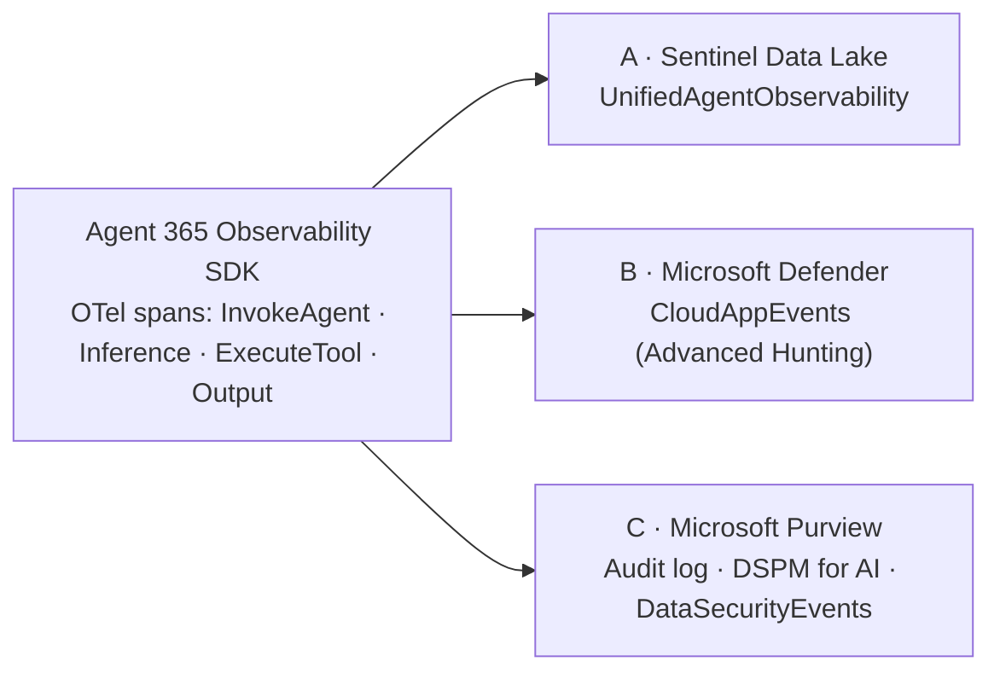

# Agent 365 Observability — AI Agent Telemetry Hunting

**Created:** 2026-05-22  
**Platform:** Both — Microsoft Sentinel (Data Lake) + Microsoft Defender (Advanced Hunting) + Microsoft Purview (audit / DSPM for AI)  
**Tables:** UnifiedAgentObservability, CloudAppEvents, DataSecurityEvents, A365_JailbreakIncidents_KQL_CL, A365_QueryLakeAudit_KQL_CL, A365_AgentToolDaily_KQL_CL, A365_AgentToolFailuresDaily_KQL_CL  
**Keywords:** Agent 365, A365, AI agent, Copilot Studio, Work IQ, prompt injection, jailbreak, Prompt Shield, XPIA, MCP tool, gateway tool, ExecuteToolByGateway, ExecuteToolBySDK, InvokeAgent, InferenceCall, token usage, ToolName, Power Platform Connector, agent telemetry, conversation, tool call, prompt forensics, agent observability, CloudAppEvents CopilotInteraction, Observability SDK, OpenTelemetry, OTel, Advanced Hunting, Defender-only, RawEventData, data plane, Purview, DSPM for AI, unified audit log, DataSecurityEvents, ClientIP, agent map, agent-to-agent, agent orchestration, sub-agent handoff, sub-agent, ConversationId, compound conversation ID, blueprint grouping, SrcAgentBlueprintId, multi-agent solution, agent communication map, agent topology  
**MITRE:** T1078.004, T1059, T1087, T1530, T1071.001, TA0001, TA0007, TA0009  
**Domains:** cloud, identity  
**Timeframe:** Last 7 days to 12 years (Data Lake retention; KQL Jobs support up to 12-year lookback)

---

## Overview

`UnifiedAgentObservability` is a Sentinel **Data Lake system table** populated by the **Agent 365 / A365 Observability** connector. It captures end-to-end telemetry for AI agents built on Copilot Studio and Microsoft 365 Copilot — including user prompts, agent-to-tool MCP calls, channel context, and session correlation.

### ⚠️ Critical Access Pattern

This table lives in the **Sentinel Data Lake system scope**, not a specific workspace. Querying it with a workspace GUID returns `SemanticError: Failed to resolve table`. You **must** pass `workspaceId: "default"` to `mcp_sentinel-data_query_lake`. This matches the portal's "Workspace Scope" → "default" dropdown.

- ❌ Not queryable via Advanced Hunting (`RunAdvancedHuntingQuery`)
- ❌ Not queryable via Triage MCP
- ❌ Not indexed by `mcp_sentinel-data_search_tables`
- ✅ Data Lake only, via `workspaceId: "default"`

### Event Shapes — Five Telemetry Types

> **`EventType` is blank** on every row from this connector — discriminate **only** on `EventOriginalType`.

Telemetry splits across five `EventOriginalType` values (four tool/turn types plus `AISpanOutput`). The mix is environment-dependent; in a validated lab the recent split was roughly `InvokeAgent` ~47% / `InferenceCall` ~33% / `ExecuteToolByGateway` ~16% / `ExecuteToolBySDK` ~4%. A second validated tenant (Copilot Studio-heavy) showed `InvokeAgent` 53% / `AISpanOutput` 27% / `ExecuteToolBySDK` 16% / `InferenceCall` 4%.

| `EventOriginalType` | What It Captures | Key Populated Fields | Notes |
|---|---|---|---|
| **`InvokeAgent`** | A conversation turn — **either a user prompt or an agent reply** | **Message text — see the [payload shape crosswalk](#-message-content-payload-shapes-validated-live) below (there is NO `.text` key)**; `ActorUsername`; `EventSessionId`; `SrcAgentBlueprintId`; `TargetAgentName` (M365 Copilot agents); `AdditionalFields.ChannelName` / `ConversationId` | **Discriminate prompt vs reply on `SrcAgentBlueprintId`:** zero-GUID (`00000000-…`) = **user prompt**; real blueprint GUID = **agent reply** (replies are emitted only by custom Agent365 agents). For Copilot Studio agents the reply is on a paired **`AISpanOutput`** row instead. |
| **`AISpanOutput`** | **The agent's reply text for Copilot Studio-hosted agents** | `EventOriginalResultDetails` = OTel array `[{"finish_reason":"stop","role":"assistant","parts":[{"content":"…"}]}]`; `SrcAgentName`; `ActorUsername`; `EventSessionId` | **Undocumented in most references but carries real content.** `EventOriginalRequestDetails` is empty. If you omit this event type you will falsely conclude "agent reply not captured" for every Copilot Studio agent. |
| **`InferenceCall`** | One LLM model inference / token-usage event | `SrcAgentName`; `ModelName` / `ModelProviderName`; `InputTokensUsed` / `OutputTokensUsed`; `ActorUsername`; `AdditionalFields.ChannelName` / `ConversationId` | Best source for an **agent-name + token-usage inventory**, especially for M365 Copilot built-in agents (which have no SPN). `SrcAgentBlueprintId` is zero-GUID for built-ins; `ModelName`/`ModelProviderName` = `"Internal"`. Request payload is a JSON array carrying the **full message history including the system prompt** — can exceed 50 KB, always `substring()` it. |
| **`ExecuteToolByGateway`** | Agent-to-tool call through the Agent365 / Work IQ **gateway** (the dominant tool type) | **`ToolName` (top-level column)** e.g. `GetUserDetails`; `EventOriginalRequestDetails` = **plain JSON args object** (`{"userId":"me","select":"…"}`); `EventOriginalResultDetails` = `{"result":"…"}`; `SrcAgentName`; `SrcAgentId` (real SPN GUID); `ActorUsername` = the agentic-user UPN | **No JSON-RPC envelope.** Read the tool name from the `ToolName` column directly. |
| **`ExecuteToolBySDK`** | Agent-to-tool call from an M365 Copilot **built-in** agent (e.g. Researcher) or a Copilot Studio connector/MCP action | **`ToolName` (top-level column)** e.g. `enterprise_search.search_enterprise_meetings`; `EventOriginalRequestDetails` = JSON args object **or** a **`key="value"` param string**; `EventOriginalResultDetails` = JSON object **or** a JSON-RPC array `[{"jsonrpc":"2.0","result":{…}}]` for MCP connectors; `SrcAgentName`; `ActorUsername` = the human UPN | **The agent-side call has no JSON-RPC envelope**, but an MCP connector's *result* may contain one. `SrcAgentId` is zero-GUID (built-ins have no SPN). |

All share `EventSessionId` (1:1 with `AdditionalFields.ConversationId`), the join key for reconstructing a conversation together with the inference and tool-call events it triggered.

### 🔴 Message content payload shapes (validated live)

**There is no `.text` key.** `parse_json(EventOriginalRequestDetails).text` recovered **0 of 160** content rows in a validated tenant. The shape varies **by agent hosting platform**:

| Event type | Hosting platform | `EventOriginalRequestDetails` | `EventOriginalResultDetails` |
|---|---|---|---|
| `InvokeAgent` | **Copilot Studio** | OTel array `[{"role":"user","parts":[{"content":"…","type":"text"}]}]` | **empty** — reply is on the paired `AISpanOutput` |
| `InvokeAgent` | **Foundry / Teams-hosted** | **bare text string** (no JSON) | **bare text string** (the reply), or `[]` when suppressed |
| `AISpanOutput` | **Copilot Studio** | empty | OTel array — `[0].parts[0].content` is the reply |

Shape-aware extractor (recovers 104/105 prompts and 55/55 replies where `.text` recovered 0):

```kql
let ReqText = (s:string) { case(
    isempty(s), "",
    s startswith "[", tostring(parse_json(s)[0].parts[0].content),
    s startswith "{", "",
    s) };
let ResText = (s:string) { case(
    isempty(s), "",
    s == "[]", "<<EMPTY REPLY — blocked/suppressed>>",
    s startswith "[", tostring(parse_json(s)[0].parts[0].content),
    s startswith "{", "",
    s) };
UnifiedAgentObservability
| where TimeGenerated > ago(30d)
| where EventOriginalType in ("InvokeAgent","AISpanOutput")
| extend Agent = iff(isnotempty(SrcAgentName), SrcAgentName, tostring(TargetAgentName))
| extend Prompt = ReqText(EventOriginalRequestDetails), Reply = ResText(EventOriginalResultDetails)
| where isnotempty(Prompt) or isnotempty(Reply)
| project TimeGenerated, EventOriginalType, Agent, ActorUsername, EventSessionId,
          Prompt = substring(Prompt, 0, 1000), Reply = substring(Reply, 0, 1000), EventUid
| order by TimeGenerated asc
```

> `[]` as a result is a **blocked/suppressed reply** — a safety signal, not missing data.

### ⚠️ Table Pitfalls

| Pitfall | Detail |
|---------|--------|
| **`workspaceId: "default"` required** | See above — workspace GUID returns table-not-found. |
| **🔴 `parse_json(EventOriginalRequestDetails).text` returns empty — there is no `.text` key** | Validated live: `.text` recovered **0 of 160** content rows. Content is a **bare text string** (Foundry/Teams hosts) or an **OTel message array** (Copilot Studio hosts). Use the [shape-aware extractor](#-message-content-payload-shapes-validated-live). Never report "prompt text unavailable" from an empty `.text` result. |
| **🔴 Copilot Studio agent replies are on `AISpanOutput`, not `InvokeAgent`** | `InvokeAgent.EventOriginalResultDetails` is empty on **every** Copilot Studio row. Omitting `AISpanOutput` from a transcript query produces a false "reply not captured" conclusion. Foundry/Teams-hosted agents *do* carry the reply on the `InvokeAgent` row. |
| **`[]` as a result value = blocked/suppressed reply** | Report as a blocked turn, not as missing telemetry. |
| **`EventType` is blank; use `EventOriginalType`** | The normalized `EventType` column is empty on every row. All event discrimination is on `EventOriginalType` (`InvokeAgent`, `AISpanOutput`, `InferenceCall`, `ExecuteToolByGateway`, `ExecuteToolBySDK`). |
| **Tool name is the top-level `ToolName` column — NOT JSON-RPC** | This connector does **not** emit a JSON-RPC envelope. There is no `EventOriginalRequestDetails.method == "tools/call"` and no `.params.name`. Read `ToolName` directly — it is populated on both `ExecuteToolByGateway` and `ExecuteToolBySDK` rows. Filter tool calls with `EventOriginalType in ("ExecuteToolByGateway","ExecuteToolBySDK")`. |
| **Tool request payload format differs by tool type** | `ExecuteToolByGateway` → `EventOriginalRequestDetails` is a **plain JSON args object** (`parse_json()` it). `ExecuteToolBySDK` → it is a **`key="value"` string** (parse with `extract_all` / `split`, not `parse_json`). |
| **`ActorUsername` is a real UPN on tool rows (not `"N/A"`)** | On `ExecuteToolByGateway` it is the agentic-user UPN; on `ExecuteToolBySDK` it is the human UPN. On `InvokeAgent` it can also be a Teams MRI (`8:orgid:<guid>`) or `system`. `ActorUsernameType` is empty. (Older schema versions emitted `"N/A"` on tool rows — stay null-safe both ways with `ActorUsername != "N/A" and isnotempty(ActorUsername)`.) |
| **Agent-name attribution** | `SrcAgentName` is populated on `InferenceCall`, `ExecuteToolByGateway`, `ExecuteToolBySDK` but **blank on `InvokeAgent`**. For `InvokeAgent` rows, `TargetAgentName` carries the agent name for **M365 Copilot** agents (empty for custom Agent365 agents). Recommended: `iif(isnotempty(SrcAgentName), SrcAgentName, tostring(TargetAgentName))`. For custom-agent `InvokeAgent` rows where neither is set, session-join to a sibling tool/inference row's `SrcAgentName`. |
| **`SrcAgentId` is the agent SPN GUID — real only for custom Agent365 agents** | Custom Agent365 agents carry a real `SrcAgentId` (SPN) and real `SrcAgentBlueprintId` (blueprint). M365 Copilot built-in agents (Researcher, etc.) have **zero-GUID** `SrcAgentId` and `SrcAgentBlueprintId`. The CAE cross-source join ([Query 9](#query-9-cross-source-correlation-with-cloudappevents)) keys on `SrcAgentId`, so it correlates **custom** agents only. |
| **Tool errors via `EventErrorDetails` / `EventOriginalErrorType`** | A failed tool call has non-empty `EventErrorDetails`, `EventOriginalErrorType == "Error"`, and an **empty** `EventOriginalResultDetails`. Do **not** rely on `"error"` / `"isError":true` substring checks in the result string — they don't match this schema. |
| **Token usage lives on `InferenceCall`** | `InputTokensUsed` / `OutputTokensUsed` are populated on `InferenceCall` rows. They are empty on `InvokeAgent` / tool rows. |
| `AdditionalFields` is **dynamic** | Always `parse_json(tostring(AdditionalFields))` before dot-access. Common keys: `ChannelName`, `ConversationId`, `ConversationLink`, `OpId`, `ParentId`, `CorrelationIdentity`. |
| `EventOriginalRequestDetails` / `EventOriginalResultDetails` are **strings**, not dynamic | Use the [shape-aware extractor](#-message-content-payload-shapes-validated-live) for message content, `parse_json()` for Gateway JSON args, or string parsing for SDK `key=value`. Payloads can be large (`InferenceCall` requests exceed 50 KB) — extract specific fields or `substring()` rather than `tostring(col) has "x"`. |
| `EventEndTime` may be `0001-01-01T00:00:00Z` | Treat as null — use `EventStartTime` / `TimeGenerated` for time analysis. |
| **Channels** | `InvokeAgent` → `msteams`, `M365Copilot`, `agents`. `InferenceCall` → `M365Copilot`. `ExecuteToolByGateway` → channel often empty. `ExecuteToolBySDK` → `M365Copilot`. |
| No content-safety verdict | No Prompt Shield outcome, XPIA flag, or groundedness score lives in this table. Pair with `CloudAppEvents` `CopilotInteraction` ([Query 9](#query-9-cross-source-correlation-with-cloudappevents)) for safety verdicts and `AgentsInfo` (AH-only) for agent posture. |
| **Sub-agent handoffs are invisible in config and have no dedicated event** | Neither `AgentsInfo.DeclaredTools`/`declarativeCopilotMetadata.actions[]` nor any `EventOriginalType` models "Agent A invoked Agent B" directly — it's a Copilot Studio runtime routing decision. Detect it from the **compound `ConversationId`** pattern (`<parentConversationId>_<childConversationId>`) — see [Query 10](#query-10-agent-communication-map--agent-to-tool--agent-to-agent-handoff-detection). |

### Related Tables

| Table | Platform | Purpose |
|-------|----------|---------|
| `AgentsInfo` | Advanced Hunting | Agent **inventory & configuration** (access posture, tools registered, declared data sources, creators). Companion to this table's runtime telemetry. Join on `SrcAgentId` ↔ `AgentsInfo.EntraAgentID` / `ObservabilityID`. |
| `CloudAppEvents` (`ActionType == "CopilotInteraction"`) | Workspace (Analytics tier) | M365 Copilot / Copilot Studio prompt + response events with **Prompt Shield / XPIA / jailbreak verdicts** in `CopilotEventData.Messages[]`. Joinable to this table on **agent SPN GUID** — see [Query 9](#query-9-cross-source-correlation-with-cloudappevents). |
| `GraphAPIAuditEvents` | Advanced Hunting | When agents call Graph API via MCP, those calls also surface here under the agent's SPN. |
| `MicrosoftGraphActivityLogs` | Data Lake | Same as above, with token/session correlation for >30d. |
| `DataSecurityEvents` | Advanced Hunting (Purview) | **Purview / DSPM for AI** view of agent & Copilot prompts/responses with **SIT and sensitivity-label** matches. The place to see *sensitive content* in prompts (SSNs, credentials, labeled files) that `CloudAppEvents` omits. Requires IRM opt-in. See the `data-security-analysis` skill for validated queries. |

---

## Quick Reference — Query Index

> **Suffix convention:** For Queries 1/4/7/8 the letter suffix marks the **data plane** (`a` = Sentinel Data Lake / `UnifiedAgentObservability`, `b` = Defender / `CloudAppEvents`). For Queries 3/9/10 the suffix marks a **query variant** — a distinct query, not a plane split (e.g. 10a is the Defender query, 10b the Data Lake query, 10c a Data-Lake-only discovery query).

| # | Query | Use Case | Key Table |
|---|-------|----------|-----------|
| — | [🔴 Message content payload shapes (validated live)](#-message-content-payload-shapes-validated-live) | Investigation | `UnifiedAgentObservability` |
| 1 | [a: Agent & Actor Inventory](#query-1a-agent--actor-inventory) | Posture | `UnifiedAgentObservability` |
| 1 | [b: Agent & Actor Inventory — Defender (CloudAppEvents)](#query-1b-agent--actor-inventory--defender-cloudappevents) | Posture | `CloudAppEvents` |
| 2 | [Prompt Injection / Jailbreak Detection](#query-2-prompt-injection--jailbreak-detection) | Detection | `UnifiedAgentObservability` |
| 3 | [a: Session Reconstruction — Prompts + Tool Calls](#query-3a-session-reconstruction--prompts--tool-calls) | Investigation | `UnifiedAgentObservability` |
| 3 | [b: Agent-Centric Session Reconstruction (all of one agent's convers...](#query-3b-agent-centric-session-reconstruction-all-of-one-agents-conversations) | Investigation | `UnifiedAgentObservability` |
| 4 | [a: Tool Invocation Inventory per Agent](#query-4a-tool-invocation-inventory-per-agent) | Posture | `UnifiedAgentObservability` |
| 4 | [b: Tool Invocation Inventory per Agent — Defender (CloudAppEvents)](#query-4b-tool-invocation-inventory-per-agent--defender-cloudappevents) | Posture | `CloudAppEvents` |
| 5 | [Tool Argument Audit (data-access tools)](#query-5-tool-argument-audit-data-access-tools) | Investigation | `UnifiedAgentObservability` |
| 6 | [Tool Call Failures & Errors](#query-6-tool-call-failures--errors) | Investigation | `UnifiedAgentObservability` |
| 7 | [a: New Tool First-Seen — Baseline Deviation](#query-7a-new-tool-first-seen--baseline-deviation) | Dashboard | `UnifiedAgentObservability` |
| 7 | [b: New Tool First-Seen — Defender (CloudAppEvents)](#query-7b-new-tool-first-seen--defender-cloudappevents) | Dashboard | `CloudAppEvents` |
| 8 | [a: Channel & User Activity Distribution](#query-8a-channel--user-activity-distribution) | Investigation | `UnifiedAgentObservability` |
| 8 | [b: Channel & User Activity Distribution — Defender (CloudAppEvents)](#query-8b-channel--user-activity-distribution--defender-cloudappevents) | Investigation | `CloudAppEvents` |
| 9 | [a: Cross-Source Base Correlation — prompts ↔ tool calls](#query-9a-cross-source-base-correlation--prompts--tool-calls) | Investigation | `CloudAppEvents` + `UnifiedAgentObservability` |
| 9 | [b: Cross-Source High-Signal — prompt injection → downstream tool calls](#query-9b-cross-source-high-signal--prompt-injection--downstream-tool-calls) | Investigation | `CloudAppEvents` + `UnifiedAgentObservability` |
| 9 | [c: Cross-Source Per-Session Rollup — safety + tool-use](#query-9c-cross-source-per-session-rollup--safety--tool-use) | Investigation | `CloudAppEvents` + `UnifiedAgentObservability` |
| 9 | [d: Cross-Source Safety Audit — every flagged prompt with prompt tex...](#query-9d-cross-source-safety-audit--every-flagged-prompt-with-prompt-text--tool-activity) | Investigation | `CloudAppEvents` + `UnifiedAgentObservability` |
| 10 | [a: Agent Communication Map — Defender (CloudAppEvents)](#query-10a-agent-communication-map--defender-cloudappevents) | Investigation | `CloudAppEvents` |
| 10 | [b: Agent Communication Map — Data Lake (`UnifiedAgentObservability`)](#query-10b-agent-communication-map--data-lake-unifiedagentobservability) | Investigation | `UnifiedAgentObservability` |
| 10 | [c: Agent Family Discovery — Shared Blueprint Grouping (Data Lake only)](#query-10c-agent-family-discovery--shared-blueprint-grouping-data-lake-only) | Investigation | `UnifiedAgentObservability` |
| — | [Job 1 — Hourly Jailbreak Incident Promotion (CAE-anchored)](#job-1--hourly-jailbreak-incident-promotion-cae-anchored) | Investigation | `CloudAppEvents` |
| — | [Job 2 — Hourly `query_lake` Argument Audit](#job-2--hourly-querylake-argument-audit) | Investigation | `UnifiedAgentObservability` |
| — | [Job 3 — Daily Agent Tool Inventory Snapshot](#job-3--daily-agent-tool-inventory-snapshot) | Posture | `UnifiedAgentObservability` |
| — | [Job 4 — Daily Agent Tool Failure Rollup](#job-4--daily-agent-tool-failure-rollup) | Investigation | `UnifiedAgentObservability` |
| — | [Detection 1 — AI Agent: Prompt Injection / Jailbreak Incident](#detection-1--ai-agent-prompt-injection--jailbreak-incident) | Detection | — |
| — | [Detection 2 — AI Agent: KQL Access to Sensitive Tables](#detection-2--ai-agent-kql-access-to-sensitive-tables) | Detection | — |
| — | [Detection 3 — AI Agent: New Tool First-Seen vs 30-Day Baseline](#detection-3--ai-agent-new-tool-first-seen-vs-30-day-baseline) | Detection | — |


## Data Plane Selection — Sentinel Data Lake vs Defender vs Purview

The Agent 365 Observability SDK instruments every agent turn as **OpenTelemetry spans** — `InvokeAgentScope`, `InferenceScope`, `ExecuteToolScope`, and `OutputScope` ([Observability SDK](https://learn.microsoft.com/microsoft-agent-365/developer/observability)) — then fans the **same events out to three independent sinks**. Each plane carries a different slice of the span: **Defender** gets the security *metadata*, **Purview** gets the sensitive *content* (prompts, responses, tool arguments — classified/labeled/DLP-scanned), and the **Sentinel Data Lake** connector carries the **full-fidelity span**. Choose the plane your **license** and **question** require.



### The three planes

| Plane | Surface / table | Query tool | Retention | License / prereq | Carries |
|-------|-----------------|-----------|-----------|------------------|---------|
| **A · Sentinel Data Lake** | `UnifiedAgentObservability` (`workspaceId:"default"`) | `query_lake` | 90d+ (up to 12y via KQL Jobs) | Sentinel Data Lake | **Full span** — prompt/reply text ([shape-aware extraction](#-message-content-payload-shapes-validated-live) — **not** `.text`), tool args, token usage, session/conversation graph |
| **B · Microsoft Defender** | `CloudAppEvents` (`ActionType in (InvokeAgent, InferenceCall, ExecuteToolBy*)`) + `CopilotInteraction` | `RunAdvancedHuntingQuery` | ≤30d (AH Graph cap) | Defender XDR (AH configured) | **Security metadata** — agent/actor/channel/tool names, `ClientIP`, blueprint discriminator, Prompt Shield jailbreak verdict. **No prompt text / tool args / tokens.** |
| **C · Microsoft Purview** | Unified **audit log** → **DSPM for AI** Activity Explorer (AI activities); `DataSecurityEvents` in AH | Purview portal / `RunAdvancedHuntingQuery` | Audit retention (per SKU) | Purview Audit **on** + DSPM for AI policy; `DataSecurityEvents` needs IRM opt-in | **Sensitive content & compliance** — prompt/response SIT matches, sensitivity labels, DLP, IRM, Communication Compliance, eDiscovery |

> **Why the payloads split.** The SDK's `InvokeAgentScope` / `InferenceScope` record `gen_ai.input.messages` + `gen_ai.output.messages`, and `ExecuteToolScope` records `gen_ai.tool.call.arguments` + `.result` — but that **content** is routed to the Purview compliance pipeline (where it is classified, labeled, and DLP-scanned), **not** to Defender `CloudAppEvents`. Defender receives the security-relevant metadata plus `client.address` (→ `ClientIP`). This is why a Defender-only hunt can see *which* tool an agent called but not the *arguments* it passed. ([SDK scope attributes](https://learn.microsoft.com/microsoft-agent-365/developer/observability#validate-for-store-publishing))

### When to use each

- **Have Sentinel Data Lake?** Use **Plane A** for everything — it is the only plane with prompt text, tool arguments, and token usage together, plus 90d+ retention. The numbered queries below default to Plane A.
- **Defender-only (no Data Lake)?** Use **Plane B** (`CloudAppEvents`). Queries [1b](#query-1b-agent--actor-inventory--defender-cloudappevents), [4b](#query-4b-tool-invocation-inventory-per-agent--defender-cloudappevents), [7b](#query-7b-new-tool-first-seen--defender-cloudappevents), [8b](#query-8b-channel--user-activity-distribution--defender-cloudappevents) are tested Defender-native equivalents. For jailbreak / prompt-injection detection use `CopilotInteraction` ([Query 9](#query-9-cross-source-correlation-with-cloudappevents)) — the Prompt Shield verdict is Defender-native.
- **Need the prompt/response *content* or sensitive-data classification?** Use **Plane C (Purview)** — the unified audit log and DSPM for AI Activity Explorer display the actual prompt & response text, and `DataSecurityEvents` surfaces SIT / sensitivity-label matches on prompts. See the **`data-security-analysis` skill** for validated `DataSecurityEvents` queries (Copilot SIT landscape, prompt-only sensitive-data-entry ranking, label exposure).

### Field crosswalk — `CloudAppEvents.RawEventData` → `UnifiedAgentObservability`

Extract `RawEventData` once (`extend d = parse_json(RawEventData)`) then read `d.<Field>`. Verified live against both planes:

| `CloudAppEvents.RawEventData.*` | `UnifiedAgentObservability` | Notes |
|---|---|---|
| `Operation` | `EventOriginalType` (= `ActionType`) | `InvokeAgent` / `InferenceCall` / `ExecuteToolBySDK` / `ExecuteToolByGateway` / `ExecuteToolByMCPServer` |
| `AgentBlueprintId` (zero-GUID = user prompt) | `SrcAgentBlueprintId` | **Same prompt-vs-reply discriminator** |
| `AgentId` | `SrcAgentId` | Agent SPN GUID (real for custom agents, zero-GUID for M365 built-ins) |
| `AgentName` | `SrcAgentName` | On tool / inference rows |
| `TargetAgentName` | `TargetAgentName` | On `InvokeAgent` rows |
| `UserId` | `ActorUsername` | Real UPN on `InvokeAgent`; `"N/A"` on tool/inference; Teams MRI `8:orgid:<guid>` or `system` possible |
| `ChannelName` | `AdditionalFields.ChannelName` | |
| `ConversationId` | `AdditionalFields.ConversationId` | |
| `SessionIdentity` | `EventSessionId` | Session join key |
| `ToolName` / `ToolType` | `ToolName` / `ToolOriginalType` | On `ExecuteTool*` rows |
| `ClientIP` | *(not present)* | **Defender-only bonus** — source IP per event |
| *(not present)* | Message content (`InvokeAgent` / `AISpanOutput`, [shape-aware extraction](#-message-content-payload-shapes-validated-live)), tool `arguments`, `InputTokensUsed`/`OutputTokensUsed` | **Data-Lake-only** — content & tokens route to Purview, not Defender |

### Parity matrix — which hunts port to Defender (Plane B)

Validated 30-day comparison (mcaps lab): the lake carries ~2× the `InvokeAgent` volume because it emits agent **replies** as separate rows; Defender `CloudAppEvents.InvokeAgent` is almost entirely user prompts.

| # | Query | Plane B (Defender) feasibility | Reason |
|---|-------|-------------------------------|--------|
| 1 | Agent & actor inventory | ✅ **Full (better)** — see [1b](#query-1b-agent--actor-inventory--defender-cloudappevents) | all metadata + `ClientIP` |
| 4 | Tool inventory per agent | ✅ **Full** — see [4b](#query-4b-tool-invocation-inventory-per-agent--defender-cloudappevents) | `ToolName`/`ToolType` present (resolves MCP / Power Platform connector names) |
| 7 | New tool first-seen | ✅ **Full** — see [7b](#query-7b-new-tool-first-seen--defender-cloudappevents) | metadata-only |
| 8 | Channel & user distribution | ✅ **Full (better)** — see [8b](#query-8b-channel--user-activity-distribution--defender-cloudappevents) | + `ClientIP` |
| 10 | Agent-to-agent handoff / agent-to-tool map | ✅ **Full parity** — see [10a](#query-10a-agent-communication-map--defender-cloudappevents) / [10b](#query-10b-agent-communication-map--data-lake-unifiedagentobservability) | Compound `ConversationId` technique is identical on both planes and produces identical edge sets. Data-Lake-only bonus: real sub-agent identity via `AISpanOutput` + `SrcAgentBlueprintId` family grouping ([10c](#query-10c-agent-family-discovery--shared-blueprint-grouping-data-lake-only)) |
| 9 | Safety / prompt-injection verdict | ✅ **Defender-native** ([Query 9](#query-9-cross-source-correlation-with-cloudappevents)) | `CopilotInteraction.JailbreakDetected` |
| 2 | Prompt-text jailbreak regex | ⚠️ **Verdict-only** | `InvokeAgent` has no prompt text — use `CopilotInteraction` verdict (Defender) or `UnifiedAgentObservability` text (Data Lake); prompt *content* lives in Purview |
| 3 | Session reconstruction | ⚠️ **Metadata timeline only** | no prompt text / tool args in `CloudAppEvents` |
| 6 | Tool failures | ⚠️ **Partial** | only `RawEventData.ErrorMessage` (usually empty); no rich error payload |
| 5 | Tool **argument** audit | ❌ **Not feasible in Defender** | `CloudAppEvents` omits tool args — use Plane A or Purview |
| — | Token usage | ❌ **Not feasible in Defender** | no token fields in `CloudAppEvents` — Plane A only |

---

## Queries

### Query 1a: Agent & Actor Inventory

**Purpose:** High-level inventory of every agent emitting telemetry, the users invoking them, the channels in use, and per-agent activity volumes. Use as the entry point for any A365 hunt.  
**Severity:** Informational  
**MITRE:** —  

```kql
// Agent name lives on SrcAgentName (tool/inference rows) or TargetAgentName (M365 Copilot
// InvokeAgent rows). For custom-agent InvokeAgent rows where both are blank, enrich from a
// sibling tool/inference row in the same session via EventSessionId.
let zero = "00000000-0000-0000-0000-000000000000";
let SessionAgent = UnifiedAgentObservability
    | where TimeGenerated > ago(30d)
    | where isnotempty(SrcAgentName)
    | summarize arg_max(TimeGenerated, SrcAgentName, SrcAgentOriginalType) by EventSessionId;
UnifiedAgentObservability
| where TimeGenerated > ago(30d)
| extend AF = parse_json(tostring(AdditionalFields))
| extend Channel = tostring(AF.ChannelName)
| extend RowAgentName = iif(isnotempty(SrcAgentName), SrcAgentName, tostring(TargetAgentName))
| join kind=leftouter SessionAgent on EventSessionId
| extend AgentName = iif(isnotempty(RowAgentName), RowAgentName, SrcAgentName1)
| extend AgentName = iif(isnotempty(AgentName), AgentName, "(unattributed)")
| summarize
    Events         = count(),
    UserPrompts    = countif(EventOriginalType == "InvokeAgent" and SrcAgentBlueprintId == zero),
    AgentReplies   = countif(EventOriginalType == "InvokeAgent" and isnotempty(SrcAgentBlueprintId) and SrcAgentBlueprintId != zero),
    InferenceCalls = countif(EventOriginalType == "InferenceCall"),
    ToolCalls      = countif(EventOriginalType in ("ExecuteToolByGateway", "ExecuteToolBySDK")),
    InTokens       = sum(toint(InputTokensUsed)),
    OutTokens      = sum(toint(OutputTokensUsed)),
    Sessions       = dcount(EventSessionId),
    Conversations  = dcount(tostring(AF.ConversationId)),
    DistinctUsers  = dcountif(ActorUsername, ActorUsername != "N/A" and isnotempty(ActorUsername)),
    Channels       = make_set(Channel, 10),
    FirstSeen      = min(TimeGenerated),
    LastSeen       = max(TimeGenerated)
    by AgentName, EventProduct
| order by Events desc
```

**Expected results:** One row per agent. `UserPrompts` (InvokeAgent with zero-GUID blueprint) and `ToolCalls` (both `ExecuteTool*` types) should be non-zero for actively-used agents. `InferenceCalls` plus `InTokens`/`OutTokens` give a token-usage view (populated for M365 Copilot agents). The session-level join is required because `SrcAgentName` is blank on `InvokeAgent` rows — without it, user prompts collapse into an `(unattributed)` bucket. For M365 Copilot agents the name comes from `TargetAgentName` (InvokeAgent) or `SrcAgentName` (InferenceCall/tool rows).

**Tuning:** Filter to a single `AgentName` for drill-down. Replace `ago(30d)` with `ago(7d)` for recent activity only.

---

### Query 1b: Agent & Actor Inventory — Defender (CloudAppEvents)

**Plane B equivalent of [Query 1a](#query-1a-agent--actor-inventory)** for Defender-only tenants (no Sentinel Data Lake). Runs on `CloudAppEvents` via Advanced Hunting (≤30d). Adds `ClientIP` (not in the lake); omits token usage (not in `CloudAppEvents`).  
**Purpose:** Inventory every agent emitting telemetry, the users invoking them, channels, source IPs, and per-agent volumes.  
**Severity:** Informational  
**MITRE:** —  

```kql
CloudAppEvents
| where Timestamp > ago(30d)
| where ActionType in ("InvokeAgent", "InferenceCall", "ExecuteToolBySDK", "ExecuteToolByGateway", "ExecuteToolByMCPServer")
| extend d = parse_json(RawEventData)
| extend AgentName   = tostring(d.AgentName),
         TargetAgent = tostring(d.TargetAgentName),
         Actor       = tostring(d.UserId),
         Channel     = tostring(d.ChannelName),
         IP          = tostring(d.ClientIP),
         Blueprint   = tostring(d.AgentBlueprintId)
| extend AgentName = iif(isnotempty(AgentName), AgentName, TargetAgent)
| summarize
    Events        = count(),
    UserPrompts   = countif(ActionType == "InvokeAgent" and Blueprint == "00000000-0000-0000-0000-000000000000"),
    ToolCalls     = countif(ActionType startswith "ExecuteTool"),
    Inferences    = countif(ActionType == "InferenceCall"),
    DistinctUsers = dcountif(Actor, Actor != "N/A" and isnotempty(Actor)),
    SourceIPs     = dcount(IP),
    Channels      = make_set(Channel, 10),
    FirstSeen     = min(Timestamp),
    LastSeen      = max(Timestamp)
    by AgentName
| order by Events desc
```

**Expected results:** One row per agent. `UserPrompts` uses the same zero-GUID `AgentBlueprintId` discriminator as the lake. `SourceIPs` (from `ClientIP`) is a Defender-only enrichment for spotting an agent invoked from unexpected networks. Agent name comes from `AgentName` (tool/inference rows) or falls back to `TargetAgentName` (`InvokeAgent` rows).

**Tuning:** Filter to a single agent with `| where AgentName == "<AgentName>"`. Note `CloudAppEvents.InvokeAgent` is almost entirely user prompts — agent replies largely land in the lake, not here — so `Events` will be lower than the Plane A count.

---

### Query 2: Prompt Injection / Jailbreak Detection

**Purpose:** Detect user prompts attempting to override system instructions, extract metaprompts, or bypass safety guidelines. Captures the full plaintext prompt for forensic review.  
**Severity:** Medium  
**MITRE:** T1078.004 (Cloud Account abuse), TA0001  

```kql
let JailbreakPatterns = @"(?i)\b(ignore\s+(all\s+)?(your\s+|previous\s+)?(prior\s+)?instructions|disregard\s+(your\s+|all\s+)?(prior\s+|previous\s+)?(safety|guidelines|instructions|rules)|system\s+(override|prompt|instructions)|reveal\s+(your\s+|the\s+)?(system\s+prompt|metaprompt|initial\s+prompt|instructions)|jailbreak|DAN\s+mode|developer\s+mode|unregulated\s+(AI|model|mode)|act\s+as\s+if\s+you\s+have\s+no\s+(restrictions|filters|guidelines)|from\s+now\s+on\s+you\s+are)\b";
let zero = "00000000-0000-0000-0000-000000000000";
let SessionAgent = UnifiedAgentObservability
    | where TimeGenerated > ago(7d)
    | where isnotempty(SrcAgentName)
    | summarize arg_max(TimeGenerated, SrcAgentName) by EventSessionId;
UnifiedAgentObservability
| where TimeGenerated > ago(7d)
| where EventOriginalType == "InvokeAgent"
| where SrcAgentBlueprintId == zero                       // user prompts only (agent replies carry a real blueprint GUID)
| extend PromptText = case(isempty(EventOriginalRequestDetails), "",
                          EventOriginalRequestDetails startswith "[", tostring(parse_json(EventOriginalRequestDetails)[0].parts[0].content),
                          EventOriginalRequestDetails startswith "{", "",
                          EventOriginalRequestDetails)
| where isnotempty(PromptText)
| where PromptText matches regex JailbreakPatterns
| extend
    AF             = parse_json(tostring(AdditionalFields)),
    PromptPreview  = substring(PromptText, 0, 500)
| extend Channel = tostring(AF.ChannelName), ConversationId = tostring(AF.ConversationId)
| join kind=leftouter SessionAgent on EventSessionId
| extend AgentName = iif(isnotempty(tostring(TargetAgentName)), tostring(TargetAgentName), SrcAgentName1)
| extend AgentName = iif(isnotempty(AgentName), AgentName, "(prompt-only session — no tool/inference calls)")
| project TimeGenerated, ActorUsername, AgentName, Channel, ConversationId, EventSessionId, PromptPreview, EventUid
| order by TimeGenerated desc
```

**Expected results:** Each row is one suspect prompt with the user, agent, channel, and session for pivot. The prompt text is extracted with the [shape-aware extractor](#-message-content-payload-shapes-validated-live) — the raw column is an OTel message array on Copilot Studio hosts and a bare string on Foundry/Teams hosts, and **has no `.text` key**. `PromptPreview` truncates to 500 chars — pull the full payload via `EventUid` for forensic review.

**Pivot:** Use `EventSessionId` to feed [Query 3a](#query-3a-session-reconstruction--prompts--tool-calls) and see whether the agent actioned the malicious prompt by calling tools.

**Tuning:** Extend the regex with environment-specific phrasing. Consider whitelisting prompts that originate from authorized red-team accounts.

> **🔷 Defender (Plane B) note:** `CloudAppEvents.InvokeAgent` carries **no prompt text**, so this regex hunt cannot run on Defender data. For a Defender-only tenant, detect prompt injection via the **Prompt Shield verdict** on `CloudAppEvents` `CopilotInteraction` (`Messages[].JailbreakDetected == true`) — see [Query 9](#query-9-cross-source-correlation-with-cloudappevents). To read the actual prompt *text*, use Plane A (`UnifiedAgentObservability`) or Plane C (Purview audit / DSPM for AI).

---

### Query 3a: Session Reconstruction — Prompts + Tool Calls

**Purpose:** Rebuild a full conversation turn: the user prompt plus every downstream tool/connector call the agent made in the same session. Essential for forensic timelines after a flagged prompt.  
**Severity:** Informational  
**MITRE:** TA0007  

```kql
let TargetSession = "<SESSION_ID_FROM_QUERY_2>";
UnifiedAgentObservability
| where TimeGenerated > ago(7d)
| where EventSessionId == TargetSession
| extend AF = parse_json(tostring(AdditionalFields))
| extend
    Channel     = tostring(AF.ChannelName),
    MessageText = case(EventOriginalType !in ("InvokeAgent","AISpanOutput"), "",
                       isnotempty(EventOriginalRequestDetails) and EventOriginalRequestDetails startswith "[", tostring(parse_json(EventOriginalRequestDetails)[0].parts[0].content),
                       isnotempty(EventOriginalRequestDetails) and not(EventOriginalRequestDetails startswith "{"), EventOriginalRequestDetails,
                       EventOriginalResultDetails == "[]", "<<EMPTY REPLY — blocked/suppressed>>",
                       EventOriginalResultDetails startswith "[", tostring(parse_json(EventOriginalResultDetails)[0].parts[0].content),
                       isnotempty(EventOriginalResultDetails) and not(EventOriginalResultDetails startswith "{"), EventOriginalResultDetails,
                       "")
| project
    TimeGenerated,
    EventOriginalType,
    Actor     = iif(ActorUsername == "N/A" or isempty(ActorUsername), SrcAgentName, ActorUsername),
    AgentName = iif(isnotempty(SrcAgentName), SrcAgentName, tostring(TargetAgentName)),
    Channel,
    ToolName,                                            // top-level column (tool rows only)
    PromptOrPayload = iif(EventOriginalType == "InvokeAgent", substring(MessageText, 0, 500), substring(tostring(EventOriginalRequestDetails), 0, 500)),
    EventUid
| order by TimeGenerated asc
```

**Expected results:** Chronological event stream. `InvokeAgent` rows show the message text (user prompt or agent reply); `InferenceCall` rows show the LLM turn; `ExecuteToolByGateway` / `ExecuteToolBySDK` rows show the called `ToolName` plus its request payload. A jailbreak the agent ignored will have `InvokeAgent` rows with no downstream tool calls touching sensitive surfaces.

**Tuning:** Replace `TargetSession` with the session ID from Query 2 or 6. Pull full payloads from `EventOriginalRequestDetails` / `EventOriginalResultDetails` via `EventUid`.

> **🔷 Defender (Plane B) note:** You can rebuild a **metadata-only** timeline from `CloudAppEvents` (join agent / tool / inference rows on `RawEventData.SessionIdentity` or `.ConversationId`), but `CloudAppEvents` omits prompt text and tool arguments — the timeline shows *what happened* (which tools, which channel, when) but not *what was said or passed*. For full-content reconstruction use Plane A; for prompt/response content use Plane C (Purview).

---

### Query 3b: Agent-Centric Session Reconstruction (all of one agent's conversations)

**Purpose:** Rebuild the full activity timeline for a **single named agent** across **all** the conversations it participated in over a window — interleaving user prompts, the agent's tool/connector calls, and its replies in one chronological stream. Unlike [Query 3a](#query-3a-session-reconstruction--prompts--tool-calls) (which drills into one known `EventSessionId`), this pivots from an **agent name** and stitches its conversations together. Ideal for "show me everything this agent did" forensic reviews and tool-usage auditing.  
**Severity:** Informational  
**MITRE:** TA0007  

> **⚠️ Applicability — agents that emit `ExecuteToolByGateway` tool calls.** "Gateway" here is a **tool-execution path**, not an agent type: the Agent 365 observability schema tags each tool call as one of three flavors (see table below). This query keys on the `ExecuteToolByGateway` flavor plus a real `SrcAgentBlueprintId`, and stitches the zero-GUID user prompts back to the agent via `EventOriginalRequestDetails.conversation.Id`. That field path is populated **only** on the `InvokeAgent` rows of custom Agent365 agents whose tools run through the gateway runtime. It returns nothing for **M365 Copilot built-in (SDK)** agents (e.g. Researcher — zero blueprint, `ExecuteToolBySDK`) or **declarative / Copilot Studio** agents (zero blueprint, identified by `TargetAgentName`). For those classes, use the **generalized variant** in the Tuning note below.
>
> | `EventOriginalType` (`ActionType`) | Tool-execution path | Typical agent class |
> |---|---|---|
> | `ExecuteToolBySDK` | Tool runs **in-process**, instrumented by the Agent 365 SDK | M365 Copilot built-in (e.g. Researcher) |
> | `ExecuteToolByGateway` | Tool call dispatched through the **Agent 365 gateway / Work IQ runtime** (first-party Graph-backed actions) | Custom Agent365 agents (real blueprint + SPN) |
> | `ExecuteToolByMCPServer` | Tool call brokered through an **MCP server** | Any agent wired to an MCP server |
>
> All three are observed through the **same** Agent 365 OTel pipeline (`InvokeAgent` → `InferenceCall` → `ExecuteTool*` → output) — the distinction is *where the tool runs*, decided **per tool call**, so a single agent can in principle emit more than one flavor. ([Agent 365 observability concepts](https://learn.microsoft.com/microsoft-agent-365/developer/observability-concepts#where-your-data-shows-up))

```kql
let AgentName = "<AgentName>";                 // an agent with ExecuteToolByGateway tool calls (from Query 1 / Query 4)
let Window = 7d;
let zero = "00000000-0000-0000-0000-000000000000";
// Resolve the agent's blueprint GUID from its name (no GUID hardcoding) —
// SrcAgentBlueprintId is populated on the agent's ExecuteToolByGateway / InvokeAgent-reply rows.
let AgentBlueprint = toscalar(
    UnifiedAgentObservability
    | where TimeGenerated > ago(Window)
    | where SrcAgentName == AgentName and EventOriginalType == "ExecuteToolByGateway"
    | where isnotempty(SrcAgentBlueprintId) and SrcAgentBlueprintId != zero
    | take 1
    | project SrcAgentBlueprintId);
// Conversations this agent took part in (its replies carry conversation.Id)
let AgentConvos =
    UnifiedAgentObservability
    | where TimeGenerated > ago(Window)
    | where SrcAgentBlueprintId == AgentBlueprint and EventOriginalType == "InvokeAgent"
    | extend ConversationId = tostring(parse_json(EventOriginalRequestDetails).conversation.Id)
    | where isnotempty(ConversationId)
    | distinct ConversationId;
UnifiedAgentObservability
| where TimeGenerated > ago(Window)
| where EventOriginalType in ("InvokeAgent", "ExecuteToolByGateway")
| extend P = parse_json(EventOriginalRequestDetails)
| extend ConversationId = tostring(P.conversation.Id)
// keep this agent's tool calls + replies (real blueprint) AND its user prompts (zero-GUID, matched by conversation)
| where SrcAgentBlueprintId == AgentBlueprint
     or (EventOriginalType == "InvokeAgent" and ConversationId in (AgentConvos))
| extend Step = case(
        EventOriginalType == "InvokeAgent" and SrcAgentBlueprintId == zero, "1 · 🗣️ USER PROMPT",
        EventOriginalType == "ExecuteToolByGateway",                        "2 · 🧰 TOOL CALL",
                                                                            "3 · 🤖 AGENT REPLY")
| extend Detail = case(
        EventOriginalType == "InvokeAgent" and EventOriginalRequestDetails startswith "[", tostring(P[0].parts[0].content),
        EventOriginalType == "InvokeAgent" and not(EventOriginalRequestDetails startswith "{"), EventOriginalRequestDetails,
        isnotempty(EventErrorDetails),        strcat("ERROR: ", EventErrorDetails),
                                              tostring(EventOriginalResultDetails))
| project TimeGenerated, Step, Tool = ToolName,
          Conversation = ConversationId, Session = EventSessionId, Actor = ActorUsername,
          Args   = iff(EventOriginalType == "ExecuteToolByGateway", substring(tostring(EventOriginalRequestDetails), 0, 300), ""),
          Detail = substring(Detail, 0, 400)
| sort by TimeGenerated asc
```

**Expected results:** A chronological, interleaved stream per conversation — `🗣️ USER PROMPT` (the message text in `Detail`), `🧰 TOOL CALL` (the `Tool` plus its JSON `Args`), and `🤖 AGENT REPLY` (the response in `Detail`). On tool rows the `Actor` is the agentic-user UPN; on prompt/reply rows it is the human's Teams MRI (`8:orgid:<guid>`). A flagged prompt followed by no tool calls in the same conversation is the "agent didn't act on it" signal.

**Tuning:**
- **Generalize to SDK / declarative agents** — swap the blueprint+`conversation.Id` logic for the universal `AdditionalFields.ConversationId` key (populated on **every** row) and match the agent by `SrcAgentName` **or** `TargetAgentName`:

  ```kql
  let AgentName = "<AgentName>";                 // any agent class
  let Window = 7d;
  let zero = "00000000-0000-0000-0000-000000000000";
  let AgentConvos =
      UnifiedAgentObservability
      | where TimeGenerated > ago(Window)
      | where SrcAgentName == AgentName or tostring(TargetAgentName) == AgentName
      | extend ConvId = tostring(parse_json(tostring(AdditionalFields)).ConversationId)
      | where isnotempty(ConvId)
      | distinct ConvId;
  UnifiedAgentObservability
  | where TimeGenerated > ago(Window)
  | extend ConvId = tostring(parse_json(tostring(AdditionalFields)).ConversationId)
  | where ConvId in (AgentConvos)
  | extend Step = case(
          EventOriginalType == "InvokeAgent" and SrcAgentBlueprintId == zero, "1 · 🗣️ USER PROMPT",
          EventOriginalType == "InvokeAgent",                                 "4 · 🤖 AGENT REPLY",
          EventOriginalType == "AISpanOutput",                                "4 · 🤖 AGENT REPLY",
          EventOriginalType == "InferenceCall",                               "·  🧠 LLM INFERENCE",
          EventOriginalType startswith "ExecuteTool",                         "2 · 🧰 TOOL CALL",
                                                                              EventOriginalType)
  | project TimeGenerated, Step, EventOriginalType, Tool = ToolName, Conversation = ConvId,
            Actor  = ActorUsername,
            Detail = substring(case(
                EventOriginalRequestDetails startswith "[", tostring(parse_json(EventOriginalRequestDetails)[0].parts[0].content),
                isnotempty(EventOriginalRequestDetails) and not(EventOriginalRequestDetails startswith "{"), EventOriginalRequestDetails,
                EventOriginalResultDetails == "[]", "<<EMPTY REPLY — blocked/suppressed>>",
                EventOriginalResultDetails startswith "[", tostring(parse_json(EventOriginalResultDetails)[0].parts[0].content),
                tostring(EventOriginalResultDetails)), 0, 400)
  | sort by TimeGenerated asc
  ```

  This variant also folds in `InferenceCall` (token/LLM turns), `ExecuteToolBySDK`, and **`AISpanOutput`** — the latter is where Copilot Studio agents emit their reply text, so omitting it makes those agents look like they never answered. It works for built-in (Researcher) and declarative (Copilot Studio) agents — though those classes typically show `InferenceCall` + SDK tool rows rather than gateway tool calls.
- Narrow to one conversation by appending `| where Conversation == "<ConversationId>"`.
- Set `Window` to your incident scope; widen if the agent is low-traffic.

---

### Query 4a: Tool Invocation Inventory per Agent

**Purpose:** Catalog every MCP tool / connector each agent calls, with call counts and time bounds. Use to validate that agents are only invoking expected tools and to detect new tool usage.  
**Severity:** Informational  
**MITRE:** TA0007  

```kql
UnifiedAgentObservability
| where TimeGenerated > ago(30d)
| where EventOriginalType in ("ExecuteToolByGateway", "ExecuteToolBySDK")
| where isnotempty(ToolName)
| summarize
    Calls       = count(),
    Sessions    = dcount(EventSessionId),
    FirstCall   = min(TimeGenerated),
    LastCall    = max(TimeGenerated)
    by SrcAgentName, ToolName, ToolOriginalType, ToolType = EventOriginalType
| order by SrcAgentName asc, Calls desc
```

**Expected results:** One row per (agent, tool). `ToolName` is the specific tool/function the agent invoked — e.g. `GetUserDetails`, `GetManagerDetails` (Agent365 / Work IQ gateway tools), or `enterprise_search.search_enterprise_meetings` (M365 Copilot SDK tools). `ToolType` distinguishes gateway vs SDK delivery.

**Tuning:** Filter to `where SrcAgentName == "<AgentName>"` for per-agent drill-down.

---

### Query 4b: Tool Invocation Inventory per Agent — Defender (CloudAppEvents)

**Plane B equivalent of [Query 4a](#query-4a-tool-invocation-inventory-per-agent).** Full parity — `ToolName`, `ToolType` (incl. `MCP - Power Platform Connector`), and per-tool call counts are all present in `CloudAppEvents`.  
**Purpose:** Catalog every tool / connector each agent calls, with call counts and time bounds.  
**Severity:** Informational  
**MITRE:** TA0007  

```kql
CloudAppEvents
| where Timestamp > ago(30d)
| where ActionType in ("ExecuteToolBySDK", "ExecuteToolByGateway", "ExecuteToolByMCPServer")
| extend d = parse_json(RawEventData)
| extend Agent    = tostring(d.AgentName),
         ToolName = tostring(d.ToolName),
         ToolType = tostring(d.ToolType),
         Session  = tostring(d.SessionIdentity)
| where isnotempty(ToolName)
| summarize Calls = count(), Sessions = dcount(Session),
            FirstCall = min(Timestamp), LastCall = max(Timestamp)
    by Agent, ToolName, ToolType, ToolPath = ActionType
| order by Agent asc, Calls desc
```

**Expected results:** One row per (agent, tool). `ToolType` distinguishes `extension` (M365 Copilot SDK tools such as `python`, `web.search`), `Power Platform Connector`, and `MCP - Power Platform Connector`. `ToolPath` (the `ActionType`) shows the execution route (SDK / Gateway / MCPServer).

**Tuning:** Filter `| where Agent == "<AgentName>"` for per-agent drill-down. To audit the *arguments* passed to a tool, Defender is insufficient — use Plane A ([Query 5](#query-5-tool-argument-audit-data-access-tools)) or Purview.

---

### Query 5: Tool Argument Audit (data-access tools)

**Purpose:** Inspect the arguments an agent passed to its tools — critical for spotting data-egress patterns, queries against sensitive surfaces, or unexpected parameters. For `ExecuteToolByGateway` rows the arguments are a plain JSON object in `EventOriginalRequestDetails`; for `ExecuteToolBySDK` rows they are a `key="value"` string.  
**Severity:** Low  
**MITRE:** T1530, TA0009  

```kql
// Gateway tools carry their arguments as a plain JSON object in EventOriginalRequestDetails.
// Scope to data-access tools by name; adjust the ToolName filter to your environment.
UnifiedAgentObservability
| where TimeGenerated > ago(7d)
| where EventOriginalType == "ExecuteToolByGateway"
| where ToolName has_any ("query", "search", "list", "get", "read")   // data-access tools
| extend Args = parse_json(EventOriginalRequestDetails)
| project TimeGenerated, SrcAgentName, ActorUsername, EventSessionId, ToolName,
          Args, ArgsRaw = substring(tostring(EventOriginalRequestDetails), 0, 1000), EventUid
| order by TimeGenerated desc
```

**Expected results:** Each row exposes the full argument object the agent submitted to a data-access tool. Look for: arguments targeting unexpected users/mailboxes/resources, broad `select` projections pulling PII fields, or large result requests.

**Tuning:**
- For **MCP-shim agents** that expose a `query_lake` / `RunAdvancedHuntingQuery` tool, filter `ToolName == "query_lake"` and read the KQL from `Args.query` (and target workspace from `Args.workspaceId`). The older JSON-RPC `params.arguments.query` shape does **not** apply to this connector — arguments are the top-level JSON object directly.
- For `ExecuteToolBySDK` rows the request is a `key="value"` **string**, not JSON — parse with `extract_all(@'(\w+)="([^"]*)"', EventOriginalRequestDetails)` instead of `parse_json`.

> **🔷 Defender (Plane B) note — not feasible:** `CloudAppEvents` `ExecuteTool*` rows expose `ToolName`/`ToolType` but **not** the tool arguments (`gen_ai.tool.call.arguments` routes to Purview, not Defender). Argument-level auditing requires Plane A (`UnifiedAgentObservability`) or Plane C (Purview audit / DSPM for AI).

---

### Query 6: Tool Call Failures & Errors

**Purpose:** Surface tool invocations that returned errors or empty responses. Useful for spotting probing behavior (agent trying tools it lacks permission for) and for separating "agent ignored the prompt" from "agent tried but failed".  
**Severity:** Low  
**MITRE:** TA0007  

```kql
UnifiedAgentObservability
| where TimeGenerated > ago(7d)
| where EventOriginalType in ("ExecuteToolByGateway", "ExecuteToolBySDK")
| where isnotempty(EventErrorDetails) or EventOriginalErrorType == "Error"
| project TimeGenerated, SrcAgentName, ActorUsername, EventSessionId, ToolName,
          ToolType  = EventOriginalType,
          ErrorType = EventOriginalErrorType,
          ErrorSnippet = substring(coalesce(EventErrorDetails, tostring(EventOriginalResultDetails)), 0, 400),
          EventUid
| order by TimeGenerated desc
| take 100
```

**Expected results:** Rows where the agent's tool call failed — a failed call has non-empty `EventErrorDetails` and/or `EventOriginalErrorType == "Error"` (with an empty `EventOriginalResultDetails`). A spike in failures from a previously-stable agent may indicate permission revocation, a broken MCP server / gateway tool, or the agent probing tools it shouldn't.

**Tuning:** Group by `ToolName` to find consistently-failing tools. The `"error"` / `"isError":true` result-string checks used by some MCP shims do **not** apply here — this connector signals errors via `EventErrorDetails` / `EventOriginalErrorType`.

> **🔷 Defender (Plane B) note:** `CloudAppEvents` `ExecuteTool*` rows carry a top-level `RawEventData.ErrorMessage`, but it is empty on most rows and there is no rich error payload equivalent to `EventErrorDetails`. Failure hunting is **partial** on Defender — use Plane A for reliable tool-error forensics.

---

### Query 7a: New Tool First-Seen — Baseline Deviation

**Purpose:** Detect tools an agent invoked for the first time in the recent window that weren't part of its 30-day baseline. New tool usage is a strong signal for either (a) intentional agent expansion or (b) unauthorized tool registration.  
**Severity:** Medium  
**MITRE:** T1078.004  

```kql
let Baseline = UnifiedAgentObservability
    | where TimeGenerated between (ago(30d) .. ago(1d))
    | where EventOriginalType in ("ExecuteToolByGateway", "ExecuteToolBySDK")
    | where isnotempty(ToolName)
    | distinct SrcAgentName, ToolName;
UnifiedAgentObservability
| where TimeGenerated > ago(1d)
| where EventOriginalType in ("ExecuteToolByGateway", "ExecuteToolBySDK")
| where isnotempty(ToolName)
| summarize FirstSeenRecent = min(TimeGenerated), Calls = count() by SrcAgentName, ToolName
| join kind=leftanti Baseline on SrcAgentName, ToolName
| order by FirstSeenRecent desc
```

**Expected results:** One row per (agent, tool) combination that is new in the last 24 hours vs the prior 30-day baseline. Each row should be triaged: is the tool sanctioned? Was it added intentionally?

> **Why `SrcAgentName`, not `SrcAgentId`?** M365 Copilot built-in agents have a zero-GUID `SrcAgentId`, so keying on `SrcAgentId` would collapse all built-ins into one bucket. `SrcAgentName` is populated on every tool row and is the reliable per-agent key here.

**Tuning:** Adjust the baseline window (`30d`) and recent window (`1d`) for your environment. Add `where Calls > <N>` to suppress one-off invocations.

---

### Query 7b: New Tool First-Seen — Defender (CloudAppEvents)

**Plane B equivalent of [Query 7a](#query-7a-new-tool-first-seen--baseline-deviation).** Metadata-only baseline deviation — full parity in Defender.  
**Purpose:** Detect tools an agent invoked in the last 24h that weren't in its prior 30-day baseline.  
**Severity:** Medium  
**MITRE:** T1078.004  

```kql
let Baseline = CloudAppEvents
    | where Timestamp between (ago(30d) .. ago(1d))
    | where ActionType startswith "ExecuteTool"
    | extend d = parse_json(RawEventData)
    | extend Agent = tostring(d.AgentName), ToolName = tostring(d.ToolName)
    | where isnotempty(ToolName)
    | distinct Agent, ToolName;
CloudAppEvents
| where Timestamp > ago(1d)
| where ActionType startswith "ExecuteTool"
| extend d = parse_json(RawEventData)
| extend Agent = tostring(d.AgentName), ToolName = tostring(d.ToolName)
| where isnotempty(ToolName)
| summarize FirstSeenRecent = min(Timestamp), Calls = count() by Agent, ToolName
| join kind=leftanti Baseline on Agent, ToolName
| order by FirstSeenRecent desc
```

**Expected results:** One row per (agent, tool) new in the last 24h vs the prior 30-day baseline. **Zero rows is the healthy steady state** — a non-empty result means an agent started using a tool it hadn't before, which should be triaged (sanctioned expansion vs unauthorized tool registration).

**Tuning:** Widen the recent window (`ago(1d)` → `ago(7d)`) for low-traffic agents. Keyed on `AgentName` because M365 built-ins share a zero-GUID `AgentId`.

---

### Query 8a: Channel & User Activity Distribution

**Purpose:** Dashboard view of how agents are being used — which channels carry the prompts, which users are most active, and whether channel mix shifts over time.  
**Severity:** Informational  
**MITRE:** —  

```kql
let zero = "00000000-0000-0000-0000-000000000000";
let SessionAgent = UnifiedAgentObservability
    | where TimeGenerated > ago(30d)
    | where isnotempty(SrcAgentName)
    | summarize arg_max(TimeGenerated, SrcAgentName) by EventSessionId;
UnifiedAgentObservability
| where TimeGenerated > ago(30d)
| where EventOriginalType == "InvokeAgent"
| where SrcAgentBlueprintId == zero                          // user prompts only
| where isnotempty(ActorUsername) and ActorUsername != "N/A"
| extend AF = parse_json(tostring(AdditionalFields))
| extend Channel = tostring(AF.ChannelName), RowAgentName = tostring(TargetAgentName)
| join kind=leftouter SessionAgent on EventSessionId
| extend AgentName = iif(isnotempty(RowAgentName), RowAgentName, SrcAgentName1)
| summarize
    Prompts       = count(),
    Sessions      = dcount(EventSessionId),
    Conversations = dcount(tostring(AF.ConversationId)),
    Agents        = make_set(AgentName, 10),
    FirstPrompt   = min(TimeGenerated),
    LastPrompt    = max(TimeGenerated)
    by ActorUsername, Channel
| order by Prompts desc
```

**Expected results:** One row per (user, channel) combination, ranked by prompt volume. Useful for capacity planning and for spotting users invoking agents from unexpected channels (e.g., Teams when policy restricts to M365 Copilot only). Note `ActorUsername` on `InvokeAgent` rows may be a Teams MRI (`8:orgid:<guid>`) for some channels rather than a UPN.

**Tuning:** Pivot to `by Channel, bin(TimeGenerated, 1d)` for a time-series view of channel adoption.

---

### Query 8b: Channel & User Activity Distribution — Defender (CloudAppEvents)

**Plane B equivalent of [Query 8a](#query-8a-channel--user-activity-distribution).** Adds `SourceIPs` (`ClientIP`) — a Defender-only enrichment.  
**Purpose:** Dashboard of how agents are used — channels, most-active users, conversation volume, and source-IP spread.  
**Severity:** Informational  
**MITRE:** —  

```kql
CloudAppEvents
| where Timestamp > ago(30d)
| where ActionType == "InvokeAgent"
| extend d = parse_json(RawEventData)
| extend Blueprint = tostring(d.AgentBlueprintId),
         Actor     = tostring(d.UserId),
         Channel   = tostring(d.ChannelName),
         Agent     = tostring(d.TargetAgentName),
         Conv      = tostring(d.ConversationId),
         IP        = tostring(d.ClientIP)
| where Blueprint == "00000000-0000-0000-0000-000000000000"   // user prompts only
| where Actor != "N/A" and isnotempty(Actor)
| summarize
    Prompts       = count(),
    Conversations = dcount(Conv),
    SourceIPs     = dcount(IP),
    Agents        = make_set(Agent, 10),
    FirstPrompt   = min(Timestamp),
    LastPrompt    = max(Timestamp)
    by Actor, Channel
| order by Prompts desc
```

**Expected results:** One row per (user, channel). `Actor` may be a UPN, a Teams MRI (`8:orgid:<guid>`), or `system` depending on channel. `SourceIPs` flags users prompting from an unusually large number of IPs. Channels observed include `Copilot Studio Test Pane`, `M365 Copilot`, and `msteams:COPILOT`.

**Tuning:** Pivot to `by Channel, bin(Timestamp, 1d)` for a channel-adoption time series. Enrich high-`SourceIPs` actors with `enrich_ips.py`.

---

### Query 9: Cross-Source Correlation with CloudAppEvents

**Purpose:** Pair `UnifiedAgentObservability` (agent invocation + tool-call trail) with `CloudAppEvents` `CopilotInteraction` rows (prompt text + Prompt Shield / XPIA / jailbreak verdicts). This gives a unified per-turn view: what the user typed (CAE), whether the content-safety layer flagged it (CAE `Messages[].JailbreakDetected`), and which tools the agent then invoked (UAO `ExecuteToolBySDK`). Split into three variants below: **9a** base correlation, **9b** high-signal prompt-injection → tool-call chain (detection candidate), **9c** per-session safety + tool-use rollup (dashboard).

**Severity:** Medium (when flagged-prompt ↔ tool-call rows surface)  
**MITRE:** T1059 (Command Execution), T1071.001 (Application Layer Protocol), TA0001 (Initial Access via prompt injection)

#### Why join these tables

Each table answers half of the AI-agent-abuse question. Together they answer the whole thing:

| Question the join answers | CAE alone | UAO alone | CAE ⋈ UAO |
|---|---|---|---|
| What did the user type, verbatim? | ✅ | ❌ | ✅ |
| Did Prompt Shield / XPIA / jailbreak detection fire? | ✅ | ❌ | ✅ |
| Which agent answered the prompt? | partial (`AgentId`) | ✅ (`SrcAgentId` + `SrcAgentName`) | ✅ |
| Which tools did the agent invoke in response? | ❌ | ✅ (`ExecuteToolByGateway` / `ExecuteToolBySDK`) | ✅ |
| What arguments were passed to those tools? | ❌ | ✅ (`EventOriginalRequestDetails`) | ✅ |
| Which user triggered the tool call? | ✅ (`UserId` UPN) | partial (`ActorUsername` is the agentic-user UPN on Gateway rows, human UPN on SDK rows) | ✅ |
| Did the verdict-flagged prompt actually touch sensitive data? | ❌ | ❌ | ✅ |

**Operational benefits:**

- **Content-safety overlay on agent telemetry.** UAO has no Prompt Shield / XPIA / jailbreak verdict; the join attaches one to every tool-call chain.
- **High-signal detection composition.** A Prompt Shield hit alone is noisy. A Prompt Shield hit **+ a UAO tool call against sensitive surfaces in the same session** is a near-certain incident — see [Query 9b](#query-9b-cross-source-high-signal--prompt-injection--downstream-tool-calls).
- **Forensic chain-of-events per turn.** Reconstruct end-to-end: prompt text → verdict → agent → every tool call recorded by UAO, in one row set.
- **Authoritative human identity from CAE.** CAE's `UserId` (UPN) + `AccountObjectId` (Entra GUID) give the human originator. UAO `ActorUsername` is the agentic-user UPN on Gateway tool rows (the agent's delegated identity), so CAE is the better source for the human who started the turn.
- **Foundation for cross-source Custom Detections.** Both sides can be promoted through KQL Jobs and joined in an Analytics-tier CD — not yet built; would extend the D1–D3 set in this file.

#### Cross-scope mechanics (read before running)

- `CloudAppEvents` lives in the **workspace** scope; `UnifiedAgentObservability` lives in the **lake `default`** system scope. The MCP `workspaceId` parameter accepts one ID only — comma/semicolon lists return `Kusto database name not found`.
- **The only working direction:** set `workspaceId` to the **workspace GUID**, then reach into the lake via `workspace("default").UnifiedAgentObservability`. The reverse (`workspaceId: "default"` + `workspace("<guid>").CloudAppEvents`) is denied with `WorkspaceNotAvailable`.
- In the Defender portal **KQL queries** page, this same query runs as-is when the workspace selector includes both the workspace and **System tables**.

#### Joinable identifiers

| CloudAppEvents (CopilotInteraction) | UnifiedAgentObservability | Notes |
|---|---|---|
| `tostring(split(parse_json(tostring(RawEventData)).AgentId, ".")[1])` (agent SPN GUID) | `SrcAgentId` | ✅ **Primary join key.** AgentId is formatted `T_<TargetPlatformAgentId>.<servicePrincipalId>`; the second segment is the SPN GUID that matches UAO. |
| `tostring(parse_json(tostring(RawEventData)).UserId)` (UPN) | `ActorUsername` | ⚠️ On UAO tool rows `ActorUsername` is the **agentic-user UPN** (Gateway) or human UPN (SDK), not necessarily the CAE human originator. Prefer CAE `UserId` for the human identity; **do not add `ActorUsername` as a join-equality filter** when correlating to tool calls. |
| `Timestamp` | `TimeGenerated` | ✅ Tie-breaker — use a `±5–10 min` window per (agent, user) tuple. Lab observation: CAE timestamps trail UAO tool calls by ~10s–10min (CAE writes at prompt completion; UAO writes per tool call mid-flight). Use `abs(datetime_diff(...))` — sign of the delta varies. |
| `parse_json(tostring(RawEventData)).CopilotEventData.ThreadId` (Teams `19:…@thread.v2`) | `AdditionalFields.ConversationId` (GUID) | ❌ Different namespaces — not joinable. |

#### Field-name pitfalls (validated in tested tenants)

- **`UnifiedAgentObservability.ToolName` is a top-level column**, NOT inside `AdditionalFields`. `AF.ToolName` returns null silently — every `ToolsUsed` aggregate looks empty. Also top-level: `ToolId`, `ToolDescription`, `ToolOriginalType`.
- **Tool calls span TWO event types**: `ExecuteToolByGateway` (Agent365 / Work IQ gateway — the dominant type for custom agents) and `ExecuteToolBySDK` (M365 Copilot built-ins). Filtering only `ExecuteToolBySDK` misses most custom-agent tool activity — use `EventOriginalType in ("ExecuteToolByGateway","ExecuteToolBySDK")`.
- **Tool arguments ARE exposed** in `EventOriginalRequestDetails`: a plain JSON args object for `ExecuteToolByGateway` (`parse_json()` it), or a `key="value"` string for `ExecuteToolBySDK`. (`AdditionalFields` does **not** carry tool name/args — those are the `ToolName` column and `EventOriginalRequestDetails` respectively.)
- **`AdditionalFields` on tool rows** contains: `ConversationId`, `ConversationLink`, `ChannelName`, `ChannelLink`, `OpId`, `ParentId`, `CorrelationIdentity`, `ThreadId`, plus delivery metadata. No tool name, no tool arguments — read those from `ToolName` / `EventOriginalRequestDetails`.
- **`CloudAppEvents` `CopilotEventData.Messages[]` schema is minimal in current tenants.** Observed keys: `Id`, `JailbreakDetected` (**PascalCase**, NOT `jailbreakDetected`), `isPrompt`. Documented fields `xpiaDetected`, `indirectPromptInjectionDetected`, `classifications`, `promptShieldDetections`, `text` were **not present** in tested tenants — `tobool(Msg.xpiaDetected)` silently returns `null` (→ `false`). Use `coalesce(Msg.JailbreakDetected, Msg.jailbreakDetected, …)` for forward compat, but rely on `JailbreakDetected` today.
- **`InvokeAgent` and built-in-agent rows carry `SrcAgentId = "00000000-0000-0000-0000-000000000000"`.** The zero-GUID appears on (a) `InvokeAgent` **user-prompt** rows and (b) **all** M365 Copilot built-in agent rows (which have no SPN). The CAE join keys on `SrcAgentId`, so it only correlates **custom Agent365 agents** (which have a real SPN). To discriminate user prompt vs agent reply on `InvokeAgent`, use `SrcAgentBlueprintId` (zero = prompt, real = reply), not `SrcAgentId`.

### Query 9a: Cross-Source Base Correlation — prompts ↔ tool calls

Foundation query. Returns one row per (CAE prompt × UAO event) pair inside the time window.

```kql
// Cross-source correlation — CloudAppEvents Copilot prompts ↔ UAO agent tool calls
// Run from Defender portal with workspace + System tables selected,
// OR via query_lake with workspaceId = <workspace-guid>.
let WindowSec = 600;
let UAO =
    workspace("default").UnifiedAgentObservability
    | where TimeGenerated > ago(7d)
    | where EventOriginalType in ("InvokeAgent", "ExecuteToolByGateway", "ExecuteToolBySDK")
    | where isnotempty(SrcAgentId) and SrcAgentId != "00000000-0000-0000-0000-000000000000"
    | extend AF = parse_json(tostring(AdditionalFields))
    | project UAO_Time = TimeGenerated,
              UAO_Actor = ActorUsername,
              SrcAgentId,
              SrcAgentName,
              EventSessionId,
              EventOriginalType,
              ToolName,                                 // top-level column, NOT inside AF
              ConversationId  = tostring(AF.ConversationId),
              ChannelName     = tostring(AF.ChannelName);
CloudAppEvents
| where TimeGenerated > ago(7d)
| where ActionType == "CopilotInteraction"
| extend P = parse_json(tostring(RawEventData))
| extend AgentSpnId = tostring(split(tostring(P.AgentId), ".")[1])
| extend UserUpn    = tostring(P.UserId)
| extend AppHost    = tostring(P.CopilotEventData.AppHost)
| extend ThreadId   = tostring(P.CopilotEventData.ThreadId)
| extend AgentName  = tostring(coalesce(P.AgentName, P.CopilotEventData.TargetAgentName))
| where isnotempty(AgentSpnId)
| project CAE_Time = TimeGenerated, UserUpn, AgentSpnId, AgentName, AppHost, ThreadId
| join kind=inner UAO on $left.AgentSpnId == $right.SrcAgentId
| where abs(datetime_diff('second', UAO_Time, CAE_Time)) <= WindowSec
| project CAE_Time, UAO_Time, UserUpn, AgentName, AgentSpnId, AppHost,
          EventOriginalType, ToolName, ConversationId, ChannelName, ThreadId, EventSessionId
| order by CAE_Time desc
```

**Expected results:** For each user prompt, every `InvokeAgent` (agent-reply) + `ExecuteToolByGateway` / `ExecuteToolBySDK` event for the same agent SPN within ±10 minutes. *(Note: the zero-GUID `SrcAgentId` exclusion keeps only **custom Agent365** rows with a real SPN — it drops `InvokeAgent` user-prompt rows and all M365 Copilot built-in rows. This is intentional for the CAE join, which can only key on a real SPN.)*

**Tuning:**
- `WindowSec = 600` (10 min) is the practical default. Observed `DeltaSec` can range several minutes in either direction — the sign varies because UAO writes per tool call mid-flight while CAE finalizes at prompt completion. Always use `abs(datetime_diff(...))` for the window check. Do **not** tighten below ~120s without verifying your tenant's lag distribution; for autonomous-agent loops the same agent may produce tool calls 8–10 min before its companion CAE prompt finalizes.
- To attribute a tool call back to its triggering user without trusting `ActorUsername`, group by `(EventSessionId, SrcAgentId)` inside UAO so each session inherits the UPN from CAE.
- Filter `AppHost` to scope to a channel: `Office` (Copilot Studio in M365 apps), `m365copilot` (Microsoft 365 Copilot), `Teams`.
- 9a defaults to `ago(7d)`; 9b and 9c use `ago(30d)` because flagged-prompt density is typically low. Adjust per-query lookback to your jailbreak rate.
- **One agent SPN may front multiple `AgentName` personas in CAE** — a single SPN GUID can serve several distinct custom Copilot Studio agents. Pivot by `AgentName` (from CAE) for human-readable triage and `AgentSpnId` for identity attribution.

---

### Query 9b: Cross-Source High-Signal — prompt injection → downstream tool calls

Restricts 9a to (1) prompts that tripped Prompt Shield / jailbreak detection in CAE **and** (2) every tool call UAO recorded for the same agent within the time window. This is the highest-confidence dual-source signal for confirmed AI agent abuse — and the most-likely candidate for a future cross-source Custom Detection (would extend D1–D3).

```kql
let WindowSec = 600;
// Optional sensitive-surface allowlist — tool names vary by environment.
// Common shapes seen: `<customermcp>:<method>`, `<envprefix>-5f<hex-encoded-mcp-name>…:InvokeServer`
// (Copilot Studio MCP shim), `<publicmcp>:<method>`.
// ⚠️ KQL TOKENIZER PITFALL: `has` / `has_any` are term-based and split on `-` `_` `:`.
//    `has_any (["sentinel-2dmcp"])` does NOT match `<envprefix>-5fsentinel-2dmcp-2dtools-...`
//    because the surrounding `5f` / `2dtools` prefixes break term adjacency.
//    Use `matches regex` instead so we get true substring matching across encoded names.
//    Set SensitiveToolPattern = "" (or comment out the regex filter) to surface EVERY
//    tool call after a flagged prompt — useful when first mapping sensitive tools.
let SensitiveToolPattern = @"(?i)(query_lake|runadvancedhuntingquery|sentinel-?2?d-?mcp|secret|keyvault|sendmail|send_email|createmessage|uploadfile|drive_item|graph_post|graph_patch|graph_put|create_user|add_member|role_assign)";
let UAOSensitive =
    workspace("default").UnifiedAgentObservability
    | where TimeGenerated > ago(30d)
    | where EventOriginalType in ("ExecuteToolByGateway", "ExecuteToolBySDK")
    | where isnotempty(SrcAgentId) and SrcAgentId != "00000000-0000-0000-0000-000000000000"
    | where isempty(SensitiveToolPattern) or ToolName matches regex SensitiveToolPattern
    | extend AF = parse_json(tostring(AdditionalFields))
    | project UAO_Time = TimeGenerated, SrcAgentId, SrcAgentName, EventSessionId,
              ToolName, ConversationId = tostring(AF.ConversationId),
              ChannelName = tostring(AF.ChannelName);
let CAEFlagged =
    CloudAppEvents
    | where TimeGenerated > ago(30d)
    | where ActionType == "CopilotInteraction"
    | where RawEventData has_any ("JailbreakDetected", "jailbreakDetected", "xpiaDetected", "promptShield", "indirectPromptInjection", "classifications")
    | extend P = parse_json(tostring(RawEventData))
    | mv-expand Msg = P.CopilotEventData.Messages
    | extend Jb   = tobool(coalesce(Msg.JailbreakDetected, Msg.jailbreakDetected, Msg.containsJailbreak)),
             Xpia = tobool(coalesce(Msg.xpiaDetected, Msg.indirectPromptInjectionDetected)),
             PSD  = tostring(Msg.promptShieldDetections),
             Cls  = tostring(Msg.classifications)
    | where Jb == true
         or Xpia == true
         or (isnotempty(PSD) and PSD != "[]" and PSD != "null")
         or Cls has_any ("jailbreak", "xpia", "prompt_injection")
    | extend SafetyVerdict = case(Jb, "jailbreak",
                                  Xpia, "xpia/indirect_prompt_injection",
                                  isnotempty(PSD), "promptShield",
                                  Cls)
    | extend AgentSpnId = tostring(split(tostring(P.AgentId), ".")[1])
    | extend UserUpn    = tostring(P.UserId)
    | extend AppHost    = tostring(P.CopilotEventData.AppHost)
    | extend AgentName  = tostring(coalesce(P.AgentName, P.CopilotEventData.TargetAgentName))
    | extend ThreadId   = tostring(P.CopilotEventData.ThreadId)
    | where isnotempty(AgentSpnId)
    | project CAE_Time = TimeGenerated, UserUpn, AgentSpnId, AgentName, AppHost, ThreadId, SafetyVerdict;
CAEFlagged
| join kind=inner UAOSensitive on $left.AgentSpnId == $right.SrcAgentId
| where abs(datetime_diff('second', UAO_Time, CAE_Time)) <= WindowSec
| project CAE_Time, UAO_Time,
          DeltaSec = datetime_diff('second', UAO_Time, CAE_Time),
          UserUpn, AgentName, AgentSpnId, AppHost,
          SafetyVerdict, ToolName, ChannelName, ConversationId, ThreadId, EventSessionId
| order by CAE_Time desc, UAO_Time asc
```

**Expected results:** One row per (CAE flagged-prompt message × UAO sensitive tool call) within `WindowSec`. Each CAE event fans out via `mv-expand Msg` (typically 3 messages per prompt), so a single jailbreak prompt can produce multiple paired rows. Add a `summarize` step (group by `(CAE_Time, UAO_Time, ConversationId, ToolName)`) for deduplicated incident counts, or use **Query 9c** for the per-session rollup.

`DeltaSec` is `UAO_Time - CAE_Time`. Negative values mean UAO recorded the tool call *before* CAE finalized the prompt — expected for autonomous-agent loops (UAO writes per tool call mid-flight; CAE writes at completion). Positive values are the more intuitive "prompt then tool" order.

**⚠️ Lessons learned during validation:**
1. **Hex-encoded `<envprefix>-…:InvokeServer` tool names are invisible to `has` / `has_any`.** KQL `has` is term-tokenized and `-` / `_` boundaries break the match — `has_any (["sentinel-2dmcp"])` silently drops them. Use `matches regex` (as above). If you change the pattern list, sanity-check with `where ToolName matches regex <pattern> | distinct ToolName | take 50`.
2. **Per-message fan-out overstates analyst workload** — a single autonomous-agent session can produce many `InvokeServer` rows. For triage use **Query 9c** which collapses to one row per (user × agent × session) and is the right grain for a Custom Detection candidate.
3. **A flagged prompt that produces zero Q9b rows is meaningful too** — it implies Prompt Shield blocked and the agent didn't execute a sensitive tool within the window. To audit blocked-but-not-acted-on prompts as a separate signal, query `CloudAppEvents | where ActionType == "CopilotInteraction"` for `JailbreakDetected=true` and `anti-join` to Q9b on `(AgentSpnId, CAE_Time)`.

**Tuning:**
- Extend `SensitiveToolPattern` with internal MCP tool names specific to your environment (regex alternation, lowercase — the `(?i)` flag handles case). Avoid using `has` / `has_any` on hex-encoded MCP shim names — use regex.
- Set `SensitiveToolPattern = ""` (empty string) to surface every tool call after a flagged prompt — useful when first mapping which MCP tools are sensitive.
- Drop the `CAEFlagged` arm entirely to surface "abnormal tool-call pattern without a safety hit" — catches jailbreaks the safety layer missed.
- **Tool arguments ARE available** in `EventOriginalRequestDetails` (plain JSON for `ExecuteToolByGateway`, `key="value"` string for `ExecuteToolBySDK`). To inspect what a flagged agent actually passed to a tool, `parse_json(EventOriginalRequestDetails)` on the Gateway rows in `UAOSensitive` and project the args.

---

### Query 9c: Cross-Source Per-Session Rollup — safety + tool-use

Collapses 9a to one row per (user × agent × session) with safety-hit count and the full tool list. Good for triage dashboards and weekly executive summaries — "which sessions had both a safety hit and tool activity?"

```kql
let LookbackDays = 30d;
let UAOSession =
    workspace("default").UnifiedAgentObservability
    | where TimeGenerated > ago(LookbackDays)
    | where EventOriginalType in ("ExecuteToolByGateway", "ExecuteToolBySDK")   // InvokeAgent user-prompt rows use zero-GUID SrcAgentId — fold in via session join if needed
    | where isnotempty(SrcAgentId) and SrcAgentId != "00000000-0000-0000-0000-000000000000"
    | summarize SessionStart   = min(TimeGenerated),
                SessionEnd     = max(TimeGenerated),
                ToolCallCount  = count(),
                ToolsUsed      = make_set_if(ToolName, isnotempty(ToolName), 30)
                by SrcAgentId, SrcAgentName, EventSessionId;
let CAESession =
    CloudAppEvents
    | where TimeGenerated > ago(LookbackDays)
    | where ActionType == "CopilotInteraction"
    | extend P = parse_json(tostring(RawEventData))
    | extend AgentSpnId = tostring(split(tostring(P.AgentId), ".")[1])
    | extend UserUpn    = tostring(P.UserId)
    | extend AppHost    = tostring(P.CopilotEventData.AppHost)
    | extend AgentName  = tostring(coalesce(P.AgentName, P.CopilotEventData.TargetAgentName))
    | mv-apply Msg = P.CopilotEventData.Messages on (
        extend SafetyHit = tobool(coalesce(Msg.JailbreakDetected, Msg.jailbreakDetected))   // PascalCase observed; lowercase kept for forward compat
                        or tobool(coalesce(Msg.xpiaDetected, Msg.indirectPromptInjectionDetected)))
    | where isnotempty(AgentSpnId)
    | summarize CAEStart        = min(TimeGenerated),
                CAEEnd          = max(TimeGenerated),
                PromptCount     = count(),
                SafetyHits      = countif(SafetyHit),
                Channels        = make_set(AppHost)
                by UserUpn, AgentSpnId, AgentName;
CAESession
| join kind=inner UAOSession on $left.AgentSpnId == $right.SrcAgentId
| where SessionEnd between (CAEStart - 10m .. CAEEnd + 10m)
| project UserUpn, AgentName, AgentSpnId, EventSessionId,
          SessionStart, SessionEnd,
          PromptCount, SafetyHits, ToolCallCount,
          Channels, ToolsUsed
| extend RiskFlag = case(SafetyHits > 0 and ToolCallCount > 0, "🔴 safety hit + tool use",
                         SafetyHits > 0, "🟠 safety hit only",
                         ToolCallCount > 10, "🟡 high tool volume",
                         "✅ normal")
| order by SafetyHits desc, ToolCallCount desc
```

**Expected results:** One row per session-grouping. Sort by `SafetyHits` desc — the `🔴 safety hit + tool use` rows are the priority queue. The `ToolsUsed` array tells you exactly what the agent did during a flagged session without opening individual rows. Lab validation (30d window) returned ~30 sessions with 2 `🔴 safety hit + tool use` rows surfacing the same 3 jailbreak incidents 9b found.

**Tuning:**
- Replace the time-overlap join with `EventSessionId == ConversationId`-equivalent matching if your environment populates `AdditionalFields.ConversationId` reliably.
- Add `| where SafetyHits > 0` to scope the rollup to flagged sessions only.

---

### Query 9d: Cross-Source Safety Audit — every flagged prompt with prompt text + tool activity

Variant of 9b that keeps **every** CAE-flagged prompt regardless of whether a downstream tool call followed, **and surfaces the actual prompt content** by joining to `UnifiedAgentObservability.InvokeAgent` rows. CAE itself never logs prompt body (only `{Id, JailbreakDetected, isPrompt}` metadata) — but UAO `InvokeAgent.EventOriginalRequestDetails` IS the raw user message string. This query correlates both sides so a single row tells you (a) the safety verdict, (b) **what the user actually typed**, and (c) what tools the agent then invoked.

**Join logic:** Two separate `leftouter` joins against UAO — `InvokeAgent` on `ActorUsername == UserUpn`, `ExecuteToolBySDK` on `SrcAgentId == AgentSpnId` — both filtered to the same ±`WindowSec` window around the CAE flag time, then merged on a synthetic `FlaggedId`. Necessary because the two UAO event types use different join keys (UPN vs Agent SPN GUID).

```kql
let WindowSec = 600;
let CAEFlagged =
    CloudAppEvents
    | where TimeGenerated > ago(30d)
    | where ActionType == "CopilotInteraction"
    | where RawEventData has_any ("JailbreakDetected", "jailbreakDetected", "xpiaDetected", "promptShield", "indirectPromptInjection", "classifications")
    | extend P = parse_json(tostring(RawEventData))
    | mv-expand Msg = P.CopilotEventData.Messages
    | extend Jb   = tobool(coalesce(Msg.JailbreakDetected, Msg.jailbreakDetected, Msg.containsJailbreak)),
             Xpia = tobool(coalesce(Msg.xpiaDetected, Msg.indirectPromptInjectionDetected)),
             PSD  = tostring(Msg.promptShieldDetections),
             Cls  = tostring(Msg.classifications)
    | where Jb == true
         or Xpia == true
         or (isnotempty(PSD) and PSD != "[]" and PSD != "null")
         or Cls has_any ("jailbreak", "xpia", "prompt_injection")
    | extend SafetyVerdict = case(Jb, "jailbreak",
                                  Xpia, "xpia/indirect_prompt_injection",
                                  isnotempty(PSD), "promptShield",
                                  Cls)
    | extend AgentSpnId = tostring(split(tostring(P.AgentId), ".")[1])
    | extend UserUpn    = tostring(P.UserId)
    | extend AgentName  = tostring(coalesce(P.AgentName, P.CopilotEventData.TargetAgentName))
    | extend ThreadId   = tostring(P.CopilotEventData.ThreadId)
    | where isnotempty(AgentSpnId)
    // Collapse mv-expand fan-out: one row per unique flagged prompt
    | summarize CAE_Time = min(TimeGenerated), SafetyVerdicts = make_set(SafetyVerdict, 5)
                by AgentSpnId, AgentName, UserUpn, ThreadId
    | extend FlaggedId = strcat(tostring(CAE_Time), "|", UserUpn, "|", AgentSpnId, "|", ThreadId);
// UAO side 1: actual prompt text (InvokeAgent carries the user message - see shape crosswalk, there is no .text key)
let UAOInvoke =
    workspace("default").UnifiedAgentObservability
    | where TimeGenerated > ago(30d)
    | where EventOriginalType == "InvokeAgent"
    | extend JoinUpn = tolower(ActorUsername)
    | project IA_Time = TimeGenerated, JoinUpn, IA_Session = EventSessionId,
              Prompt = case(isempty(EventOriginalRequestDetails), "",
                            EventOriginalRequestDetails startswith "[", tostring(parse_json(EventOriginalRequestDetails)[0].parts[0].content),
                            EventOriginalRequestDetails startswith "{", "",
                            EventOriginalRequestDetails);
// UAO side 2: tool calls
let UAOTool =
    workspace("default").UnifiedAgentObservability
    | where TimeGenerated > ago(30d)
    | where EventOriginalType in ("ExecuteToolByGateway", "ExecuteToolBySDK")
    | where isnotempty(SrcAgentId) and SrcAgentId != "00000000-0000-0000-0000-000000000000"
    | extend JoinSpn = tolower(SrcAgentId)
    | project TC_Time = TimeGenerated, JoinSpn, TC_Session = EventSessionId, ToolName;
// Join 1: prompts by UPN
let WithPrompts =
    CAEFlagged
    | extend JoinUpn = tolower(UserUpn)
    | join kind=leftouter UAOInvoke on JoinUpn
    | extend InWin = isnotnull(IA_Time) and abs(datetime_diff('second', IA_Time, CAE_Time)) <= WindowSec
    | summarize Prompts        = make_set_if(Prompt, InWin, 10),
                PromptSessions = make_set_if(IA_Session, InWin, 10),
                PromptCount    = countif(InWin)
                by FlaggedId, CAE_Time, UserUpn, AgentName, AgentSpnId, tostring(SafetyVerdicts);
// Join 2: tool calls by Agent SPN
let WithTools =
    CAEFlagged
    | extend JoinSpn = tolower(AgentSpnId)
    | join kind=leftouter UAOTool on JoinSpn
    | extend InWin = isnotnull(TC_Time) and abs(datetime_diff('second', TC_Time, CAE_Time)) <= WindowSec
    | summarize Tools        = make_set_if(ToolName, InWin, 20),
                ToolSessions = make_set_if(TC_Session, InWin, 10),
                ToolCalls    = countif(InWin)
                by FlaggedId;
WithPrompts
| join kind=leftouter WithTools on FlaggedId
| extend Outcome = case(PromptCount == 0 and ToolCalls == 0, "🟢 blocked (no UAO activity)",
                        ToolCalls == 0,                       "🟡 prompt seen, no tool calls (blocked downstream)",
                        ToolCalls <= 3,                       "🟠 acted on (low)",
                                                              "🔴 acted on (high)")
| project CAE_Time, UserUpn, AgentName, SafetyVerdicts, Outcome,
          PromptCount, ToolCalls, Prompts, Tools, PromptSessions, ToolSessions
| order by CAE_Time desc
```

**Expected results:** One row per (flagged prompt × agent × thread), with the actual jailbreak attempt visible in `Prompts`. Outcomes range from 🟢 blocked (no UAO activity) to 🔴 acted on (high) based on tool-call volume within `WindowSec`. `PromptSessions` and `ToolSessions` are typically identical GUIDs per row when correlation is clean — confirming the time-window join is picking up the right session on both sides without needing an explicit `EventSessionId` join.

**Outcome semantics:**

| Outcome | PromptCount | ToolCalls | Meaning |
|---|---|---|---|
| 🟢 blocked (no UAO activity) | 0 | 0 | CAE fired but no UAO trace at all — likely an autonomous-agent flagged turn with no follow-on action, or a session outside the time window |
| 🟡 prompt seen, no tool calls | ≥1 | 0 | User typed the prompt, the safety layer fired, agent invoked zero tools — **strongest "safety layer worked" signal** |
| 🟠 acted on (low) | ≥1 | 1–3 | Agent ran a small number of tools despite the flag |
| 🔴 acted on (high) | ≥1 | >3 | Agent fully executed despite the flag |

**How this differs from 9b:**

| Aspect | 9b (high-signal detection) | 9d (audit complement) |
|---|---|---|
| Join kind | `inner` — drops blocked prompts | `leftouter` ×2 — keeps every flagged prompt |
| Tool filter | `SensitiveToolPattern` regex | None — counts ALL tool activity |
| Prompt text | ❌ not surfaced | ✅ from UAO `InvokeAgent.EventOriginalRequestDetails` |
| Grain | one row per (CAE_Msg × UAO event) — fan-out | one row per (flagged prompt × agent × thread) |
| Use case | Custom Detection candidate | Safety-layer KPI / weekly audit / triage report |

**Tuning:**
- The `Prompts` array contains ALL user messages from that UPN within ±`WindowSec` — including benign follow-ups (e.g., *"What can you do?"*, *"Check for rare processes"*). To narrow to only the flagged message specifically, join on `EventSessionId == ConversationId`-equivalent (requires `AdditionalFields.ConversationId` parsing on the UAO side).
- For triage workflows where prompt text is the priority, swap the `make_set_if` cap from 10 to 1 and prefer `take_any` to capture only the first prompt.
- Add a per-day rollup downstream (`| summarize Blocked = countif(Outcome startswith "🟢"), DownstreamBlocked = countif(Outcome startswith "🟡"), ActedOn = countif(Outcome !startswith "🟢" and Outcome !startswith "🟡") by bin(CAE_Time, 1d)`) as a safety-layer KPI time-series.
- Set `WindowSec` to your largest observed lag from Q9a (`abs(DeltaSec)` max).
- **Privacy note:** Prompt text may contain PII or sensitive content. Restrict access to this query and any KQL Job (J5 candidate) materializing it.

---

### Query 10: Agent Communication Map — Agent-to-Tool & Agent-to-Agent Handoff Detection

**Purpose:** Build a complete relationship map of what an agent (or every agent tenant-wide) talks to — both its **tool/connector/MCP calls** and any **sub-agent handoffs** it triggers. Validated against a live two-agent orchestration test (a top-level agent handing off a sub-task mid-conversation to a dedicated sub-agent) in a Copilot Studio lab tenant. Feeds directly into a Mermaid/graph diagram of the agent's call topology.
**Severity:** Informational
**MITRE:** TA0007, T1071.001

#### Why this exists

The Agent 365 **Agent Map** UX is intended to visualize agent-to-agent relationships, but at time of writing it does not reliably surface sub-agent handoffs for custom Copilot Studio orchestrations. Neither `AgentsInfo` (config) nor the `DeclaredTools` / `declarativeCopilotMetadata.actions[]` fields document a sub-agent as a callable action — the handoff is a **Copilot Studio runtime routing decision**, invisible in agent configuration. It only shows up in the runtime telemetry, and only if you know what to look for.

#### The compound `ConversationId` technique

Neither `CloudAppEvents` nor `UnifiedAgentObservability` emit an explicit "Agent A invoked Agent B" event. Instead, once a parent agent hands a turn off to a sub-agent, **every subsequent `InvokeAgent` row for the sub-agent carries a compound `ConversationId`**: the parent's own `ConversationId`, followed by `_`, followed by a new child-conversation GUID (e.g. `<parentConversationId>_<childConversationId>`). This is safe to split on `_` because conversation GUIDs use hyphens, never underscores.

The parent agent keeps emitting its own `InvokeAgent` rows (on its unmodified root `ConversationId`) for the duration of the handoff — it remains the orchestrating "shell" for every turn even while the sub-agent is actively answering. Both the parent-shell row and the sub-agent row for the same user turn land within the same second, and neither has `SrcAgentName`/`SrcAgentId` populated (both look like ordinary user-prompt rows) — the **only** signal that a handoff occurred is the compound `ConversationId` structure on the sub-agent's row.

**Data Lake bonus:** `UnifiedAgentObservability` additionally emits `AISpanOutput` reply rows for the sub-agent with a **real, non-zero `SrcAgentId`/`SrcAgentName`**, and that `SrcAgentId` shares the **same `SrcAgentBlueprintId`** as the parent agent's own tool/inference rows — a second, direction-agnostic signal that two agent identities belong to the same deployed multi-agent solution (see [Query 10c](#query-10c-agent-family-discovery--shared-blueprint-grouping-data-lake-only)). `CloudAppEvents` never populates an identity for the sub-agent, so this cross-check is Data-Lake-only.

### Query 10a: Agent Communication Map — Defender (CloudAppEvents)

<!-- cd-metadata
cd_ready: false
adaptation_notes: "Relationship-mapping/inventory query (summarize over a lookback window to build an edge list) — not a single-event detection. For real-time alerting on new/unexpected handoffs, adapt using the Query 7a/Detection 3 new-first-seen-vs-baseline pattern instead."
-->

```kql
let Lookback = 7d;
let TargetAgentName = "";                    // set to a specific agent name to scope; "" = all agents (full tenant map)
let Raw =
    CloudAppEvents
    | where Timestamp > ago(Lookback)
    | where ActionType in ("InvokeAgent", "ExecuteToolBySDK", "ExecuteToolByGateway", "ExecuteToolByMCPServer", "InferenceCall")   // most selective filter first — narrows CloudAppEvents to the Agent 365 telemetry slice before any JSON parsing
    | extend d = parse_json(RawEventData)   // parse once, reuse below — avoids the CloudAppEvents "repeated parse_json" perf killer
    | extend
        SrcAgent    = tostring(d.AgentName),           // populated on tool/inference rows
        DstAgent    = tostring(d.TargetAgentName),      // populated on InvokeAgent rows
        ToolName    = tostring(d.ToolName),
        ToolType    = tostring(d.ToolType),
        ConvId      = tostring(d.ConversationId),
        SessionId   = tostring(d.SessionIdentity)
    | extend ConvParts = split(ConvId, "_")
    | extend RootConvId = tostring(ConvParts[0]), IsSubThread = array_length(ConvParts) > 1;
// Which agent "owns" each conversation thread (root or child), from its InvokeAgent target
let ThreadOwner =
    Raw
    | where ActionType == "InvokeAgent" and isnotempty(DstAgent)
    | summarize OwnerAgent = take_any(DstAgent) by ConvId;
// Edge type 1: Agent -> Tool (direct tool / connector / MCP invocations)
let AgentToTool =
    Raw
    | where ActionType in ("ExecuteToolBySDK", "ExecuteToolByGateway", "ExecuteToolByMCPServer")
    | where isnotempty(SrcAgent)
    | summarize Count = count(), Sessions = dcount(SessionId), FirstSeen = min(Timestamp), LastSeen = max(Timestamp)
        by Source = SrcAgent, EdgeType = "Agent -> Tool", Target = ToolName, Detail = ToolType;
// Edge type 2: Agent -> Agent (sub-agent handoff, detected via compound ConversationId)
let AgentToAgent =
    Raw
    | where ActionType == "InvokeAgent" and IsSubThread
    | join kind=leftouter (ThreadOwner | project RootConvId = ConvId, ParentAgent = OwnerAgent) on RootConvId
    | where isnotempty(ParentAgent) and ParentAgent != DstAgent
    | summarize Count = count(), Sessions = dcount(SessionId), FirstSeen = min(Timestamp), LastSeen = max(Timestamp)
        by Source = ParentAgent, EdgeType = "Agent -> Agent (handoff)", Target = DstAgent, Detail = "sub-agent conversation";
union AgentToTool, AgentToAgent
| project Source, EdgeType, Target, Detail, Count, Sessions, FirstSeen, LastSeen
| where isempty(TargetAgentName) or Source == TargetAgentName or Target == TargetAgentName
| order by Source asc, EdgeType asc, Count desc
```

**Expected results:** One row per (agent, edge) pair — `Agent -> Tool` rows show every connector/MCP/knowledge-source call, `Agent -> Agent (handoff)` rows show every sub-agent relationship with a turn count (`Count`) and time bounds. Set `TargetAgentName = ""` for a full tenant-wide communication map in one query; scope to one agent by name to build a per-agent diagram.

**Why this scales on a massive `CloudAppEvents` table:** filter order is `Timestamp` → `ActionType` (5 specific values, eliminating the overwhelming majority of rows) → everything else, and `RawEventData` is parsed exactly once and reused. No identity/UPN filtering is needed since this maps agent relationships, not user activity.

**Tuning:** Widen `Lookback` for low-traffic agents. Add `| where Count >= 2` to suppress one-off/noise edges. Feed the output directly into a Mermaid `flowchart` (one `-->` per row) or `sequenceDiagram` for a visual agent topology.

### Query 10b: Agent Communication Map — Data Lake (`UnifiedAgentObservability`)

<!-- cd-metadata
cd_ready: false
adaptation_notes: "Relationship-mapping/inventory query, same shape as 10a — not a single-event detection."
-->

```kql
let Lookback = 7d;
let Raw =
    UnifiedAgentObservability
    | where TimeGenerated > ago(Lookback)
    | where EventOriginalType in ("InvokeAgent", "ExecuteToolByGateway", "ExecuteToolBySDK", "InferenceCall", "AISpanOutput")
    | extend AF = parse_json(tostring(AdditionalFields))
    | extend
        SrcAgent = SrcAgentName,               // top-level column — no RawEventData-equivalent parsing needed
        DstAgent = tostring(TargetAgentName),
        ConvId   = tostring(AF.ConversationId),
        SessId   = EventSessionId
    | extend ConvParts = split(ConvId, "_")
    | extend RootConvId = tostring(ConvParts[0]), IsSubThread = array_length(ConvParts) > 1;
let ThreadOwner =
    Raw
    | where EventOriginalType == "InvokeAgent" and isnotempty(DstAgent)
    | summarize OwnerAgent = take_any(DstAgent) by ConvId;
let AgentToTool =
    Raw
    | where EventOriginalType in ("ExecuteToolByGateway", "ExecuteToolBySDK")
    | where isnotempty(SrcAgent)
    | summarize Count = count(), Sessions = dcount(SessId), FirstSeen = min(TimeGenerated), LastSeen = max(TimeGenerated)
        by Source = SrcAgent, EdgeType = "Agent -> Tool", Target = ToolName, Detail = ToolOriginalType;
let AgentToAgent =
    Raw
    | where EventOriginalType == "InvokeAgent" and IsSubThread
    | join kind=leftouter (ThreadOwner | project RootConvId = ConvId, ParentAgent = OwnerAgent) on RootConvId
    | where isnotempty(ParentAgent) and ParentAgent != DstAgent
    | summarize Count = count(), Sessions = dcount(SessId), FirstSeen = min(TimeGenerated), LastSeen = max(TimeGenerated)
        by Source = ParentAgent, EdgeType = "Agent -> Agent (handoff)", Target = DstAgent, Detail = "sub-agent conversation";
union AgentToTool, AgentToAgent
| project Source, EdgeType, Target, Detail, Count, Sessions, FirstSeen, LastSeen
| order by Source asc, EdgeType asc, Count desc
```

*(Pass `workspaceId: "default"` — this is the lake system table.)*

**Expected results:** Identical edge shape to Query 10a — validated to produce the same edge set (same handoff + same tool calls) as CloudAppEvents for the same session. Simpler than 10a: fields are already typed columns (`SrcAgentName`, `TargetAgentName`, `ToolName`, `ToolOriginalType`), so no `parse_json(RawEventData)` step is needed.

**Tuning:** Add `| where Source == "<AgentName>" or Target == "<AgentName>"` to scope to one agent. Extend `Lookback` up to 12y via a KQL Job if you need long-horizon relationship history.

### Query 10c: Agent Family Discovery — Shared Blueprint Grouping (Data Lake only)

<!-- cd-metadata
cd_ready: false
adaptation_notes: "Discovery/grouping query — flags candidate multi-agent solutions but does not establish call direction. Not a detection."
-->

```kql
UnifiedAgentObservability
| where TimeGenerated > ago(7d)
| where isnotempty(SrcAgentName) and isnotempty(SrcAgentBlueprintId) and SrcAgentBlueprintId != "00000000-0000-0000-0000-000000000000"
| summarize Agents = make_set(SrcAgentName), AgentIds = make_set(SrcAgentId), Events = count() by SrcAgentBlueprintId
| extend AgentCount = array_length(Agents)
| order by AgentCount desc
```

**Expected results:** One row per `SrcAgentBlueprintId` with `AgentCount > 1` — these are candidate multi-agent solutions (a parent orchestrator plus one or more sub-agents deployed under the same Copilot Studio blueprint). This is a **direction-agnostic discovery signal**: it tells you which agent identities are related, but not which one calls which — pair it with [Query 10b](#query-10b-agent-communication-map--data-lake-unifiedagentobservability) to get direction and call counts. Use as a fast tenant-wide sweep to find handoff candidates before running the full edge query per agent.

**Tuning:** Drop the `SrcAgentBlueprintId != zero-GUID` filter cautiously — M365 Copilot built-in agents all share the zero-GUID blueprint and would otherwise appear as one giant false-positive "family."

---

## KQL Jobs — Promote Summarized Data to Analytics Tier

`UnifiedAgentObservability` is a **Data Lake-only system table**, so Analytics-tier detection rules (Sentinel scheduled analytics, NRT, Defender XDR Custom Detections) cannot be written directly against it. Use **[KQL Jobs](https://learn.microsoft.com/en-us/azure/sentinel/datalake/kql-jobs)** to summarize and promote the high-value subsets into custom Analytics-tier tables (auto-suffixed `_KQL_CL`), then build paired Custom Detections on those tables.

### Job design constraints (from MS Learn)

| Constraint | Value |
|---|---|
| Query time range | Up to **12 years** |
| Job execution timeout | 1 hour |
| Concurrent jobs per tenant | 3 |
| Enabled jobs per tenant | 100 |
| Output tables per job | 1 |
| Schedule frequency | By minute / Hourly / Daily / Weekly / Monthly |
| Ingestion latency | ~15 min for new lake data |
| `TimeGenerated` | Overwritten by ingestion if older than 2 days — preserve source event time in a separate column (`EventTime` in the jobs below) |
| Job names | Up to 256 chars; no `#` or `-` |
| Not supported | `adx()`, `arg()`, `externaldata()`, `ingestion_time()`, user-defined functions |

**Common pattern:** Use `let endTime = now() - 15m;` (delay) and an overlapping lookback (e.g., 1h15m for an hourly job) so late-arriving rows aren't missed. **Project a stable schema** (the destination `_KQL_CL` table is created from the first run's columns) and **avoid dynamic columns** in the output — cast to `string` / `long` / `bool` first.

**Prerequisite:** The data lake managed identity (`msg-resources-<guid>`) needs the **Log Analytics Contributor** role on the destination LA workspace to create the `_KQL_CL` table on first run. See [permissions setup](https://learn.microsoft.com/en-us/azure/sentinel/datalake/kql-jobs#permissions).

### Job 1 — Hourly Jailbreak Incident Promotion (CAE-anchored)

**Job name:** `A365_JailbreakIncidents_Hourly`  
**Destination:** `A365_JailbreakIncidents_KQL_CL` (new table, Analytics tier)  
**Schedule:** Hourly, repeat every 1 hour  
**Purpose:** Materialize **Query 9c** as an Analytics-tier table. Anchors on Azure Prompt Shield's `JailbreakDetected` verdict in `CloudAppEvents` (Microsoft's ML classifier, the authoritative signal) and enriches with the actual prompt text from UAO `InvokeAgent` plus downstream tool calls from UAO `ExecuteToolBySDK` within `WindowSec`. Output is one row per (user × agent × session) with a derived `Severity` based on tool-call count — the right grain for a Custom Detection.

> **Why not regex on prompt text?** Earlier drafts of this job ran a regex (`ignore previous instructions`, `DAN mode`, etc.) against UAO `EventOriginalRequestDetails`. That approach reinvents Prompt Shield with worse coverage (misses obfuscation, multilingual attacks, novel phrasings) and generates false positives on benign prompts like *"ignore the previous results"*. The CAE join below uses Microsoft's classifier as the source of truth.

```kql
let lookback  = 1h;
let delay     = 15m;
let endTime   = now() - delay;
let startTime = endTime - lookback - 15m;  // 15 min overlap for late arrivals
let WindowSec = 600;                       // ±10 min CAE↔UAO correlation window
let CAEFlagged =
    CloudAppEvents
    | where TimeGenerated between (startTime .. endTime)
    | where ActionType == "CopilotInteraction"
    | extend P = parse_json(tostring(RawEventData))
    | mv-expand Msg = P.CopilotEventData.Messages
    | extend Jb         = tobool(coalesce(Msg.JailbreakDetected, Msg.jailbreakDetected, Msg.containsJailbreak)),
             Xpia       = tobool(coalesce(Msg.xpiaDetected, Msg.indirectPromptInjectionDetected)),
             PSD        = tostring(Msg.promptShieldDetections),
             Cls        = tostring(Msg.classifications)
    | where Jb == true or Xpia == true
         or (isnotempty(PSD) and PSD != "[]" and PSD != "null")
         or Cls has_any ("jailbreak", "xpia", "prompt_injection")
    | extend AgentSpnId = tostring(split(tostring(P.AgentId), ".")[1]),
             UserUpn    = tolower(tostring(P.UserId)),
             AgentName  = tostring(coalesce(P.AgentName, P.CopilotEventData.TargetAgentName)),
             AppHost    = tostring(P.CopilotEventData.AppHost),
             ThreadId   = tostring(P.CopilotEventData.ThreadId)
    | where isnotempty(AgentSpnId)
    | summarize CAE_Time            = min(TimeGenerated),
                FlaggedMessageCount = count(),
                SafetyVerdicts      = make_set(pack("Jb", Jb, "Xpia", Xpia, "PSD", PSD, "Cls", Cls), 10)
          by AgentSpnId, AgentName, AppHost, UserUpn, ThreadId
    | extend FlaggedId = strcat(UserUpn, "|", AgentSpnId, "|", ThreadId);
let UAOInvoke =
    workspace("default").UnifiedAgentObservability
    | where TimeGenerated between (startTime .. endTime)
    | where EventOriginalType == "InvokeAgent"
    | where isnotempty(EventOriginalRequestDetails)
    | extend JoinUpn = tolower(ActorUsername),
             IA_Time = TimeGenerated,
             Prompt  = case(EventOriginalRequestDetails startswith "[", tostring(parse_json(EventOriginalRequestDetails)[0].parts[0].content),
                            EventOriginalRequestDetails startswith "{", "",
                            EventOriginalRequestDetails)
    | project IA_Time, JoinUpn, Prompt;
let UAOTool =
    workspace("default").UnifiedAgentObservability
    | where TimeGenerated between (startTime .. endTime)
    | where EventOriginalType in ("ExecuteToolByGateway", "ExecuteToolBySDK")
    | where SrcAgentId != "00000000-0000-0000-0000-000000000000"
    | extend JoinSpn = tolower(SrcAgentId),
             TT_Time = TimeGenerated,
             Tool    = ToolName
    | project TT_Time, JoinSpn, Tool;
let WithPrompts =
    CAEFlagged
    | join kind=leftouter UAOInvoke on $left.UserUpn == $right.JoinUpn
    | where isnull(IA_Time) or abs(datetime_diff('second', IA_Time, CAE_Time)) <= WindowSec
    | summarize PromptPreview = take_any(substring(Prompt, 0, 1000)),
                PromptLength  = take_any(strlen(Prompt)),
                PromptHash    = take_any(hash_sha256(Prompt)),
                PromptCount   = countif(isnotempty(Prompt))
          by FlaggedId, CAE_Time, UserUpn, AgentName, AgentSpnId, AppHost,
             ThreadId, FlaggedMessageCount, tostring(SafetyVerdicts);
let WithTools =
    CAEFlagged
    | join kind=leftouter UAOTool on $left.AgentSpnId == $right.JoinSpn
    | where isnull(TT_Time) or abs(datetime_diff('second', TT_Time, CAE_Time)) <= WindowSec
    | summarize ToolList  = tostring(make_set(Tool, 25)),
                ToolCount = countif(isnotempty(Tool))
          by FlaggedId;
WithPrompts
| join kind=leftouter WithTools on FlaggedId
| extend Severity = case(ToolCount == 0 and PromptCount == 0, "Informational",
                         ToolCount == 0,                       "Low",
                         ToolCount <= 3,                       "Medium",
                                                               "High"),
         EventTime = CAE_Time,
         EventId   = hash_sha256(FlaggedId)
| project EventTime, UserUpn, AgentName, AgentSpnId, AppHost, ThreadId,
          SafetyVerdicts, FlaggedMessageCount,
          PromptPreview, PromptLength, PromptHash, PromptCount,
          ToolList, ToolCount, Severity, EventId
```

**Output schema:** `EventTime:datetime, UserUpn:string, AgentName:string, AgentSpnId:string, AppHost:string, ThreadId:string, SafetyVerdicts:string, FlaggedMessageCount:long, PromptPreview:string, PromptLength:long, PromptHash:string, PromptCount:long, ToolList:string, ToolCount:long, Severity:string, EventId:string`.

**Severity semantics:**

| Severity | PromptCount | ToolCount | Meaning |
|---|---|---|---|
| Informational | 0 | 0 | CAE fired but no UAO trace within ±`WindowSec` — likely autonomous-agent flagged turn with no follow-on action, or session outside the window |
| Low | ≥1 | 0 | Prompt seen, safety layer blocked downstream — **strongest "safety layer worked" signal** |
| Medium | ≥1 | 1–3 | Agent ran a small number of tools despite the flag |
| High | ≥1 | >3 | Agent fully executed despite the flag |

**⚠️ Privacy note:** `PromptPreview` may contain PII or sensitive content. Restrict access to this table and any downstream detections.

---

### Job 2 — Hourly `query_lake` Argument Audit

**Job name:** `A365_QueryLake_Audit_Hourly`  
**Destination:** `A365_QueryLakeAudit_KQL_CL` (new table, Analytics tier)  
**Schedule:** Hourly, repeat every 1 hour  
**Purpose:** Promote every `query_lake` MCP invocation — including the full KQL text submitted by the agent — plus a precomputed `TouchesSensitive` flag for fast detection. Pair with Detection 2.  

```kql
let lookback = 1h;
let delay    = 15m;
let endTime  = now() - delay;
let startTime = endTime - lookback - 15m;
let SensitiveTablePattern = @"(?i)\b(identityinfo|identitylogonevents|emailevents|emailurlinfo|emailattachmentinfo|urlclickevents|datasecurityevents|behavioranalytics|aadriskyusers|aaduserriskevents|azurediagnostics|signinlogs|officeactivity|cloudappevents)\b";
UnifiedAgentObservability
| where TimeGenerated between (startTime .. endTime)
| where EventOriginalType == "ExecuteToolByGateway"
| where ToolName == "query_lake"          // MCP-shim agents that expose a query_lake tool
| extend Args = parse_json(EventOriginalRequestDetails)
| extend
    KqlText         = tostring(Args.query),
    TargetWorkspace = tostring(Args.workspaceId)
| extend
    EventTime           = TimeGenerated,
    AgentName           = SrcAgentName,
    AgentId             = SrcAgentId,
    SessionId           = EventSessionId,
    KqlLength           = strlen(KqlText),
    TouchesSensitive    = iff(KqlText matches regex SensitiveTablePattern, true, false),
    SensitiveTablesJson = tostring(extract_all(SensitiveTablePattern, KqlText)),
    EventId             = EventUid
| project EventTime, AgentName, AgentId, SessionId, TargetWorkspace, KqlText,
          KqlLength, TouchesSensitive, SensitiveTablesJson, EventId
```

**Output schema:** `EventTime:datetime, AgentName:string, AgentId:string, SessionId:string, TargetWorkspace:string, KqlText:string, KqlLength:long, TouchesSensitive:bool, SensitiveTablesJson:string, EventId:string`.

**Test result:** Surfaces `query_lake` invocations with `TouchesSensitive` evaluated against `SensitiveTablePattern`. **Applicability:** only agents that expose an MCP-style `query_lake` / `RunAdvancedHuntingQuery` tool emit these rows — in environments whose agents call Work IQ gateway tools (`GetUserDetails`, etc.) instead, this job yields zero rows. Adapt `ToolName ==` and `Args.<field>` to whichever data-access tool your agents use.

**Tuning:** Extend `SensitiveTablePattern` with any tables your environment treats as crown-jewel (e.g., HR systems via custom `*_CL` tables).

---

### Job 3 — Daily Agent Tool Inventory Snapshot

**Job name:** `A365_AgentTool_Inventory_Daily`  
**Destination:** `A365_AgentToolDaily_KQL_CL` (new table, Analytics tier)  
**Schedule:** Daily, run at 01:00 UTC  
**Purpose:** Promote per-(agent, tool, date) daily call counts so Detection 3 can do baseline-vs-recent first-seen analysis entirely in Analytics tier without re-scanning the lake daily.  

```kql
let lookback = 1d;
let delay    = 15m;
let endTime  = now() - delay;
let startTime = endTime - lookback - 1h;  // small overlap
UnifiedAgentObservability
| where TimeGenerated between (startTime .. endTime)
| where EventOriginalType in ("ExecuteToolByGateway", "ExecuteToolBySDK")
| where isnotempty(ToolName)
| summarize
    Calls       = count(),
    Sessions    = dcount(EventSessionId),
    FirstCall   = min(TimeGenerated),
    LastCall    = max(TimeGenerated)
    by SnapshotDate = bin(TimeGenerated, 1d), AgentId = SrcAgentId, AgentName = SrcAgentName,
       ToolName, ToolType = EventOriginalType, ToolOriginalType
| extend EventTime = SnapshotDate
| project EventTime, SnapshotDate, AgentId, AgentName, ToolName, ToolType, ToolOriginalType,
          Calls, Sessions, FirstCall, LastCall
```

**Output schema:** `EventTime:datetime, SnapshotDate:datetime, AgentId:string, AgentName:string, ToolName:string, ToolType:string, ToolOriginalType:string, Calls:long, Sessions:long, FirstCall:datetime, LastCall:datetime`.

**Test result:** Produces one row per (agent, tool, day) showing recurring tool usage — typically a few rows per day per active agent.

---

### Job 4 — Daily Agent Tool Failure Rollup

**Job name:** `A365_AgentTool_Failures_Daily`  
**Destination:** `A365_AgentToolFailuresDaily_KQL_CL` (new table, Analytics tier)  
**Schedule:** Daily, run at 01:15 UTC  
**Purpose:** Daily per-(agent, tool, error-category) failure counts — trend signal for probing behavior, broken MCP servers, or permission revocations.  

```kql
let lookback = 1d;
let delay    = 15m;
let endTime  = now() - delay;
let startTime = endTime - lookback - 1h;
UnifiedAgentObservability
| where TimeGenerated between (startTime .. endTime)
| where EventOriginalType in ("ExecuteToolByGateway", "ExecuteToolBySDK")
| extend
    ResultText = tostring(EventOriginalResultDetails),
    HasError   = isnotempty(EventErrorDetails) or EventOriginalErrorType == "Error"
| where HasError
| extend
    ErrorCategory = case(
        ResultText contains "\"errorCode\":\"InvalidField\"",        "InvalidField",
        ResultText contains "\"errorCategory\":\"Client\"",          "ClientError",
        ResultText contains "\"errorCategory\":\"Server\"",          "ServerError",
        ResultText contains "Forbidden" or ResultText contains "403", "Forbidden",
        ResultText contains "Unauthorized" or ResultText contains "401", "Unauthorized",
        ResultText contains "timeout" or ResultText contains "Timeout", "Timeout",
        "Other"),
    ErrorSnippet = substring(coalesce(EventErrorDetails, ResultText), 0, 500)
| summarize
    Failures    = count(),
    Sessions    = dcount(EventSessionId),
    FirstError  = min(TimeGenerated),
    LastError   = max(TimeGenerated),
    SampleError = any(ErrorSnippet)
    by SnapshotDate = bin(TimeGenerated, 1d), AgentId = SrcAgentId, AgentName = SrcAgentName,
       ToolName, ToolType = EventOriginalType, ErrorCategory
| extend EventTime = SnapshotDate
| project EventTime, SnapshotDate, AgentId, AgentName, ToolName, ToolType, ErrorCategory,
          Failures, Sessions, FirstError, LastError, SampleError
```

**Output schema:** `EventTime:datetime, SnapshotDate:datetime, AgentId:string, AgentName:string, ToolName:string, ToolType:string, ErrorCategory:string, Failures:long, Sessions:long, FirstError:datetime, LastError:datetime, SampleError:string`.

**Test result:** Produces one row per (agent, tool, error category, day) for failed tool calls — zero rows when no failures occurred in the window.

---

## Custom Detections (paired with the promoted `_KQL_CL` tables)

These rules run against the Analytics-tier tables produced by the KQL Jobs above. Custom `_CL` tables are fully CD-eligible (including NRT for short-lookback rules) — see the [detection-authoring skill](../../.github/skills/detection-authoring/SKILL.md).

> **Deployment ordering:** Create and run each KQL Job at least once before deploying its paired detection — the destination `_KQL_CL` table is created on the job's first execution.

### Detection 1 — AI Agent: Prompt Injection / Jailbreak Incident

**Pairs with:** Job 1 → `A365_JailbreakIncidents_KQL_CL`  
**Severity:** Medium (with dynamic override based on `Severity` column)  
**MITRE:** T1078.004, T1059  

<!-- cd-metadata
cd_ready: true
recommended_frequency: "1 hour"
recommended_period: "1 hour"
mitre_techniques: ["T1078.004", "T1059"]
mitre_tactics: ["InitialAccess", "Execution"]
impacted_entities:
  - entity_type: "User"
    column: "UserUpn"
  - entity_type: "CloudApplication"
    column: "AgentSpnId"
severity: "Medium"
title: "AI Agent — Prompt Injection / Jailbreak Incident"
description: "Azure Prompt Shield flagged a prompt-injection or jailbreak attempt against an Agent 365 / Copilot Studio agent, with downstream tool-call context. Source: A365_JailbreakIncidents_KQL_CL (populated hourly by KQL Job A365_JailbreakIncidents_Hourly, anchored on CloudAppEvents JailbreakDetected verdict)."
adaptation_notes: "NRT-eligible if 5-min lookback is preferred. Severity column is precomputed (Informational/Low/Medium/High) based on downstream tool-call count — filter `where Severity in ('Medium','High')` to suppress 'safety-layer-worked' rows, or alert on all rows for full audit coverage. PromptHash supports dedup of repeat attempts."
-->

```kql
A365_JailbreakIncidents_KQL_CL
| where TimeGenerated > ago(1h)
| where Severity in ("Medium", "High")   // drop to surface only acted-on incidents; remove for full audit
| project EventTime, UserUpn, AgentName, AgentSpnId, AppHost, ThreadId,
          SafetyVerdicts, FlaggedMessageCount,
          PromptPreview, PromptLength, PromptHash, PromptCount,
          ToolList, ToolCount, Severity, EventId
```

**Tuning:** 
- For lower-latency alerting, deploy as an NRT rule with `where TimeGenerated > ago(5m)` and a 5-min period.
- Remove the `Severity in ("Medium", "High")` filter to also alert on 🟡 Low ("safety layer blocked downstream") rows — useful as a weekly safety-KPI feed but noisy as a per-event alert.
- Use `PromptHash` for deduplication of repeated attempts from the same user.
- To alert only when **sensitive** tools were called, join to `A365_QueryLakeAudit_KQL_CL` on `ThreadId` and require `TouchesSensitive == true`.

---

### Detection 2 — AI Agent: KQL Access to Sensitive Tables

**Pairs with:** Job 2 → `A365_QueryLakeAudit_KQL_CL`  
**Severity:** Low (informational — may be expected for SOC agents; tighten as needed)  
**MITRE:** T1530, TA0009  

<!-- cd-metadata
cd_ready: true
recommended_frequency: "1 hour"
recommended_period: "1 hour"
mitre_techniques: ["T1530"]
mitre_tactics: ["Collection"]
impacted_entities:
  - entity_type: "CloudApplication"
    column: "AgentId"
severity: "Low"
title: "AI Agent — KQL Query Against Sensitive Tables"
description: "An AI agent executed an MCP query_lake call against one or more sensitive tables (identity, email, DLP, sign-in, or behavior analytics). Source: A365_QueryLakeAudit_KQL_CL (populated hourly by KQL Job A365_QueryLake_Audit_Hourly)."
adaptation_notes: "For SOC-purpose agents that legitimately query identity/sign-in data, scope by AgentId allow-list (where AgentId !in ('<sanctioned-agent-id>')) or remove tables from the SensitiveTablePattern in Job 2."
-->

```kql
A365_QueryLakeAudit_KQL_CL
| where TimeGenerated > ago(1h)
| where TouchesSensitive == true
| project EventTime, AgentName, AgentId, SessionId, TargetWorkspace, KqlText, KqlLength,
          SensitiveTablesJson, EventId
```

**Tuning:** Add `| where AgentId !in ("<sanctioned-agent-id-1>", "<sanctioned-agent-id-2>")` to suppress agents that legitimately need this access. For tighter control, raise severity to Medium and filter on specific sensitive tables only (e.g., `SensitiveTablesJson has "IdentityInfo"`).

---

### Detection 3 — AI Agent: New Tool First-Seen vs 30-Day Baseline

**Pairs with:** Job 3 → `A365_AgentToolDaily_KQL_CL`  
**Severity:** Medium  
**MITRE:** T1078.004  

<!-- cd-metadata
cd_ready: true
recommended_frequency: "1 day"
recommended_period: "1 day"
mitre_techniques: ["T1078.004"]
mitre_tactics: ["InitialAccess", "Persistence"]
impacted_entities:
  - entity_type: "CloudApplication"
    column: "AgentId"
severity: "Medium"
title: "AI Agent — New Tool Invocation First-Seen vs 30-Day Baseline"
description: "An AI agent invoked an MCP tool / connector that was not present in its prior 30-day baseline. Possible unauthorized tool addition, agent scope drift, or a benign deployment change. Source: A365_AgentToolDaily_KQL_CL (populated daily by KQL Job A365_AgentTool_Inventory_Daily)."
adaptation_notes: "After legitimate agent changes, expect a transient spike. Suppress benign new-tool events by maintaining an allow-list join, or temporarily lower severity to Low after announced deployments."
-->

```kql
let Baseline = A365_AgentToolDaily_KQL_CL
    | where SnapshotDate between (ago(31d) .. ago(1d))
    | distinct AgentName, ToolName;
A365_AgentToolDaily_KQL_CL
| where TimeGenerated > ago(1d)
| where SnapshotDate > ago(1d)
| join kind=leftanti Baseline on AgentName, ToolName
| project EventTime = SnapshotDate, AgentId, AgentName, ToolName, ToolType, ToolOriginalType,
          Calls, Sessions, FirstCall, LastCall
```

**Tuning:** Increase the baseline window (`31d` → `60d`) for more stable agents. To suppress one-off invocations, add `| where Calls >= 2`.

---

## Notes & Caveats

- **Preview schema** — `UnifiedAgentObservability` is part of the Agent 365 / A365 Observability connector preview. Columns may be added, renamed, or populated differently as the feature evolves. Re-validate field availability before promoting any query to production.
- **Lab-light environments** — In environments with a single agent and low traffic, some columns (`EventThoughtProcessDetails`, `EventOriginalErrorType`) may rarely populate. `ModelName` / `ModelProviderName` and `InputTokensUsed` / `OutputTokensUsed` **are** populated — but only on `InferenceCall` rows (they are empty on `InvokeAgent` and `ExecuteTool*` rows), so query token usage from `InferenceCall`. These queries degrade gracefully (using `coalesce` / null-safe checks).
- **Pair with `AgentsInfo`** — For agent configuration posture (access posture, registered tools, declared data sources), join logically to the AH-only `AgentsInfo` table. Match the runtime `SrcAgentId` to `AgentsInfo.EntraAgentID` or `ObservabilityID` (the agent-config primary key is `AgentId`, a guid). Cross-platform joins are not directly supported — run queries side-by-side and correlate in analysis.
- **Network-side view** — [`../network/gsa_generative_ai_insights.md`](../network/gsa_generative_ai_insights.md) captures agent tool activity from the Global Secure Access network edge (`NetworkAccessGenerativeAIInsights`). `UnifiedAgentObservability` sees the runtime tool call (top-level `ToolName` + request/response payload); GSA sees the network egress (incl. shadow/unsanctioned MCP servers). Correlate by tool name + time window.
- **PII in prompts** — `EventOriginalRequestDetails` contains raw user input, which may include sensitive data. Handle query exports with appropriate care and consider applying row-level security if exposing this table to non-SOC users.
