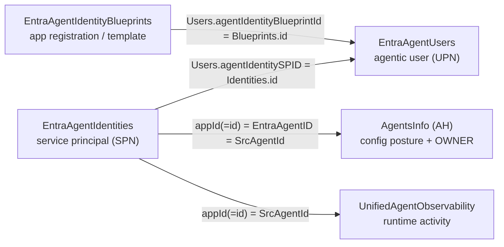

# Entra Agent Identity — AI Agent Identity & Governance Posture

**Created:** 2026-08-16  
**Platform:** Microsoft Sentinel (Data Lake) — with a Microsoft Defender (Advanced Hunting) fallback for tenants without Data Lake  
**Tables:** EntraAgentIdentities, EntraAgentIdentityBlueprints, EntraAgentUsers, AgentsInfo, IdentityInfo, UnifiedAgentObservability, CloudAppEvents  
**Keywords:** Agent 365, AI agent, agent identity, agentic user, agent blueprint, service principal, EntraAgentIdentities, EntraAgentIdentityBlueprints, EntraAgentUsers, agent identity posture, agent governance, dormant agent, ownerless agent, orphaned agent, owner departed, agents without owners, no owner assigned, agent registry, agent sprawl, lifecycle, compliance state, verified publisher, multi-tenant app, oauth2 scopes, blueprint hierarchy, provisioned but inactive, agent SPN, agentIdentitySPID, agentIdentityBlueprintId, createdByAppId, agent identity graph, AgentsInfo cross-reference, IdentityInfo, data plane  
**MITRE:** T1078.004, T1136.003, T1098, TA0003, TA0004, TA0005  
**Domains:** identity, cloud  
**Timeframe:** Last 30 days (snapshot tables; adjust for older provisioning history)

---

## Overview

Microsoft Agent 365 models every AI agent's Entra identity in **three layers**, each surfaced as a **Sentinel Data Lake snapshot table**:

| Layer | Table | What it is |
|-------|-------|-----------|
| **Blueprint** | `EntraAgentIdentityBlueprints` | The **app registration / template** an agent is built from (publisher, OAuth2 scopes, app roles, sign-in audience). One blueprint can spawn many agent identities. |
| **Agent Identity** | `EntraAgentIdentities` | The **service principal instance** — the agent's own SPN. Carries `accountEnabled`, `lifecycle` (compliance/expiration), `createdByAppId` (provisioning platform), tags. |
| **Agent User** | `EntraAgentUsers` | The **agentic user account** — a real Entra user object (with a UPN) that the agent signs in as. Only agents provisioned with a full user identity appear here. |

These are the **identity & governance** counterpart to the *runtime activity* in [`UnifiedAgentObservability`](agent365_observability.md) and the *configuration posture* in `AgentsInfo` (Advanced Hunting). Together the three planes answer:

- **Who is this agent in Entra?** (identity tables) · **What is it configured to do?** (`AgentsInfo`) · **What did it actually do?** (`UnifiedAgentObservability` / `CloudAppEvents`)



### ⚠️ Critical Access Pattern

All three tables live in the **Sentinel Data Lake system scope**. Pass **`workspaceId: "default"`** to `mcp_sentinel-data_query_lake`. A workspace GUID returns `SemanticError: Failed to resolve table`.

- ✅ Data Lake only, via `workspaceId: "default"`
- ❌ Not in Advanced Hunting (`RunAdvancedHuntingQuery`), Triage MCP, or `search_tables`
- 🔁 **No Data Lake?** `AgentsInfo` (AH) carries the inventory, owner, and Entra linkage; confirm runtime-**active** agents via [Query 5b](#query-5b-runtime-attributed-agents--defender) and owner-departure via [Query 7](#query-7-orphaned-agents--owner-departed). (Fleet-wide *dormancy* needs the Data Lake plane — [Query 5a](#query-5a-dormant-agents--data-lake-unifiedagentobservability) — Defender attribution is too sparse.) See [Defender-only coverage](#defender-only-coverage--what-ports-without-data-lake).

### 🔑 Cross-plane join map (validated live)

The bridge across all three planes is the **agent SPN GUID** and the **blueprint GUID**. `AgentsInfo` is the only plane that also carries the **human owner**.

| Concept | Value example | Where it appears |
|---------|--------------|------------------|
| **Agent SPN** | `<spn-guid>` | `EntraAgentIdentities.appId` **==** `EntraAgentIdentities.id` · `EntraAgentUsers.agentIdentitySPID` · `AgentsInfo.EntraAgentID` (**==** `ObservabilityID`) · `UnifiedAgentObservability.SrcAgentId` |
| **Blueprint** | `<blueprint-guid>` | `EntraAgentUsers.agentIdentityBlueprintId` → `EntraAgentIdentityBlueprints.id` · `AgentsInfo.EntraBlueprintID` · `UnifiedAgentObservability.SrcAgentBlueprintId` · often `EntraAgentIdentities.createdByAppId` (Copilot Studio) |
| **Owner / creator** | `<user-guid>` | `AgentsInfo.Owners[]` · `AgentsInfo.RawAgentInfo.creatorId` — **NOT present in any Entra agent identity table** (resolve GUID → UPN via `IdentityInfo`) |

> **Ownership reality:** the three Entra tables have **no owner field**. `createdByAppId` is the *provisioning platform app* (e.g. the Copilot Studio first-party app), not a person. For true owner/creator, cross-reference `AgentsInfo` (join on `EntraAgentIdentities.appId == AgentsInfo.EntraAgentID`) or Microsoft Graph `/servicePrincipals/{id}/owners`.

### ⚠️ Table Pitfalls

| Pitfall | Detail |
|---------|--------|
| **`workspaceId: "default"` required** | System-scope tables — workspace GUID returns table-not-found. |
| **Snapshot tables — always dedup** | Multiple rows per entity over time (e.g. hundreds of rows for a dozen agents). **Always** `summarize arg_max(TimeGenerated, *) by id` before analysis. `TimeGenerated` is ingestion time; `_SnapshotTime` is the source snapshot time. |
| **`EntraAgentIdentities.id == appId`** | For agent SPs these two columns hold the **same** SPN GUID. Either works as the cross-plane join key to `AgentsInfo.EntraAgentID` / `UnifiedAgentObservability.SrcAgentId`. |
| **`lifecycle`, `tags`, `verifiedPublisher`, `appRoles`, `oauth2PermissionScopes`, `optionalClaims`, `certification` are `dynamic`** | `parse_json(tostring(col))` before dot-access. `lifecycle.expirationDateTime` / `lastEvaluationDateTime` default to `0001-01-01T00:00:00Z` (treat as null/no-expiry). `lifecycle.complianceState` is a **numeric string** (`"0"`). |
| **Blueprint table contains non-agent platform apps** | `EntraAgentIdentityBlueprints` includes infrastructure/platform app registrations (e.g. GSA traffic-forwarding profiles, `Agent 365 CLI`, integration apps) alongside real agent blueprints. Scope to blueprints referenced by the agent identity/user chain, or filter out known platform apps, before treating a row as an "agent blueprint." |
| **Blueprint link can be absent** | `EntraAgentUsers.agentIdentityBlueprintId` does not always resolve in `EntraAgentIdentityBlueprints` (observed for some Security Copilot agents). Use `leftouter` and flag the orphan rather than dropping the row. |
| **Agent USERS are a subset of agents** | Only agents provisioned with a full agentic-user identity appear in `EntraAgentUsers` (e.g. Agent 365 / Meeting-Assistant-class agents). SP-only agents (many Copilot Studio agents) have an `EntraAgentIdentities` row but **no** `EntraAgentUsers` row — that's expected, not an orphan. |
| **`createdByAppId` = provisioning platform, not a user** | Groups agents by how they were provisioned (Copilot Studio blueprint app, Foundry provisioning app, etc.). Useful as a "provisioning source" dimension — do **not** read it as an owner. |
| **Foundry agents carry `tags`** | Foundry-provisioned identities populate `tags` with `region:*`, `virtualWorkspaceId:*`, `projectId:*`. Copilot Studio agents usually have empty `tags`. |
| **No runtime/activity in these tables** | Identity state only. For "is it actually used?" cross-reference `UnifiedAgentObservability` (Query 5a) or, Defender-only, `CloudAppEvents` (Query 5b). |

### Related planes

| Plane | Table(s) | Availability | Carries |
|-------|----------|--------------|---------|
| **Identity (this file)** | `EntraAgent*` | Data Lake only | Entra identity model: SPN state, lifecycle, blueprint app-reg governance, agentic-user accounts |
| **Config posture** | `AgentsInfo` | Advanced Hunting (**all Defender XDR tenants**) | Inventory, tools/MCP, knowledge sources, **owner/creator**, `EntraAgentID`/`EntraBlueprintID` linkage |
| **Runtime** | `UnifiedAgentObservability` (Data Lake) / `CloudAppEvents` (AH) | Data Lake / AH | Prompts, tool calls, agent-to-agent handoffs, safety verdicts |

> The **`ai-agent-posture`** skill orchestrates all three (data-plane-gated): `AgentsInfo` is the always-present baseline; these Entra tables are an optional enrichment tier.

---

## Quick Reference — Query Index

| # | Query | Use Case | Key Table |
|---|-------|----------|-----------|
| 1 | [Agent Identity State & Lifecycle](#query-1-agent-identity-state--lifecycle) | Investigation | `AgentsInfo` + multi |
| 2 | [Agent User Account Audit (agentic users + orphans)](#query-2-agent-user-account-audit-agentic-users--orphans) | Investigation | `EntraAgentIdentities` + multi |
| 3 | [Blueprint App-Registration Governance](#query-3-blueprint-app-registration-governance) | Investigation | `EntraAgentIdentities` + multi |
| 4 | [Identity Graph — Blueprint → Identity → Agent User](#query-4-identity-graph--blueprint--identity--agent-user) | Investigation | `EntraAgentIdentities` + multi |
| 5 | [a: Dormant Agents — Data Lake (`UnifiedAgentObservability`)](#query-5a-dormant-agents--data-lake-unifiedagentobservability) | Investigation | `EntraAgentIdentities` + `UnifiedAgentObservability` |
| 5 | [b: Runtime-Attributed Agents — Defender](#query-5b-runtime-attributed-agents--defender) | Investigation | `AgentsInfo` + multi |
| 6 | [Duplicate / Re-Provisioned Identities](#query-6-duplicate--re-provisioned-identities) | Investigation | `EntraAgentIdentities` |
| 7 | [Orphaned Agents — Owner Departed](#query-7-orphaned-agents--owner-departed) | Investigation | `AgentsInfo` + multi |


## Queries

### Query 1: Agent Identity State & Lifecycle

**Purpose:** One-row-per-agent inventory of the SPN layer — enabled state, compliance/expiration, provisioning source, age. Entry point for the identity plane.  
**Severity:** Informational  
**MITRE:** T1078.004  

<!-- cd-metadata
cd_ready: false
adaptation_notes: "Snapshot inventory/posture query (arg_max dedup over a lookback) — not a single-event detection. For alerting on a newly-disabled or expired agent identity, promote via a KQL Job to an Analytics-tier _CL table and diff snapshots."
-->

```kql
EntraAgentIdentities
| where TimeGenerated > ago(30d)
| summarize arg_max(TimeGenerated, *) by id
| extend LC = parse_json(tostring(lifecycle))
| extend ExpirationDateTime = todatetime(LC.expirationDateTime)
| extend HasExpiry = isnotnull(ExpirationDateTime) and ExpirationDateTime > datetime(1900-01-01)
| project
    AgentName        = displayName,
    AgentSpnId       = appId,               // == id; join key to AgentsInfo.EntraAgentID / UnifiedAgentObservability.SrcAgentId
    accountEnabled,
    ServicePrincipalType = servicePrincipalType,
    ComplianceState  = tostring(LC.complianceState),
    IsExternallyManaged = tostring(LC.isExternallyManaged),
    HasExpiry,
    ExpirationDateTime = iff(HasExpiry, ExpirationDateTime, datetime(null)),
    Expired          = HasExpiry and ExpirationDateTime < now(),
    ProvisioningAppId = createdByAppId,     // provisioning platform app, NOT an owner
    createdDateTime,
    AgeDays          = datetime_diff('day', now(), createdDateTime),
    Tags             = tostring(tags)
| order by createdDateTime asc
```

**Expected results:** One row per agent SPN. In a healthy estate `accountEnabled == true` and `Expired == false` for all. Flag: `accountEnabled == false` (disabled-but-present), `Expired == true` (lifecycle lapsed), or clustered `createdDateTime` bursts (bulk provisioning). `ProvisioningAppId` groups agents by platform (Copilot Studio vs Foundry vs other).

**Tuning:** Filter to a single `ProvisioningAppId` to scope to one provisioning platform. Add `| where accountEnabled == false or Expired` to surface only the hygiene concerns.

---

### Query 2: Agent User Account Audit (agentic users + orphans)

**Purpose:** Audit the **agentic user accounts** (agents that sign in as a real Entra user with a UPN) and detect broken links to their SP identity or blueprint.  
**Severity:** Low  
**MITRE:** T1136.003 (Create Account: Cloud Account), T1078.004  

<!-- cd-metadata
cd_ready: false
adaptation_notes: "Inventory/orphan-reconciliation query with multi-table joins — not a single-event detection."
-->

```kql
let Ids = EntraAgentIdentities
    | where TimeGenerated > ago(30d)
    | summarize arg_max(TimeGenerated, *) by id
    | project spId = id, sp_name = displayName, sp_enabled = accountEnabled;
let Bps = EntraAgentIdentityBlueprints
    | where TimeGenerated > ago(30d)
    | summarize arg_max(TimeGenerated, *) by id
    | project bpId = id, bp_name = displayName, bp_audience = signInAudience;
EntraAgentUsers
| where TimeGenerated > ago(30d)
| summarize arg_max(TimeGenerated, *) by id
| join kind=leftouter Ids on $left.agentIdentitySPID == $right.spId
| join kind=leftouter Bps on $left.agentIdentityBlueprintId == $right.bpId
| project
    AgentUser     = displayName,
    UPN           = userPrincipalName,
    UserEnabled   = accountEnabled,
    SP_Orphan     = isempty(spId),          // agentic user whose SP identity is missing
    SP_Name       = sp_name,
    SP_Enabled    = sp_enabled,
    BP_Orphan     = isempty(bpId),          // agentic user whose blueprint is missing
    BP_Name       = bp_name,
    BP_Audience   = bp_audience             // AzureADMultipleOrgs = multi-tenant (higher exposure)
| order by AgentUser asc
```

**Expected results:** One row per agentic user. Healthy rows have `SP_Orphan == false` and `UserEnabled == true`. Flags: `SP_Orphan == true` (user account with no backing SP identity — dangling credential), `BP_Orphan == true` (blueprint not in the snapshot — common for some Security Copilot agents), `UserEnabled == true` while `SP_Enabled == false` (mismatched state), `BP_Audience == "AzureADMultipleOrgs"` (multi-tenant blueprint — broader trust).

**Tuning:** This table is small (only agents with full user identities). Add `| where SP_Orphan or BP_Orphan or UserEnabled != SP_Enabled` to surface only reconciliation issues.

---

### Query 3: Blueprint App-Registration Governance

**Purpose:** Governance of the **blueprint** (app registration) layer — publisher verification, sign-in audience, OAuth2 scope / app-role exposure, disabled state. Deeper app-registration detail than `AgentsInfo` provides.  
**Severity:** Low  
**MITRE:** T1098 (Account Manipulation), TA0005  

<!-- cd-metadata
cd_ready: false
adaptation_notes: "App-registration governance inventory (arg_max dedup) — not a single-event detection. Blueprint table includes non-agent platform apps; scope before alerting."
-->

```kql
// Scope to blueprints actually referenced by an agent identity/user chain to exclude
// platform/infra app registrations (GSA profiles, CLI apps, integration apps).
let AgentBpIds = union
    (EntraAgentUsers | where TimeGenerated > ago(30d) | distinct agentIdentityBlueprintId),
    (EntraAgentIdentities | where TimeGenerated > ago(30d) | distinct createdByAppId)  // Copilot Studio blueprint app
    | distinct agentIdentityBlueprintId;
EntraAgentIdentityBlueprints
| where TimeGenerated > ago(30d)
| summarize arg_max(TimeGenerated, *) by id
| extend VP = parse_json(tostring(verifiedPublisher))
| project
    BlueprintName    = displayName,
    BlueprintAppId   = appId,
    isDisabled,
    DisabledByMicrosoft = disabledByMicrosoftStatus,
    SignInAudience   = signInAudience,       // AzureADMultipleOrgs = multi-tenant
    PublisherDomain  = publisherDomain,
    VerifiedPublisher = tostring(VP.displayName),
    HasVerifiedPublisher = isnotempty(tostring(VP.displayName)),
    ScopeCount       = array_length(parse_json(tostring(oauth2PermissionScopes))),
    AppRoleCount     = array_length(parse_json(tostring(appRoles))),
    createdDateTime,
    id
| extend IsMultiTenant = SignInAudience == "AzureADMultipleOrgs"
| order by IsMultiTenant desc, ScopeCount desc
```

**Expected results:** One row per blueprint app registration. Governance flags: `IsMultiTenant == true` (broader trust boundary), `HasVerifiedPublisher == false` (unverified publisher), non-zero `ScopeCount` / `AppRoleCount` (delegated/app permissions exposed by the template), `isDisabled == true` or `DisabledByMicrosoft != "0"` (Microsoft-disabled — investigate).

**Tuning:** To include *all* app registrations (platform apps too), remove the `AgentBpIds` scoping concept and query the deduped table directly — but expect infrastructure apps (GSA, CLI) in the results. Add `| where HasVerifiedPublisher == false and IsMultiTenant` for the highest-exposure blueprints.

---

### Query 4: Identity Graph — Blueprint → Identity → Agent User

**Purpose:** Emit the full identity hierarchy as an edge list feeding a Mermaid graph (the "agent ↔ identity" visualization). Optionally enrich each identity with runtime activity from `UnifiedAgentObservability`.  
**Severity:** Informational  
**MITRE:** —  

<!-- cd-metadata
cd_ready: false
adaptation_notes: "Relationship/graph edge-list query for visualization — not a single-event detection."
-->

```kql
let Ids = EntraAgentIdentities
    | where TimeGenerated > ago(30d)
    | summarize arg_max(TimeGenerated, *) by id
    | project spId = id, sp_appId = appId, sp_name = displayName, sp_enabled = accountEnabled, createdByAppId;
let Bps = EntraAgentIdentityBlueprints
    | where TimeGenerated > ago(30d)
    | summarize arg_max(TimeGenerated, *) by id
    | project bpId = id, bp_name = displayName;
let ActiveSPs = UnifiedAgentObservability
    | where TimeGenerated > ago(30d)
    | where isnotempty(SrcAgentId) and SrcAgentId != "00000000-0000-0000-0000-000000000000"
    | distinct SrcAgentId;
EntraAgentUsers
| where TimeGenerated > ago(30d)
| summarize arg_max(TimeGenerated, *) by id
| join kind=leftouter Ids on $left.agentIdentitySPID == $right.spId
| join kind=leftouter Bps on $left.agentIdentityBlueprintId == $right.bpId
| extend HasRuntime = sp_appId in (ActiveSPs)
| project
    Blueprint = coalesce(bp_name, "(blueprint not in snapshot)"),
    AgentIdentity = sp_name,
    AgentUser = displayName,
    UPN = userPrincipalName,
    AgentSpnId = sp_appId,
    HasRuntime
| order by Blueprint asc, AgentIdentity asc
```

**Expected results:** One row per (blueprint → identity → agent user) chain, with a `HasRuntime` flag showing whether that identity produced telemetry. Feed the columns into a Mermaid `flowchart` — one node per distinct Blueprint / AgentIdentity / AgentUser, edges `Blueprint --> AgentIdentity --> AgentUser`, styling `HasRuntime == false` nodes as dormant.

**Note:** This joins only the agents that have an **agentic user** (the `EntraAgentUsers` set). For an SP-centric graph that includes SP-only agents (e.g. most Copilot Studio agents), start from `EntraAgentIdentities` and `leftouter`-join `EntraAgentUsers` instead.

**Tuning:** Drop the `ActiveSPs` / `HasRuntime` arm entirely if the tenant has no Data Lake observability connector — the hierarchy still renders from the identity tables alone.

---

### Query 5a: Dormant Agents — Data Lake (`UnifiedAgentObservability`)

**Purpose:** 🔴 The flagship governance query — agent identities that exist in Entra but produced **no runtime telemetry** over the window. Provisioned, credentialed, and forgotten = attack surface with no operational value.  
**Severity:** Medium  
**MITRE:** T1078.004  

<!-- cd-metadata
cd_ready: false
adaptation_notes: "Cross-source posture query (identity snapshot leftanti runtime). Not a single-event detection; promote via KQL Job for alerting on newly-dormant agents."
-->

```kql
let ActiveSPs = UnifiedAgentObservability
    | where TimeGenerated > ago(30d)
    | where isnotempty(SrcAgentId) and SrcAgentId != "00000000-0000-0000-0000-000000000000"
    | distinct SrcAgentId;
EntraAgentIdentities
| where TimeGenerated > ago(30d)
| summarize arg_max(TimeGenerated, *) by id
| extend HasRuntime = appId in (ActiveSPs)
| where HasRuntime == false                 // dormant: identity exists, no runtime activity
| where accountEnabled == true              // still enabled = live credential, unused
| project
    AgentName        = displayName,
    AgentSpnId       = appId,
    accountEnabled,
    ProvisioningAppId = createdByAppId,
    createdDateTime,
    AgeDays          = datetime_diff('day', now(), createdDateTime)
| order by AgeDays desc
```

**Expected results:** Enabled agent identities with zero runtime activity in the window — decommissioning candidates. In a validated lab, **11 of 14** provisioned identities were dormant (only 3 had any runtime). Prioritize the oldest (`AgeDays`) and any that also carry sensitive blueprint scopes (join Query 3) or an agentic-user account (join Query 2).

**Tuning:** Widen the runtime window (`ago(30d)` → `ago(90d)`) to avoid flagging recently-quiet agents. **🔴 Requires the observability connector:** `UnifiedAgentObservability` is a *separate* Data Lake connector — validated absent in a large Data-Lake tenant that still had all three `EntraAgent*` tables. If `UnifiedAgentObservability` fails to resolve, **fleet-wide dormancy cannot be reliably assessed on the Defender plane** (attribution is too sparse for a leftanti) — see [Query 5b](#query-5b-runtime-attributed-agents--defender), which returns the *positive* runtime-attributed set instead.

---

### Query 5b: Runtime-Attributed Agents — Defender

**Defender-plane counterpart to [Query 5a](#query-5a-dormant-agents--data-lake-unifiedagentobservability).** ⚠️ **Defender cannot measure fleet-wide dormancy** the way the Data Lake plane can: agent runtime attribution in `CloudAppEvents` / `CopilotActivity` is **sparse** — validated at only **45 of 15,038** agents (~0.3%) with *any* attributable runtime over 30 days, because (a) the ~250k-event `CopilotInteraction`/`CopilotActivity` bulk rarely tags a specific agent, and (b) only Copilot Studio / Agent 365 custom agents emit the well-attributed `InvokeAgent`/`ExecuteTool*` events (Agent Builder / Foundry largely don't surface here). A naive `AgentsInfo ∖ CloudAppEvents` leftanti therefore flags ~99% of the fleet as "dormant" — a **telemetry artifact, not a finding**. This query instead returns the **positive** runtime-attributed set (name **or** SPN GUID, across **both** Defender runtime tables). Use it to confirm which agents are actually **active** — especially cross-referencing the flagged high-risk list for *active-and-dangerous* agents.  
**Plane:** Advanced Hunting (`AgentsInfo` + `CloudAppEvents` + `CopilotActivity`) — available to **all Defender tenants**.  
**Severity:** Informational  
**MITRE:** T1078.004  

<!-- cd-metadata
cd_ready: false
adaptation_notes: "Positive runtime-attribution inventory (AgentsInfo joined to CloudAppEvents/CopilotActivity by name OR SPN GUID). Defender attribution is sparse — do NOT invert into a fleet-wide dormancy leftanti; true fleet dormancy is Data Lake Query 5a only."
-->

```kql
// Defender agent-runtime attribution is SPARSE: the bulk CopilotInteraction/CopilotActivity rows
// rarely carry an agent identity, and only Copilot Studio / Agent 365 agents emit well-attributed
// InvokeAgent/ExecuteTool events. Return the POSITIVE runtime-attributed set (name OR SPN GUID,
// across both runtime tables) — NOT a fleet-wide dormancy leftanti (that needs Data Lake Query 5a).
let ActiveNames = union
    (CloudAppEvents | where Timestamp > ago(30d)
        | where ActionType in ("InvokeAgent","ExecuteToolBySDK","ExecuteToolByGateway","ExecuteToolByMCPServer","InferenceCall")
        | extend d = parse_json(RawEventData)
        | extend N = tostring(coalesce(d.AgentName, d.TargetAgentName)) | where isnotempty(N) | distinct N),
    (CopilotActivity | where TimeGenerated > ago(30d) | where isnotempty(AgentName) | distinct N = AgentName)
    | distinct N;
let ActiveIds = union
    (CloudAppEvents | where Timestamp > ago(30d)
        | extend d = parse_json(RawEventData) | extend I = tostring(d.AgentId)
        | where isnotempty(I) and I != "00000000-0000-0000-0000-000000000000" | distinct I),
    (CopilotActivity | where TimeGenerated > ago(30d) | where isnotempty(AgentId) | distinct I = AgentId)
    | distinct I;
AgentsInfo
| summarize arg_max(Timestamp, *) by AgentId
| where LifecycleStatus != "Deleted"
| extend RuntimeByName = Name in (ActiveNames),
         RuntimeById   = isnotempty(EntraAgentID) and EntraAgentID in (ActiveIds)
| where RuntimeByName or RuntimeById            // POSITIVE: agents with observed runtime attribution
| project Name, Platform, PublishedStatus, EntraAgentID, RuntimeByName, RuntimeById,
          Owner = tostring(RawAgentInfo.creatorId)
| order by Platform asc, Name asc
```

**Expected results:** The (typically small) set of agents with observed Defender-plane runtime attribution — validated at **45** in a 15,038-agent tenant (23 Copilot Studio, 10 Other, 6 Foundry, 6 Agent Builder). These are confirmed *active*. Cross-reference against the broadly-accessible / sensitive-op flagged lists to isolate **active-and-dangerous** agents (top remediation priority). `RuntimeById` is often 0 for Agent Builder / Other (their `EntraAgentID` is unpopulated), which is why the name path is essential.

**Tuning:**
> **🔴 Do NOT invert this into fleet-wide dormancy.** `CloudAppEvents`/`CopilotActivity` attribute only a sliver of agents at runtime, and `AgentsInfo.EntraAgentID` is populated on only ~5% of agents (validated: 755/15,038) — so a leftanti trivially returns ~99% "dormant" as a **telemetry artifact**. True fleet-wide dormancy requires the Data Lake observability plane ([Query 5a](#query-5a-dormant-agents--data-lake-unifiedagentobservability)), where `UnifiedAgentObservability.SrcAgentId` attributes **every** agent tool call by SPN GUID.
> **Scoped dormancy for flagged agents (the right pattern):** filter `AgentsInfo` to a small flagged list first (broadly-accessible + sensitive-op agents), then a flagged agent *absent* from this active set is a lower-priority (candidate-dormant) item — but corroborate, since absence ≠ proof. This mirrors the `ai-agent-posture` skill's scoped Phase 5 approach.
> **Owner enrichment** is handled separately by [Query 7](#query-7-orphaned-agents--owner-departed) (owner-departed) — 5b intentionally stays a pure runtime signal.

---

### Query 6: Duplicate / Re-Provisioned Identities

**Purpose:** Detect the same agent name backed by **multiple distinct SP identities** — a sign of re-provisioning, failed cleanup, or impersonation. Also surfaces identities sharing one blueprint (fan-out / sprawl).  
**Severity:** Medium  
**MITRE:** T1098, T1078.004  

<!-- cd-metadata
cd_ready: false
adaptation_notes: "Duplicate/sprawl detection via grouping — not a single-event detection."
-->

```kql
EntraAgentIdentities
| where TimeGenerated > ago(30d)
| summarize arg_max(TimeGenerated, *) by id
| summarize
    SpCount      = dcount(appId),
    SpIds        = make_set(appId, 10),
    Created      = make_set(createdDateTime, 10),
    EnabledCount = countif(accountEnabled == true)
    by AgentName = displayName
| where SpCount > 1                          // same display name, multiple SP identities
| order by SpCount desc
```

**Expected results:** Agent names with more than one backing SP. A benign cause is an agent republished under a new identity where the old one wasn't cleaned up (both still `accountEnabled`); a suspicious cause is a look-alike identity created to impersonate a trusted agent. Cross-check `createdDateTime` spread and whether the older SP is still enabled (Query 1). At scale this is common — a large Data-Lake tenant returned 119 duplicate-name groups (one default-named `Agent` backed by 38 SPNs).

**Tuning:** **Default/placeholder names inflate the results** — names like `Agent`, `Agent 1`, `test` are auto-generated or test artifacts, not impersonation. Filter them out with `| where AgentName !in ("Agent", "Agent 1", "test") and AgentName !startswith "Agent ("` (adjust to your platform's default-name pattern) to focus on meaningful re-provisioning of *named* agents. To measure **blueprint fan-out** (one template spawning many agents) instead, `summarize dcount(id), make_set(displayName, 20) by createdByAppId` — a high count from a single provisioning app is expected for platform blueprints but worth confirming.

---

## Owner Governance — Orphaned Agents (`AgentsInfo` + `IdentityInfo`)

The agent **owner** lives in `AgentsInfo` (`Owners[]` / `RawAgentInfo.creatorId`), **not** in the `EntraAgent*` identity tables — so owner-governance queries run on **Advanced Hunting** and work for **every Defender tenant**, Data Lake or not.

This maps directly to the Microsoft 365 admin center **Agent Registry** governance cards ([docs](https://learn.microsoft.com/en-us/microsoft-365/admin/manage/agent-registry#agents-without-owners)):

| Agent 365 registry signal | Definition (per docs) | Telemetry equivalent |
|---|---|---|
| **"Agents without owners"** card | *Shared* agents that **no longer have owners** — the creator was **hard-deleted** from the org | **Query 7** below (owner GUID present but no longer a directory user) |
| **"No owner assigned"** risk (Critical) | Agent has **no owner or sponsor on record** at all | ⚠️ **Not reliably answerable from telemetry** — `AgentsInfo.Owners`/`creatorId` are **sparse** (blank ≠ no owner). Use the Agent Registry / Graph `/servicePrincipals/{id}/owners` as the authoritative source. |
| **"Shadow agent"** risk (Critical) | No registry entry, no owner, **or no Entra Agent ID** | Partial: `AgentsInfo \| where isempty(EntraAgentID)` flags the missing-Entra-Agent-ID leg. |

### Query 7: Orphaned Agents — Owner Departed

**Purpose:** 🔴 Agents whose **assigned owner has left the organization** — a live, credentialed, published agent with no accountable human. This is the telemetry equivalent of the Agent 365 **"Agents without owners"** card, but **cross-platform and more complete**.  
**Plane:** Advanced Hunting (`AgentsInfo` + `IdentityInfo`) — available to **all Defender tenants**.  
**Severity:** Medium  
**MITRE:** T1098, T1078.004  

<!-- cd-metadata
cd_ready: false
adaptation_notes: "Cross-table governance query (AgentsInfo Owners[] leftanti IdentityInfo). Not a single-event detection; promote via a scheduled analytic/KQL Job for alerting when a user deletion newly orphans agents."
-->

```kql
// Owner GUID lives in AgentsInfo.Owners[] (populated for SHARED agents), NOT the Entra identity tables.
// "Owner departed" = the assigned owner GUID no longer resolves to a current directory user
// — the Agent 365 "Agents without owners" card triggers on hard-delete of the creator.
let CurrentUsers = IdentityInfo
    | where isnotempty(AccountObjectId)
    | distinct AccountObjectId;
AgentsInfo
| summarize arg_max(Timestamp, *) by AgentId
| where LifecycleStatus != "Deleted"
| extend AppType = tostring(RawAgentInfo.appType)
| mv-expand OwnerGuid = parse_json(tostring(Owners)) to typeof(string)
| where isnotempty(OwnerGuid)                     // an owner IS assigned...
| where OwnerGuid !in (CurrentUsers)              // ...but no longer a current directory user = departed
| project Name, Platform, AppType, PublishedStatus, EntraAgentID, DepartedOwnerId = OwnerGuid, CreatedDateTime
| order by Platform asc, CreatedDateTime asc
```

**Expected results:** One row per orphaned agent + its departed owner GUID. Validated at scale in a large tenant: **127 orphaned agents** (79 Copilot Studio + 37 Foundry + 7 SharePoint + 4 Agent Builder) — all `appType == "shared"` — vs. the Agent 365 **"Agents without owners"** card, which showed **only the 4 Agent Builder** ones. The telemetry catches the same signal the card does (the Agent Builder count + names matched) but **across every platform**, surfacing ~30× more orphaned agents than the card. Prioritize `PublishedStatus == "Published"` agents — they are live and unowned.

**Tuning:**
- **`IdentityInfo`-absence is a proxy for "departed."** It reliably catches hard-deleted creators, but may also include disabled, external (B2B), or unsynced identities. Corroborate a specific owner GUID against `IdentityInfo`/Entra before blocking or deleting an agent.
- Scope to the card's exact cohort with `| where Platform == "Agent Builder in Microsoft 365 Copilot"`, or invert it (`Platform != ...`) to surface **only the orphans the Agent 365 card misses**.
- To resolve the *departed* owner's name for the report, the standard `IdentityInfo` join won't help (they're gone) — pull the last-known display name from `AuditLogs`/`SigninLogs` history or an offboarding record if needed.
- **Owner GUID source:** this keys on `Owners[]` (populated for shared agents). `RawAgentInfo.creatorId` is a separate, sparser field; a shared agent's owner is in `Owners[]`.

---

## Defender-only coverage — what ports without Data Lake

The three `EntraAgent*` tables are **Data Lake only**. Tenants with just **Microsoft Defender XDR (Advanced Hunting)** recover part of the identity-governance value from `AgentsInfo` (config posture, incl. owner + Entra linkage) plus `CloudAppEvents` / `CopilotActivity` (runtime). The Defender-native signals are **inline above**: runtime-active confirmation is [Query 5b](#query-5b-runtime-attributed-agents--defender), and owner-departure is [Query 7](#query-7-orphaned-agents--owner-departed) (AH-native, all tenants). **Fleet-wide dormancy does *not* port to Defender** — attribution is too sparse; it needs the Data Lake plane ([Query 5a](#query-5a-dormant-agents--data-lake-unifiedagentobservability)).

**What ports, and what doesn't:**

| Identity-plane signal | Defender-only equivalent | Parity |
|-----------------------|--------------------------|--------|
| Agent inventory + Entra SPN | `AgentsInfo` (`EntraAgentID`, `ObservabilityID`) | ✅ Full |
| **Owner / creator + orphaned-by-departure** | `AgentsInfo.Owners[]` / `RawAgentInfo.creatorId` ⋈ `IdentityInfo` — [Query 7](#query-7-orphaned-agents--owner-departed) | ✅ **Better** (Entra tables lack owner; AH-native, all tenants) |
| Dormant agents (fleet-wide) | ❌ **not reliably measurable** — Defender runtime attribution is sparse (~0.3% of fleet). [Query 5b](#query-5b-runtime-attributed-agents--defender) returns the *positive* runtime-active set instead | ⚠️ True dormancy is Data Lake only ([Query 5a](#query-5a-dormant-agents--data-lake-unifiedagentobservability)) |
| Blueprint linkage | `AgentsInfo.EntraBlueprintID` + `InstanceCount` | ⚠️ Partial — no publisher/scope/app-role detail |
| Agentic-user accounts (Query 2) | — | ❌ No equivalent — Data Lake only |
| SP lifecycle / compliance / expiration (Query 1) | — | ❌ No equivalent — Data Lake only |
| Blueprint app-reg governance (Query 3) | — | ❌ No equivalent — Data Lake only |

---

## Notes & Caveats

- **Preview schema** — the `EntraAgent*` tables are part of the Agent 365 identity connector preview. Columns may be added, renamed, or populated differently. Re-validate field availability before production use.
- **Snapshot cadence** — these are periodic state snapshots, not event streams. A change (disable, delete, re-provision) is visible only after the next snapshot; diff `_SnapshotTime` across days to reconstruct a change timeline.
- **Owner enrichment** — for true ownership, join `EntraAgentIdentities.appId == AgentsInfo.EntraAgentID` (cross-plane, run side-by-side) or call Graph `/servicePrincipals/{id}/owners`. Resolve owner/creator GUIDs to UPNs via `IdentityInfo` on `AccountObjectId`.
- **Skill integration** — the **`ai-agent-posture`** skill consumes these queries as a data-plane-gated enrichment tier (probe the tables first; skip gracefully if absent). `AgentsInfo` remains the universal baseline so Defender-only tenants still receive a full posture assessment and identical composite score.
- **Runtime companion** — pair with [`agent365_observability.md`](agent365_observability.md) for what these agents actually *do* (prompts, tool calls, agent-to-agent handoffs, safety verdicts).
